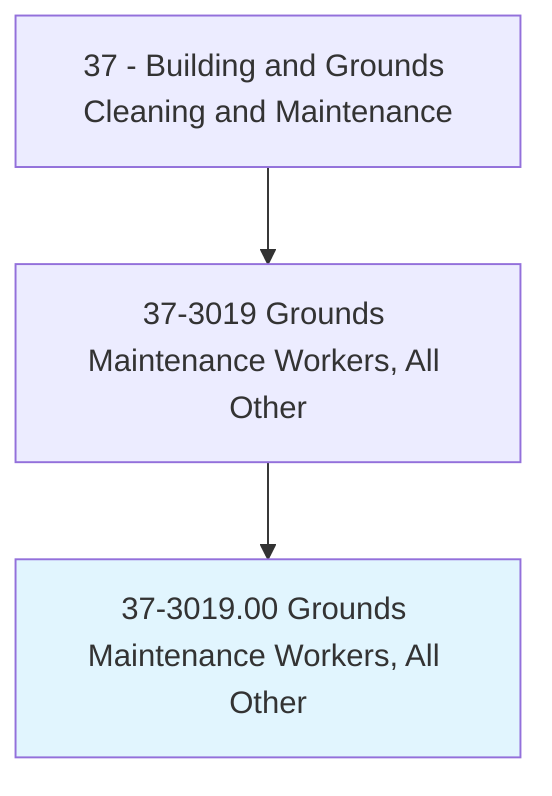
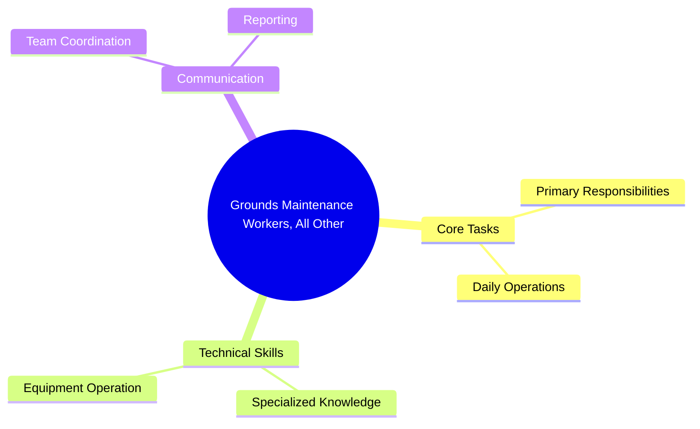
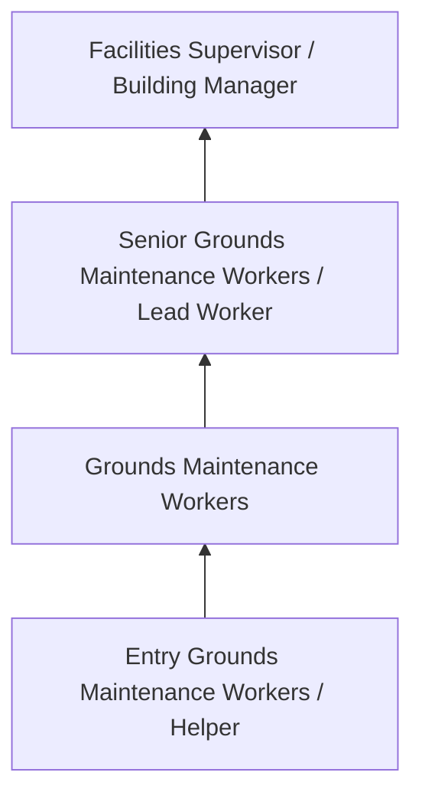
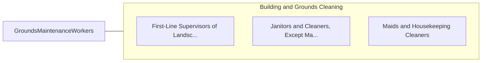

# Grounds Maintenance Workers, All Other

> All grounds maintenance workers not listed separately.

## Overview

Grounds Maintenance Workers professionals serve a vital function within the Building and Grounds Cleaning and Maintenance field. They bring specialized skills and knowledge to their roles, contributing to organizational objectives and societal needs.

These practitioners work in varied environments, adapting their expertise to meet specific requirements of their industry and employer. The role requires ongoing professional development to maintain competency and respond to changing demands.

Career paths in this field offer opportunities for advancement through experience, additional education, and specialized certifications. Employment prospects are influenced by industry trends, technological change, and workforce demographics.

## Classification Hierarchy



## Key Statistics

| Metric | Value |
|--------|-------|
| SOC Code | 37-3019.00 |
| Job Zone | N/A |
| Category | [Building and Grounds Cleaning and Maintenance](/occupations/Facilities/index) |
| Core Tasks | N/A+ |
| Salary Range | $26,000 - $55,000 |
| Median Salary | $35,000 |
| Growth Outlook | 4% (As fast as average) |
| Source | O*NET |

## Core Tasks



### Technical Skills
- **Facilities Maintenance** - Advanced
- **Equipment Operation** - Advanced
- **Safety Procedures** - Advanced

### Soft Skills
- **Communication** - Essential
- **Problem Solving** - Essential
- **Critical Thinking** - Important
- **Teamwork** - Important
- **Adaptability** - Important


## Skills & Competencies

### Technical Skills
- **Cleaning Techniques** - Advanced
- **Equipment Operation** - Proficient
- **Chemical Safety** - Proficient
- **Maintenance Procedures** - Proficient
- **Safety Compliance** - Proficient
- **Grounds Maintenance** - Proficient

### Soft Skills
- **Reliability** - Critical
- **Physical Stamina** - Critical
- **Attention to Detail** - Essential
- **Time Management** - Essential
- **Teamwork** - Important

## Education & Certifications

| Requirement | Details |
|-------------|---------|
| Typical Education | High school diploma or equivalent |
| Work Experience | 0-1 years experience |
| On-the-Job Training | Short-term on-the-job training |
| Certifications | OSHA safety certifications, green cleaning certifications |

## Career Progression



## Industry Variations

### Commercial Office Buildings
Maintenance and cleaning of professional office spaces. Grounds Maintenance Workers professionals ensure clean, safe work environments.

### Healthcare Facilities
Specialized cleaning and maintenance meeting stringent infection control standards.

### Educational Institutions
School and university facility maintenance. Focus on safety, cleanliness, and support for educational activities.

### Industrial and Manufacturing
Facility maintenance in production environments with specialized cleaning and safety requirements.

## Technology & Tools

- **Building automation systems**
- **Floor care equipment**
- **HVAC monitoring systems**
- **Cleaning chemical dispensing systems**
- **Work order management software**

## Related Occupations



## Industries

- [Services to Buildings and Dwellings](/industries/BuildingServices) - High Employment
- [Education](/industries/Education) - Moderate Employment
- [Healthcare](/industries/Healthcare/index) - Moderate Employment
- [Government](/industries/Government) - Moderate Employment

## Departments

This occupation typically works in:
- [Facilities Management](/departments/Facilities)
- [Building Services](/departments/BuildingServices)
- [Grounds Maintenance](/departments/GroundsMaintenance)

## GraphDL Semantic Structure

```
Grounds Maintenance Workers, All Other perform:
- clean.Facilities.using.ProperTechniques
- maintain.Equipment.for.CleaningOperations
- inspect.Areas.for.MaintenanceNeeds
- follow.Procedures.for.SafetyCompliance
- report.Issues.to.FacilitiesManagement
```

---

*Source: O*NET 37-3019.00 - ONETOccupation*
