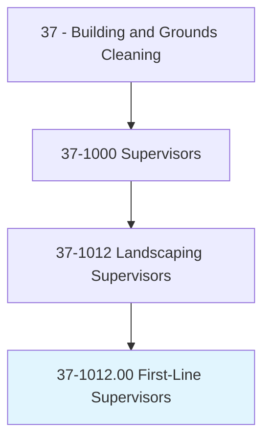
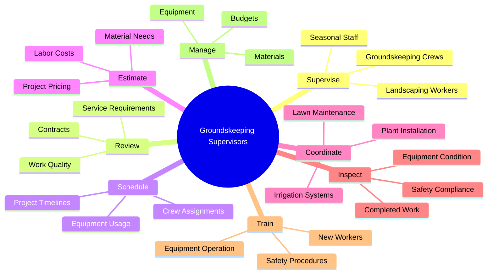
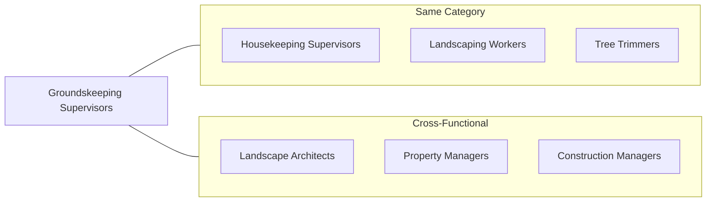
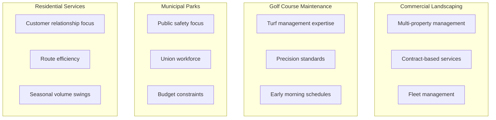
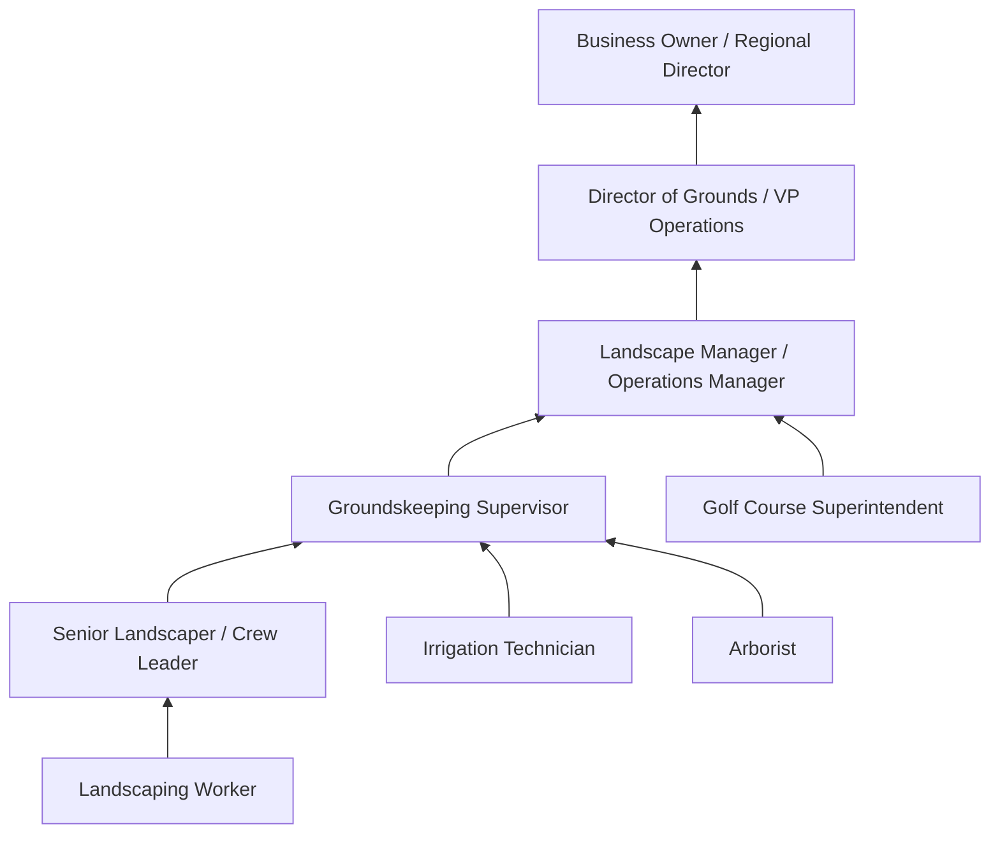
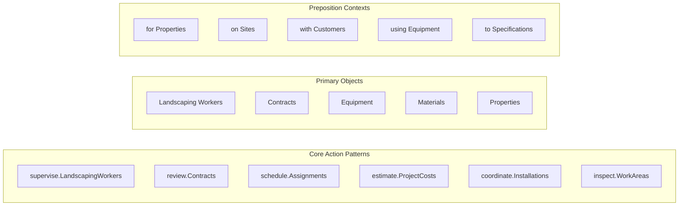
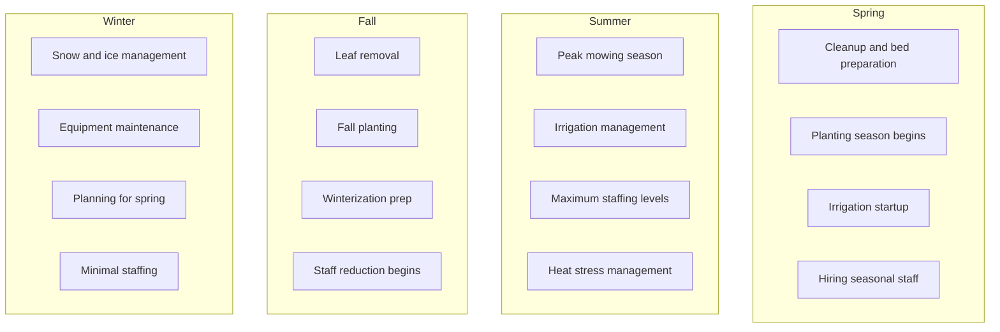

# First-Line Supervisors of Landscaping, Lawn Service, and Groundskeeping Workers

> Directly supervise and coordinate activities of workers engaged in landscaping or groundskeeping activities. Work may involve reviewing contracts to ascertain service, machine, and workforce requirements; answering inquiries from potential customers regarding methods, material, and price ranges; and preparing estimates according to labor, material, and machine costs.

## Overview

First-Line Supervisors of Landscaping, Lawn Service, and Groundskeeping Workers lead teams that maintain the outdoor appearance and health of properties. They coordinate landscaping operations for residential, commercial, institutional, and public properties. These supervisors manage crew scheduling, equipment allocation, customer relations, and project execution while ensuring safety compliance and quality standards. The role bridges skilled outdoor labor with business operations, requiring expertise in horticulture, equipment management, and team leadership.

## Classification Hierarchy

## Key Statistics

| Metric | Value |
|--------|-------|
| SOC Code | 37-1012.00 |
| Job Zone | 2 (Some Preparation) |
| Category | [Building and Grounds](/occupations/Facilities) |
| Core Tasks | 15+ |
| Source | O*NET |

## Core Tasks

### supervise.LandscapingWorkers

Groundskeeping Supervisors direct and coordinate the daily activities of landscaping and groundskeeping crews.

**Actions:**
- `supervise.LandscapingWorkers.on.PropertyMaintenance` - Direct routine grounds maintenance work
- `supervise.LandscapingWorkers.on.PlantInstallation` - Oversee planting and landscaping projects
- `supervise.GroundskeepingCrews.for.SeasonalWork` - Coordinate seasonal activities like mowing and snow removal
- `supervise.Workers.to.ensure.QualityStandards` - Monitor work quality against specifications

### review.Contracts

Groundskeeping Supervisors evaluate contracts and service agreements to plan resource allocation.

**Actions:**
- `review.Contracts.to.ascertain.ServiceRequirements` - Understand scope of contracted services
- `review.Contracts.to.determine.MachineRequirements` - Identify equipment needs for projects
- `review.Contracts.to.plan.WorkforceNeeds` - Calculate staffing requirements
- `review.Specifications.for.ProjectExecution` - Ensure work meets contractual standards

### schedule.Assignments

Groundskeeping Supervisors create efficient schedules that optimize crew productivity and equipment utilization.

**Actions:**
- `schedule.Assignments.for.Crews` - Assign daily work tasks to teams
- `schedule.Equipment.for.Projects` - Allocate machinery and vehicles to jobs
- `schedule.Routes.for.LawnService` - Plan efficient service routes for crews
- `schedule.Projects.by.Priority` - Sequence work based on urgency and weather

### estimate.ProjectCosts

Groundskeeping Supervisors prepare accurate cost estimates for proposed work.

**Actions:**
- `estimate.ProjectCosts.using.LaborRates` - Calculate labor costs for proposals
- `estimate.ProjectCosts.using.MaterialPrices` - Include material costs in estimates
- `estimate.ProjectCosts.using.EquipmentCosts` - Factor in equipment and machine time
- `estimate.Timelines.for.ProjectCompletion` - Provide realistic project schedules

### coordinate.Installations

Groundskeeping Supervisors manage complex installation projects from planning to completion.

**Actions:**
- `coordinate.PlantInstallation.with.Suppliers` - Arrange plant material delivery
- `coordinate.IrrigationInstallation.with.Contractors` - Manage irrigation system projects
- `coordinate.HardscapeInstallation.for.Properties` - Oversee patios, walkways, and structures
- `coordinate.SeasonalPreparation.for.Properties` - Plan spring startup and winterization

### inspect.WorkAreas

Groundskeeping Supervisors evaluate completed work and maintain quality standards.

**Actions:**
- `inspect.CompletedWork.to.verify.Quality` - Check work against specifications
- `inspect.Equipment.to.ensure.SafeOperation` - Verify equipment is functional and safe
- `inspect.Properties.to.identify.ServiceNeeds` - Assess ongoing maintenance requirements
- `inspect.Sites.to.plan.Projects` - Survey locations before project initiation

### train.Workers

Groundskeeping Supervisors develop staff skills in technical and safety areas.

**Actions:**
- `train.Workers.on.EquipmentOperation` - Instruct staff on machinery use
- `train.Workers.on.SafetyProcedures` - Educate on workplace safety practices
- `train.Workers.on.PlantCare` - Teach horticultural techniques
- `train.Workers.on.CustomerService` - Develop client interaction skills

## Skills & Competencies

### Technical Skills
- **Horticulture** - Plant identification, care, and landscaping design
- **Equipment Operation** - Mowers, trimmers, tractors, snow removal equipment
- **Irrigation Systems** - Installation, maintenance, and troubleshooting
- **Estimating** - Labor, material, and equipment cost calculation
- **Pesticide Application** - Licensed applicator knowledge and safety

### Soft Skills
- **Leadership** - Critical for crew motivation and direction
- **Customer Service** - Essential for client relations and sales
- **Communication** - Important for crew coordination and customer interaction
- **Problem Solving** - Necessary for handling site challenges
- **Time Management** - Essential for scheduling and project coordination

## Related Occupations

## Industries

- [Landscaping Services](/industries/LandscapingServices) - Highest Employment (commercial landscaping companies)
- [Local Government](/industries/LocalGovernment) - High Employment (parks, public works)
- [Educational Services](/industries/Education) - High Employment (schools, universities)
- [Real Estate](/industries/RealEstate) - Moderate Employment (HOAs, property management)
- [Golf Courses and Country Clubs](/industries/Recreation) - Moderate Employment (course maintenance)
- [Healthcare](/industries/Healthcare) - Growing Employment (hospital grounds)

## Industry Variations

### Commercial Landscaping Focus
- Managing multiple property accounts simultaneously
- Contract negotiation and renewal
- Equipment fleet maintenance and scheduling
- Scalable workforce management

### Golf Course Focus
- Highly specialized turf management knowledge
- Precise maintenance schedules around play
- Irrigation and drainage system expertise
- Agronomic program development

### Municipal Focus
- Public park and right-of-way maintenance
- Community event preparation
- Playground and athletic field care
- Storm response and cleanup coordination

### Residential Focus
- High-volume customer relationship management
- Route optimization for efficiency
- Handling seasonal demand fluctuations
- Upselling additional services

## Career Progression

## Education & Training

| Requirement | Details |
|-------------|---------|
| Typical Education | High school diploma; some college in horticulture preferred |
| Work Experience | 2-5 years in landscaping or groundskeeping |
| On-the-Job Training | Moderate (3-6 months) supervisory training |
| Common Certifications | Pesticide Applicator License, ISA Certified Arborist, NALP Certifications, GCSAA (Golf Course) |

## Departments

This occupation typically works in:
- [Grounds Department](/departments/Grounds)
- [Facilities Management](/departments/FacilitiesManagement)
- [Operations](/departments/Operations)
- [Parks and Recreation](/departments/ParksRecreation)

## GraphDL Semantic Structure

## Seasonal Considerations

## Key Performance Indicators

| KPI | Description |
|-----|-------------|
| Customer Retention | Percentage of contract renewals |
| Crew Productivity | Jobs completed per crew per day |
| Safety Record | Lost-time injury rate |
| Equipment Uptime | Percentage of equipment operational |
| Estimate Accuracy | Actual vs. estimated costs |
| Customer Satisfaction | Ratings and referral rates |

---

*Source: O*NET 37-1012.00 - ONETOccupation*
