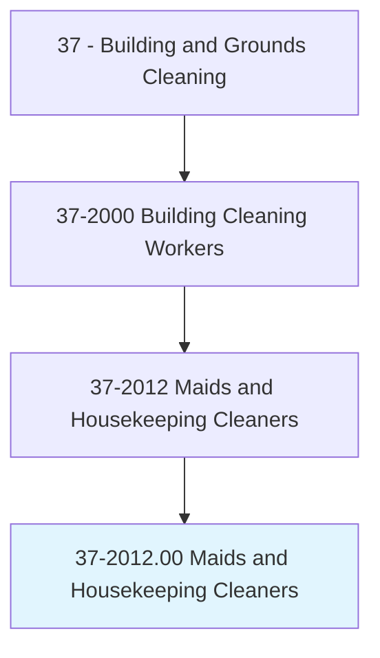
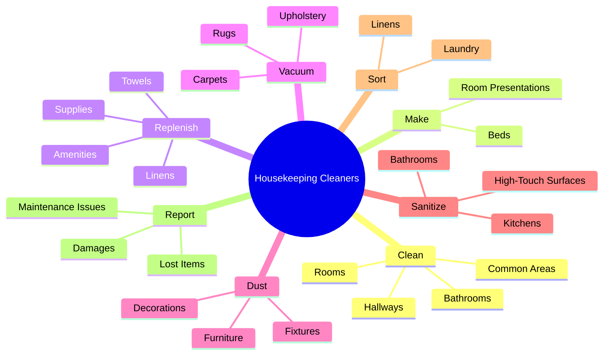
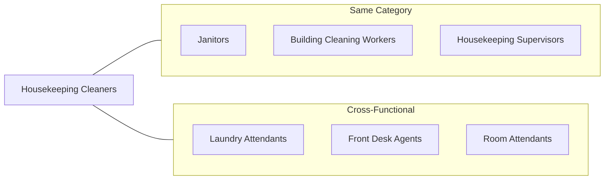
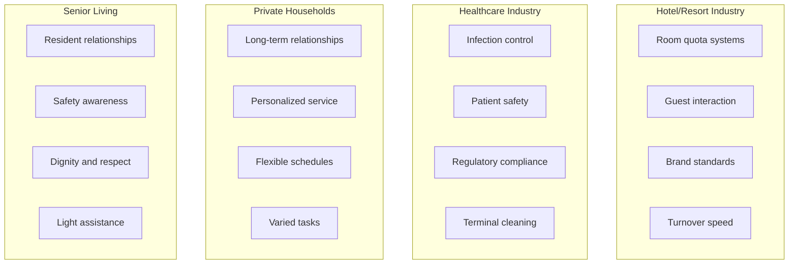
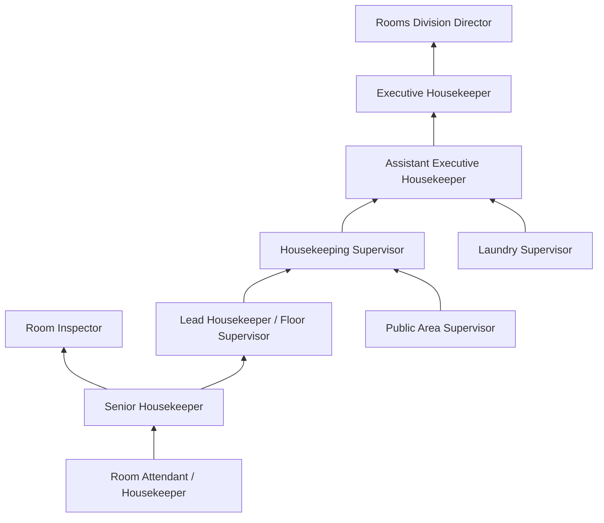
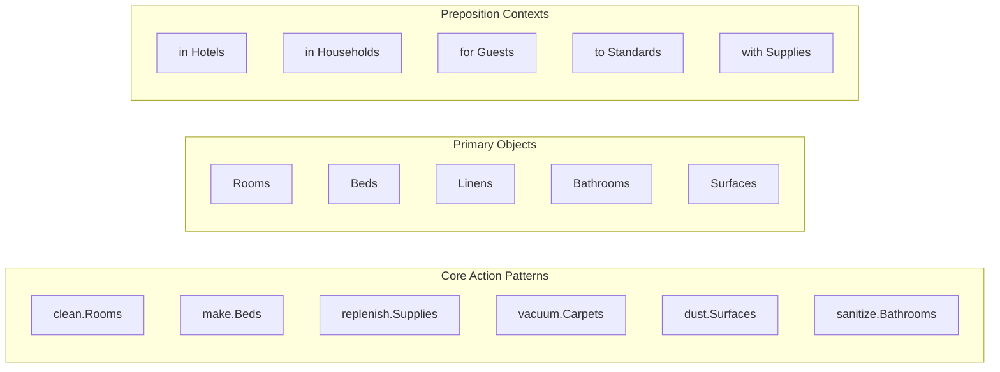
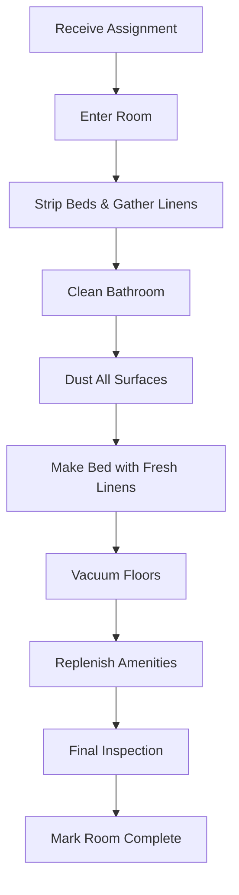

# Maids and Housekeeping Cleaners

> Perform any combination of light cleaning duties to maintain private households or commercial establishments, such as hotels and hospitals, in a clean and orderly manner. Duties may include making beds, replenishing linens, cleaning rooms and halls, and vacuuming.

## Overview

Maids and Housekeeping Cleaners perform light cleaning duties to maintain the cleanliness and orderly appearance of private homes, hotels, hospitals, and other facilities. Unlike janitors who focus on heavy industrial cleaning, housekeepers specialize in detailed room cleaning, bed making, linen management, and guest-facing service in hospitality settings. This occupation is particularly concentrated in the hotel and accommodation industry, where room attendants are essential to guest satisfaction and operational success. Housekeepers in private residences often develop long-term relationships with families while maintaining their homes.

## Classification Hierarchy

## Key Statistics

| Metric | Value |
|--------|-------|
| SOC Code | 37-2012.00 |
| Job Zone | 1 (Little or No Preparation) |
| Category | [Building and Grounds](/occupations/Facilities/index) |
| Core Tasks | 10+ |
| Source | O*NET |

## Core Tasks

### clean.Rooms

Housekeepers thoroughly clean assigned rooms following established procedures and quality standards.

**Actions:**
- `clean.Rooms.to.maintain.Cleanliness` - Perform complete room cleaning
- `clean.Rooms.to.prepare.ForGuests` - Ready rooms for new arrivals
- `clean.Rooms.following.Checklists` - Complete all cleaning steps systematically
- `clean.CheckoutRooms.for.NewGuests` - Deep clean rooms after guest departure

### make.Beds

Housekeepers prepare beds according to establishment standards for guest comfort and visual appeal.

**Actions:**
- `make.Beds.to.Standards` - Create properly made beds per brand standards
- `make.Beds.with.FreshLinens` - Change and arrange sheets and bedding
- `make.Beds.for.Turndown` - Prepare beds for evening turndown service
- `arrange.Pillows.for.Presentation` - Style pillows and decorative elements

### replenish.Supplies

Housekeepers maintain adequate supplies of linens, toiletries, and amenities in assigned areas.

**Actions:**
- `replenish.Linens.in.Rooms` - Stock fresh towels and bed linens
- `replenish.Toiletries.in.Bathrooms` - Restock soaps, shampoos, and amenities
- `replenish.Supplies.on.Cart` - Maintain stocked housekeeping cart
- `replenish.Minibar.Items` - Restock in-room beverage and snack items

### clean.Bathrooms

Housekeepers sanitize and maintain bathroom facilities to high cleanliness standards.

**Actions:**
- `clean.Bathrooms.to.Sanitize` - Disinfect all bathroom surfaces
- `clean.Toilets.to.Standards` - Thoroughly clean and sanitize toilets
- `clean.Showers.to.RemoveSoapScum` - Clean shower and tub enclosures
- `clean.Mirrors.to.SpotFree` - Polish mirrors streak-free

### vacuum.Carpets

Housekeepers maintain floor coverings through regular vacuuming and spot cleaning.

**Actions:**
- `vacuum.Carpets.in.Rooms` - Vacuum all carpeted floor areas
- `vacuum.Rugs.for.Cleanliness` - Clean area rugs and runners
- `vacuum.Upholstery.periodically` - Maintain upholstered furniture
- `spot.Clean.Stains` - Address carpet spots and stains

### dust.Surfaces

Housekeepers remove dust from furniture, fixtures, and decorative items throughout spaces.

**Actions:**
- `dust.Furniture.in.Rooms` - Clean all furniture surfaces
- `dust.Fixtures.and.Lamps` - Clean light fixtures and accessories
- `dust.Decorations.carefully` - Clean artwork and decorative items
- `dust.Electronics.safely` - Clean TVs and other electronic devices

### report.Issues

Housekeepers communicate maintenance needs, lost items, and other findings to appropriate personnel.

**Actions:**
- `report.MaintenanceIssues.to.Engineering` - Notify of repair needs
- `report.LostItems.to.FrontDesk` - Turn in items left by guests
- `report.Damages.to.Supervisors` - Document room damage findings
- `report.Suspicious.Activity` - Alert security to concerns

## Skills & Competencies

### Technical Skills
- **Cleaning Techniques** - Proper methods for different surfaces and materials
- **Bed Making** - Hotel-standard bed preparation techniques
- **Laundry Handling** - Sorting, handling, and stocking linens
- **Chemical Safety** - Safe use of cleaning products
- **Equipment Operation** - Vacuums, steam cleaners, and other tools

### Soft Skills
- **Attention to Detail** - Critical for meeting quality standards
- **Time Management** - Essential for completing room quotas
- **Physical Stamina** - Ability to perform active work all day
- **Discretion** - Respecting guest privacy and property
- **Customer Service** - Positive guest interactions when encountered

## Related Occupations

## Industries

- [Accommodation](/industries/Accommodation) - Highest Employment (hotels, motels, resorts)
- [Healthcare](/industries/Healthcare/index) - High Employment (hospitals, nursing facilities)
- [Private Households](/industries/OtherServices/PrivateHouseholds) - High Employment (residential cleaning)
- [Real Estate](/industries/RealEstate/index) - Moderate Employment (residential management)
- [Educational Services](/industries/Education) - Moderate Employment (dormitories)
- [Social Assistance](/industries/SocialAssistance) - Growing Employment (assisted living)

## Industry Variations

### Hotel Industry Focus
- Room quota completion (typically 14-18 rooms per shift)
- Brand-specific standards and procedures
- Rapid checkout room turnovers
- Guest amenity and presentation standards
- Coordination with front desk and maintenance

### Healthcare Industry Focus
- Strict infection prevention protocols
- Patient privacy and dignity
- Biohazard handling certification
- Discharge cleaning procedures
- Coordination with nursing staff

### Private Household Focus
- Developing trust with families
- Caring for personal belongings
- Adapting to individual preferences
- Managing keys and security access
- Variable task scope (laundry, organization, etc.)

### Senior Living Focus
- Building resident relationships
- Fall prevention awareness
- Respecting resident autonomy
- Light personal assistance
- Family communication

## Career Progression

## Education & Training

| Requirement | Details |
|-------------|---------|
| Typical Education | No formal education requirement |
| Work Experience | None required for entry-level |
| On-the-Job Training | Short-term (1-4 weeks) |
| Common Certifications | Brand-specific training, GBAC Fundamentals (healthcare), CPR (residential) |

## Departments

This occupation typically works in:
- [Housekeeping](/departments/Housekeeping)
- [Rooms Division](/departments/RoomsDivision)
- [Environmental Services](/departments/EnvironmentalServices)
- [Residential Services](/departments/ResidentialServices)

## GraphDL Semantic Structure

## Hotel Room Cleaning Workflow

## Luxury vs. Standard Service Comparison

| Aspect | Standard Service | Luxury Service |
|--------|-----------------|----------------|
| Rooms Per Shift | 14-18 | 8-12 |
| Bed Making | Standard triple sheet | Premium turndown presentation |
| Amenities | Basic toiletries | Premium brand products |
| Linen Change | Every 3 days (eco) | Daily or per preference |
| Turndown | Not offered | Evening turndown service |
| Personalization | Minimal | Preference tracking |

## Physical Requirements

| Requirement | Level |
|-------------|-------|
| Standing/Walking | Continuous (6-8 hours) |
| Lifting | Frequent (up to 25 lbs - linens) |
| Bending/Stooping | Very Frequent |
| Reaching | Frequent (bed making, dusting) |
| Pushing/Pulling | Moderate (carts, vacuum) |

## Key Performance Indicators

| KPI | Description |
|-----|-------------|
| Rooms Cleaned | Number of rooms completed per shift |
| Quality Scores | Inspection ratings and guest feedback |
| Checkout Turnovers | Speed of preparing departure rooms |
| Guest Complaints | Cleanliness-related complaints |
| Attendance | Reliability and punctuality |
| Linen Usage | Efficient use of linen supplies |

---

*Source: O*NET 37-2012.00 - ONETOccupation*
