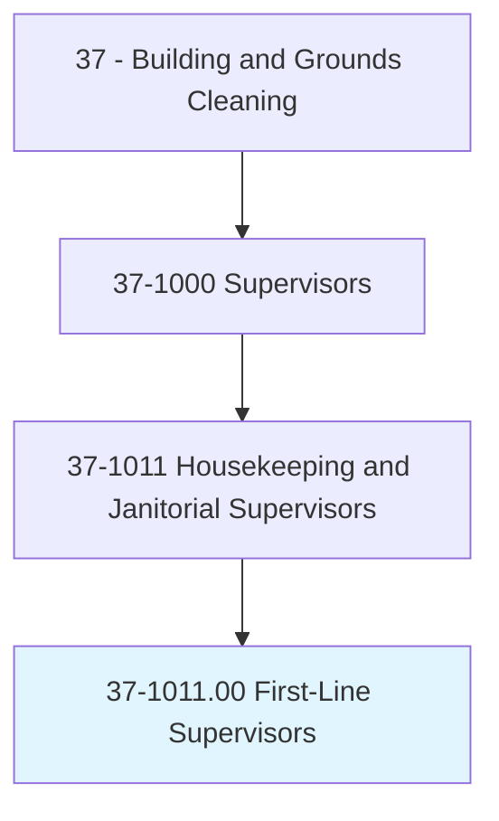
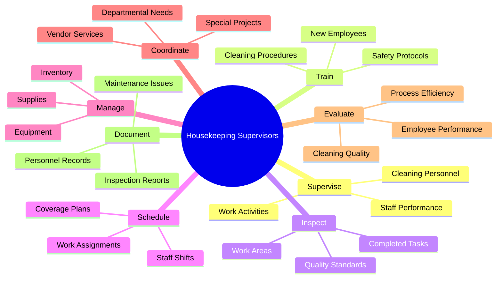
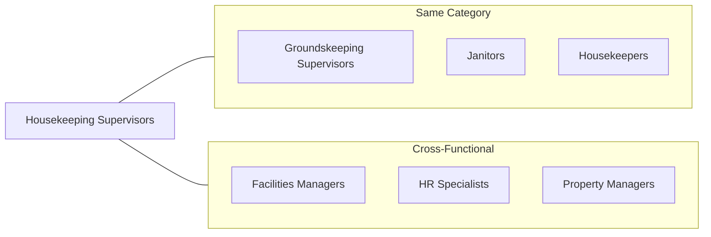
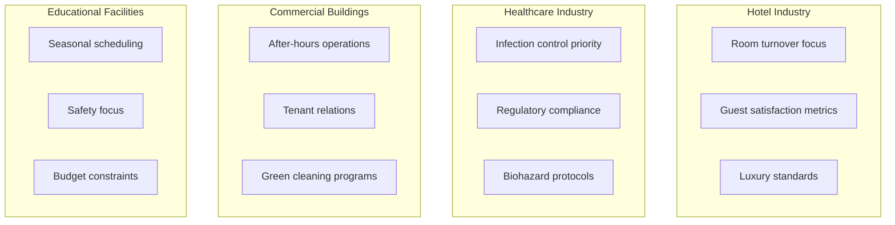
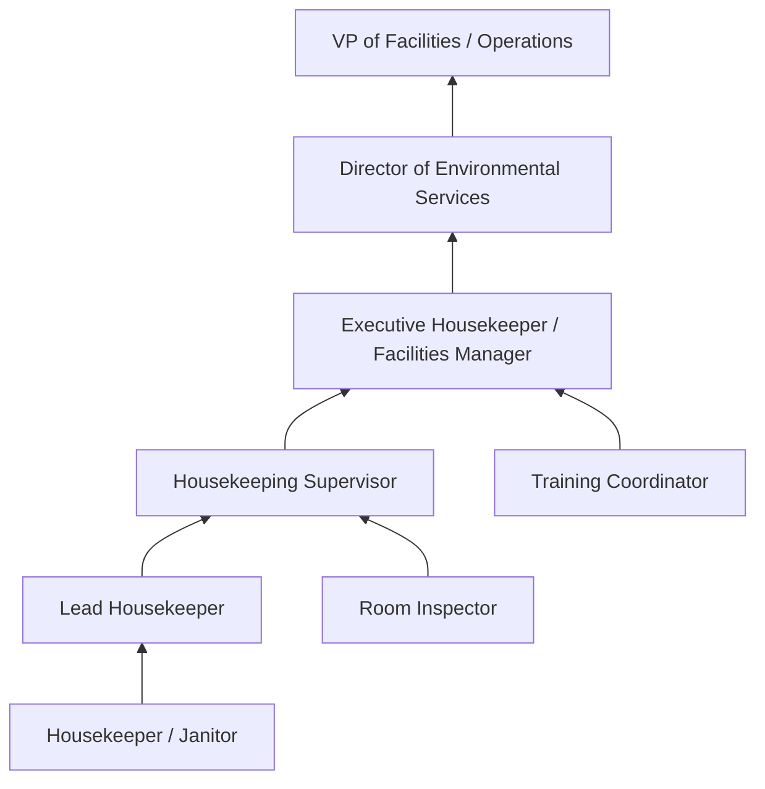
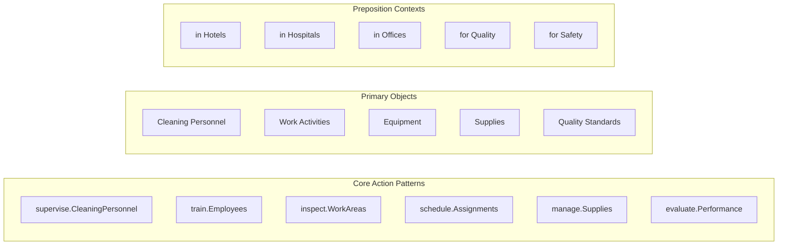

# First-Line Supervisors of Housekeeping and Janitorial Workers

> Directly supervise and coordinate work activities of cleaning personnel in hotels, hospitals, offices, and other establishments.

## Overview

First-Line Supervisors of Housekeeping and Janitorial Workers are essential leaders in facilities management, responsible for overseeing cleaning staff across diverse settings including hotels, hospitals, schools, office buildings, and residential facilities. They coordinate daily cleaning operations, train and evaluate staff, manage supplies and equipment, inspect work quality, and ensure compliance with health and safety standards. These supervisors serve as the critical link between management goals and frontline execution, balancing workforce scheduling with service quality expectations.

## Classification Hierarchy

## Key Statistics

| Metric | Value |
|--------|-------|
| SOC Code | 37-1011.00 |
| Job Zone | 2 (Some Preparation) |
| Category | [Building and Grounds](/occupations/Facilities) |
| Core Tasks | 12+ |
| Source | O*NET |

## Core Tasks

### supervise.CleaningPersonnel

Housekeeping Supervisors directly oversee the daily activities of cleaning staff to ensure quality and productivity standards are met.

**Actions:**
- `supervise.CleaningPersonnel.in.Hotels` - Oversee hotel housekeeping staff operations
- `supervise.CleaningPersonnel.in.Hospitals` - Manage healthcare facility cleaning teams
- `supervise.CleaningPersonnel.in.Offices` - Direct commercial building janitorial staff
- `supervise.WorkActivities.to.ensure.QualityStandards` - Monitor work to maintain cleanliness standards

### train.Employees

Housekeeping Supervisors develop staff capabilities through comprehensive training programs.

**Actions:**
- `train.Employees.on.CleaningProcedures` - Instruct staff in proper cleaning techniques
- `train.Employees.on.SafetyProtocols` - Educate workers on workplace safety requirements
- `train.Employees.on.EquipmentOperation` - Demonstrate proper use of cleaning equipment
- `train.Employees.on.ChemicalHandling` - Ensure safe handling of cleaning agents

### inspect.WorkAreas

Housekeeping Supervisors conduct regular inspections to verify quality standards and identify issues.

**Actions:**
- `inspect.WorkAreas.to.verify.Cleanliness` - Check completed work meets standards
- `inspect.WorkAreas.to.identify.MaintenanceIssues` - Spot repair needs during rounds
- `inspect.Equipment.to.ensure.ProperFunctioning` - Verify equipment is operational
- `inspect.Supplies.to.manage.Inventory` - Monitor supply levels for restocking

### schedule.WorkAssignments

Housekeeping Supervisors create efficient schedules that balance coverage needs with staff availability.

**Actions:**
- `schedule.WorkAssignments.for.Staff` - Assign cleaning areas and responsibilities
- `schedule.Shifts.to.ensure.Coverage` - Plan staffing to meet operational needs
- `schedule.SpecialProjects.for.DeepCleaning` - Coordinate periodic intensive cleaning
- `schedule.Training.for.NewHires` - Plan onboarding activities for new staff

### manage.Supplies

Housekeeping Supervisors ensure adequate supplies and functional equipment are available.

**Actions:**
- `manage.Supplies.to.maintain.Inventory` - Keep cleaning supplies stocked
- `manage.Equipment.to.ensure.Availability` - Maintain functional equipment pool
- `manage.Budget.for.Supplies` - Control purchasing within budget constraints
- `manage.Vendors.for.SupplyDelivery` - Coordinate with suppliers for timely delivery

### evaluate.Performance

Housekeeping Supervisors assess employee work quality and provide feedback for improvement.

**Actions:**
- `evaluate.Performance.of.Employees` - Conduct regular performance assessments
- `evaluate.Quality.of.CompletedWork` - Review cleaning results against standards
- `evaluate.Processes.for.Efficiency` - Identify workflow improvement opportunities
- `evaluate.Complaints.to.resolve.Issues` - Address customer or management concerns

## Skills & Competencies

### Technical Skills
- **Cleaning Techniques** - Expert knowledge of commercial cleaning methods
- **Equipment Operation** - Proficiency with industrial cleaning equipment
- **Chemical Safety** - Understanding of MSDS and safe chemical handling
- **Quality Control** - Inspection and quality assurance methods
- **Inventory Management** - Supply tracking and ordering systems

### Soft Skills
- **Leadership** - Critical for team motivation and direction
- **Communication** - Essential for staff coordination and management liaison
- **Problem Solving** - Important for handling daily operational challenges
- **Time Management** - Essential for scheduling and prioritization
- **Conflict Resolution** - Necessary for staff and customer issue resolution

## Related Occupations

## Industries

- [Accommodation](/industries/Accommodation) - Highest Employment (hotels, resorts, motels)
- [Healthcare](/industries/Healthcare) - High Employment (hospitals, nursing homes, clinics)
- [Educational Services](/industries/Education) - High Employment (schools, universities)
- [Real Estate](/industries/RealEstate) - Moderate Employment (property management)
- [Government](/industries/Government) - Moderate Employment (public buildings)
- [Manufacturing](/industries/Manufacturing) - Growing Employment (industrial facilities)

## Industry Variations

### Hospitality Focus
- Rapid room turnover for guest check-in
- High aesthetic standards and attention to detail
- Guest service orientation and complaint handling
- Coordination with front desk and maintenance

### Healthcare Focus
- Strict infection control protocols
- Joint Commission and regulatory compliance
- Terminal cleaning and isolation room procedures
- Coordination with nursing staff

### Commercial Focus
- After-hours cleaning schedules
- Minimal disruption to tenants
- Green cleaning and sustainability initiatives
- Multi-tenant coordination

## Career Progression

## Education & Training

| Requirement | Details |
|-------------|---------|
| Typical Education | High school diploma or equivalent |
| Work Experience | 1-3 years in housekeeping or janitorial work |
| On-the-Job Training | Short-term (1-3 months) supervisory training |
| Common Certifications | CMI Certified Executive Housekeeper (CEH), ISSA Cleaning Management Professional |

## Departments

This occupation typically works in:
- [Environmental Services](/departments/EnvironmentalServices)
- [Housekeeping](/departments/Housekeeping)
- [Facilities Management](/departments/FacilitiesManagement)
- [Operations](/departments/Operations)

## GraphDL Semantic Structure

## Key Performance Indicators

| KPI | Description |
|-----|-------------|
| Cleanliness Scores | Inspection ratings and audit results |
| Staff Turnover | Employee retention rate |
| Guest/Tenant Satisfaction | Feedback scores related to cleanliness |
| Budget Compliance | Staying within supply and labor budgets |
| Safety Incidents | Workplace injury frequency |
| Room/Area Turnover Time | Speed of cleaning completion |

---

*Source: O*NET 37-1011.00 - ONETOccupation*
