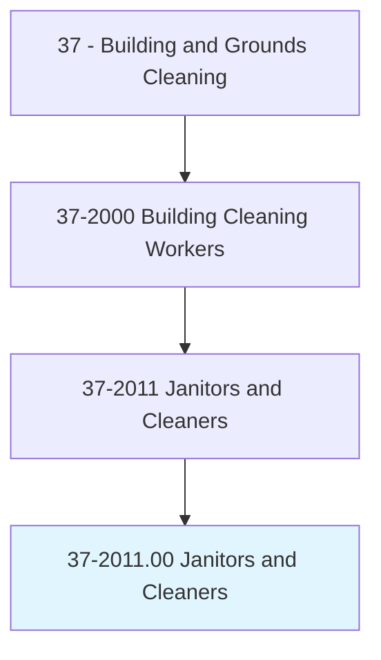
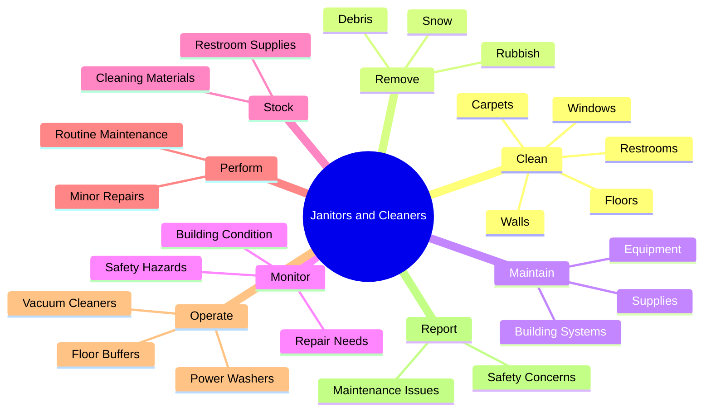
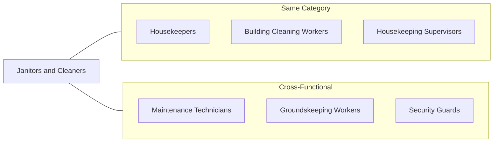
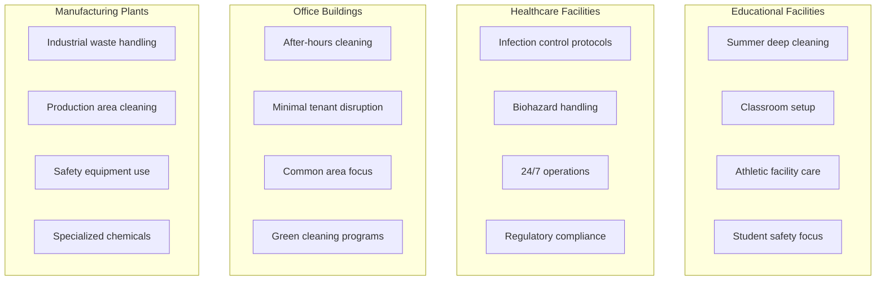
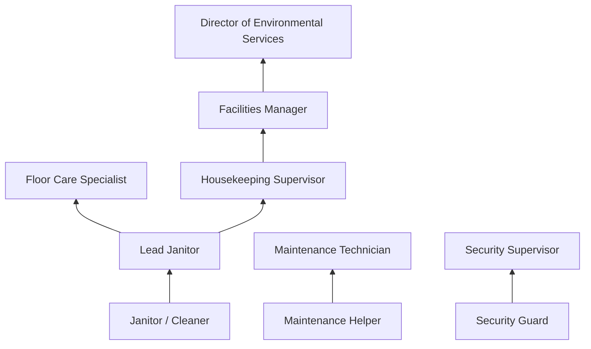
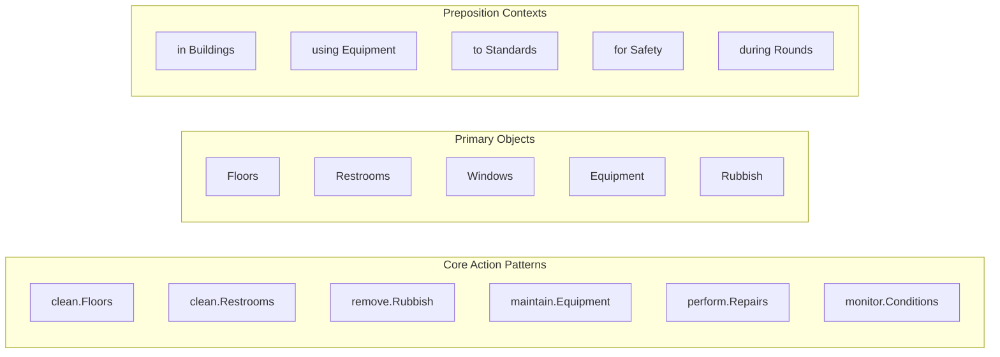
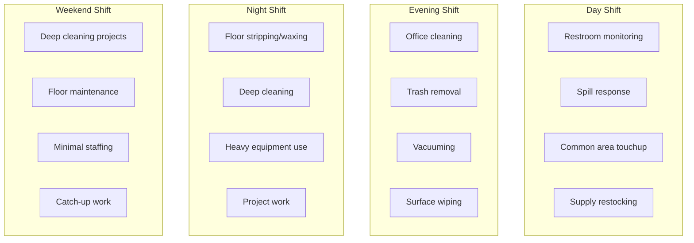

# Janitors and Cleaners, Except Maids and Housekeeping Cleaners

> Keep buildings in clean and orderly condition. Perform heavy cleaning duties, such as cleaning floors, shampooing rugs, washing walls and glass, and removing rubbish. Duties may include tending furnace and boiler, performing routine maintenance activities, notifying management of need for repairs, and cleaning snow or debris from sidewalk.

## Overview

Janitors and Cleaners are essential workers who maintain the cleanliness, safety, and functionality of buildings across all sectors of the economy. Unlike housekeeping staff who focus on light cleaning in hospitality and residential settings, janitors typically work in commercial, industrial, institutional, and public buildings performing heavier cleaning duties. They handle floor care, waste removal, restroom sanitation, and often perform basic maintenance tasks. This occupation represents one of the largest employment categories in the facilities sector, with workers found in virtually every type of building from offices and schools to factories and hospitals.

## Classification Hierarchy

## Key Statistics

| Metric | Value |
|--------|-------|
| SOC Code | 37-2011.00 |
| Job Zone | 1 (Little or No Preparation) |
| Category | [Building and Grounds](/occupations/Facilities/index) |
| Core Tasks | 10+ |
| Source | O*NET |

## Core Tasks

### clean.Floors

Janitors maintain floor surfaces throughout buildings using appropriate methods for each flooring type.

**Actions:**
- `clean.Floors.using.Mops` - Mop hard surface floors to remove dirt and stains
- `clean.Floors.using.Buffers` - Machine polish hard floors for shine and protection
- `clean.Carpets.using.Vacuums` - Vacuum carpeted areas daily
- `clean.Carpets.using.Shampooers` - Deep clean carpets periodically
- `clean.Floors.using.Strippers` - Strip and refinish floor surfaces

### clean.Restrooms

Janitors maintain restroom facilities to sanitary standards throughout operating hours.

**Actions:**
- `clean.Restrooms.to.maintain.Sanitation` - Sanitize toilets, sinks, and fixtures
- `clean.Restrooms.to.prevent.Odors` - Deodorize and maintain freshness
- `stock.Restrooms.with.Supplies` - Replenish paper products and soap
- `clean.Mirrors.to.maintain.Appearance` - Clean mirrors and chrome fixtures

### clean.Windows

Janitors clean glass surfaces both interior and exterior to maintain building appearance.

**Actions:**
- `clean.Windows.using.Squeegees` - Clean interior glass surfaces
- `clean.Windows.using.WashingSolutions` - Apply appropriate cleaning agents
- `clean.Glass.to.maintain.Visibility` - Ensure clear, streak-free glass
- `clean.Partitions.in.Offices` - Clean glass partitions and dividers

### remove.Rubbish

Janitors collect and dispose of waste materials from throughout the building.

**Actions:**
- `remove.Rubbish.from.Offices` - Empty trash receptacles in work areas
- `remove.Rubbish.from.CommonAreas` - Clear waste from hallways and lobbies
- `remove.Rubbish.to.Dumpsters` - Transport waste to disposal areas
- `remove.RecyclableMaterials.to.RecyclingAreas` - Sort and dispose of recyclables

### maintain.Equipment

Janitors care for cleaning equipment to ensure reliable operation.

**Actions:**
- `maintain.Equipment.to.ensure.Operation` - Keep cleaning machines functional
- `maintain.Supplies.to.ensure.Availability` - Monitor and restock cleaning supplies
- `maintain.Tools.in.WorkingCondition` - Care for mops, brooms, and hand tools
- `report.EquipmentProblems.to.Supervisors` - Alert management to equipment issues

### perform.MinorRepairs

Janitors often handle basic maintenance tasks to keep buildings functional.

**Actions:**
- `perform.MinorRepairs.on.Fixtures` - Replace light bulbs, tighten hardware
- `perform.MinorRepairs.on.Plumbing` - Unclog drains, adjust fixtures
- `perform.MinorRepairs.on.Doors` - Adjust hinges, replace hardware
- `report.MajorRepairs.to.Maintenance` - Escalate significant repair needs

### monitor.BuildingCondition

Janitors observe building conditions during their rounds and report issues.

**Actions:**
- `monitor.BuildingCondition.for.SafetyHazards` - Identify potential dangers
- `monitor.BuildingCondition.for.RepairNeeds` - Spot maintenance requirements
- `monitor.Security.during.Rounds` - Note security concerns during work
- `report.Issues.to.Management` - Communicate findings to supervisors

### operate.CleaningEquipment

Janitors use various powered and manual equipment to accomplish cleaning tasks.

**Actions:**
- `operate.FloorBuffers.for.HardFloors` - Use buffing machines for floor care
- `operate.VacuumCleaners.for.Carpets` - Run vacuums for carpet maintenance
- `operate.PressureWashers.for.Exteriors` - Clean outdoor surfaces
- `operate.CarpetExtractors.for.DeepCleaning` - Use extraction equipment for carpet care

## Skills & Competencies

### Technical Skills
- **Floor Care** - Mopping, buffing, stripping, waxing techniques
- **Equipment Operation** - Buffers, vacuums, extractors, pressure washers
- **Chemical Safety** - Safe handling and mixing of cleaning agents
- **Basic Maintenance** - Minor repair and troubleshooting abilities
- **Waste Management** - Proper waste handling and recycling procedures

### Soft Skills
- **Reliability** - Critical for consistent attendance and performance
- **Attention to Detail** - Essential for thorough cleaning
- **Physical Stamina** - Standing, walking, lifting throughout shifts
- **Time Management** - Important for completing assigned areas
- **Independence** - Ability to work without constant supervision

## Related Occupations

## Industries

- [Educational Services](/industries/Education) - Highest Employment (schools, colleges)
- [Healthcare](/industries/Healthcare/index) - High Employment (hospitals, clinics)
- [Real Estate](/industries/RealEstate/index) - High Employment (commercial buildings)
- [Manufacturing](/industries/Manufacturing/index) - High Employment (factories, plants)
- [Government](/industries/PublicAdministration) - High Employment (public buildings)
- [Retail Trade](/industries/Retail/index) - Moderate Employment (stores, malls)

## Industry Variations

### Educational Facilities Focus
- Intensive summer cleaning and floor refinishing
- Classroom turnover and preparation
- Gymnasium and cafeteria maintenance
- Child safety considerations in cleaning products

### Healthcare Facilities Focus
- Strict infection prevention protocols
- Terminal cleaning of patient rooms
- Biohazardous waste handling certification
- Compliance with Joint Commission standards

### Commercial Buildings Focus
- Evening and night shift operations
- Minimal disruption to business activities
- High-traffic common area maintenance
- Green cleaning and LEED compliance

### Industrial Facilities Focus
- Handling industrial debris and waste
- Cleaning around production equipment
- Personal protective equipment requirements
- Specialized cleaning for manufacturing environments

## Career Progression

## Education & Training

| Requirement | Details |
|-------------|---------|
| Typical Education | No formal education requirement; high school diploma preferred |
| Work Experience | None required for entry-level positions |
| On-the-Job Training | Short-term (up to 1 month) |
| Common Certifications | OSHA Safety, Bloodborne Pathogens (healthcare), Floor Care Certification |

## Departments

This occupation typically works in:
- Environmental Services
- Custodial Services
- Facilities Management
- Building Operations

## GraphDL Semantic Structure

## Work Schedule Variations

## Physical Requirements

| Requirement | Level |
|-------------|-------|
| Standing/Walking | Continuous (6-8 hours) |
| Lifting | Frequent (up to 50 lbs) |
| Bending/Stooping | Frequent |
| Climbing | Occasional (ladders) |
| Pushing/Pulling | Frequent (equipment, carts) |

## Key Performance Indicators

| KPI | Description |
|-----|-------------|
| Area Coverage | Square footage cleaned per shift |
| Quality Scores | Inspection ratings from supervisors |
| Attendance | Reliability and punctuality |
| Complaint Rate | Occupant complaints per period |
| Supply Usage | Efficient use of cleaning materials |
| Safety Record | Incident-free work days |

---

*Source: O*NET 37-2011.00 - ONETOccupation*
