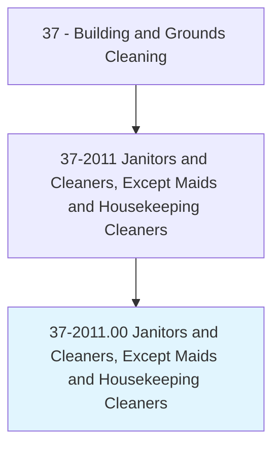
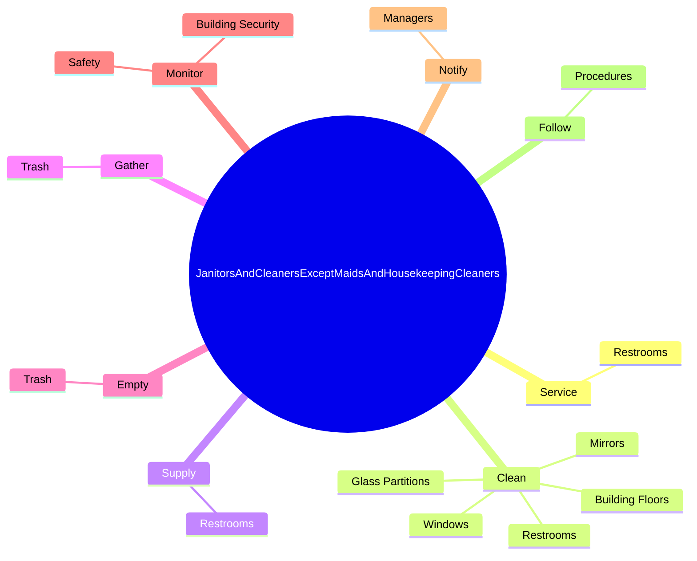
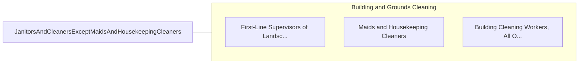

# Janitors and Cleaners, Except Maids and Housekeeping Cleaners

> Keep buildings in clean and orderly condition. Perform heavy cleaning duties, such as cleaning floors, shampooing rugs, washing walls and glass, and removing rubbish. Duties may include tending furnace and boiler, performing routine maintenance activities, notifying management of need for repairs, and cleaning snow or debris from sidewalk.

## Overview

Janitors and Cleaners, Except Maids and Housekeeping Cleaners is an occupation within the Building and Grounds Cleaning category. Keep buildings in clean and orderly condition. Perform heavy cleaning duties, such as cleaning floors, shampooing rugs, washing walls and glass, and removing rubbish.

## Classification Hierarchy

## Key Statistics

| Metric | Value |
|--------|-------|
| SOC Code | 37-2011.00 |
| Category | [Building and Grounds Cleaning](/occupations/Facilities) |
| Task Count | 113 |
| Source | O*NET |

## Core Tasks

### service.Restrooms

Janitors and Cleaners, Except Maids and Housekeeping Cleaners service restrooms as part of their core responsibilities.

**Actions:**
- `service.Restrooms`

### clean.Restrooms

Janitors and Cleaners, Except Maids and Housekeeping Cleaners clean restrooms as part of their core responsibilities.

**Actions:**
- `clean.Restrooms`
- `clean.BuildingFloors.by.Sweeping`
- `clean.BuildingFloors.by.Mopping`
- `clean.BuildingFloors.by.Scrubbing`

### supply.Restrooms

Janitors and Cleaners, Except Maids and Housekeeping Cleaners supply restrooms as part of their core responsibilities.

**Actions:**
- `supply.Restrooms`

## Skills & Competencies

### Technical Skills
- **Facilities Maintenance** - Advanced
- **Equipment Operation** - Advanced
- **Safety Procedures** - Advanced

### Soft Skills
- **Communication** - Essential
- **Problem Solving** - Essential
- **Critical Thinking** - Important
- **Teamwork** - Important
- **Adaptability** - Important

## Related Occupations

## Industries

This occupation is found across multiple industries. See [Industries](/industries) for sector-specific employment data.

## Career Progression

---

*Source: O*NET 37-2011.00 - ONETOccupation*
