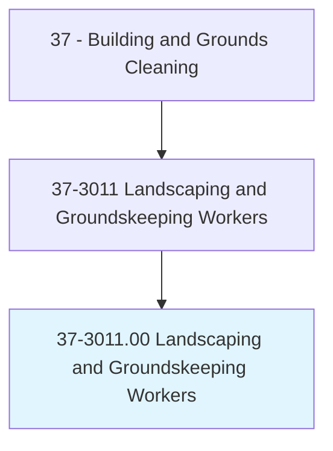
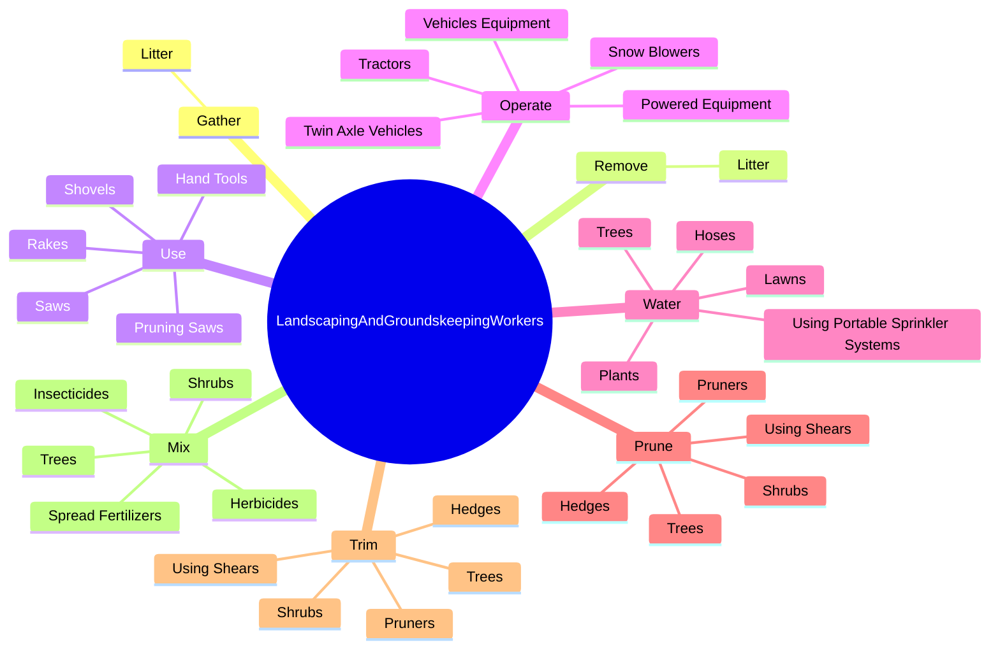

# Landscaping and Groundskeeping Workers

> Landscape or maintain grounds of property using hand or power tools or equipment. Workers typically perform a variety of tasks, which may include any combination of the following: sod laying, mowing, trimming, planting, watering, fertilizing, digging, raking, sprinkler installation, and installation of mortarless segmental concrete masonry wall units.

## Overview

Landscaping and Groundskeeping Workers is an occupation within the Building and Grounds Cleaning category. Landscape or maintain grounds of property using hand or power tools or equipment. 

## Classification Hierarchy

## Key Statistics

| Metric | Value |
|--------|-------|
| SOC Code | 37-3011.00 |
| Category | [Building and Grounds Cleaning](/occupations/Facilities) |
| Task Count | 141 |
| Source | O*NET |

## Core Tasks

### gather.Litter

Landscaping and Groundskeeping Workers gather litter as part of their core responsibilities.

**Actions:**
- `gather.Litter`

### remove.Litter

Landscaping and Groundskeeping Workers remove litter as part of their core responsibilities.

**Actions:**
- `remove.Litter`

### use.HandTools

Landscaping and Groundskeeping Workers use hand tools as part of their core responsibilities.

**Actions:**
- `use.HandTools`
- `use.Shovels`
- `use.Rakes`
- `use.PruningSaws`

## Skills & Competencies

### Technical Skills
- **Facilities Maintenance** - Advanced
- **Equipment Operation** - Advanced
- **Safety Procedures** - Advanced

### Soft Skills
- **Communication** - Essential
- **Problem Solving** - Essential
- **Critical Thinking** - Important
- **Teamwork** - Important
- **Adaptability** - Important

## Related Occupations

## Industries

This occupation is found across multiple industries. See [Industries](/industries) for sector-specific employment data.

## Career Progression

---

*Source: O*NET 37-3011.00 - ONETOccupation*
