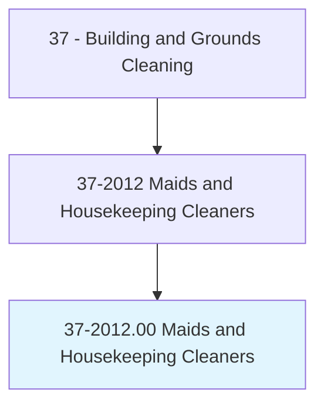
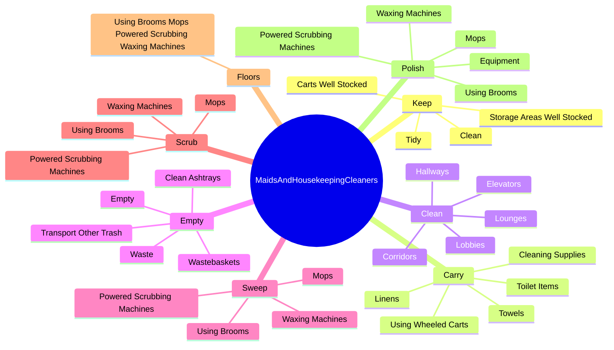
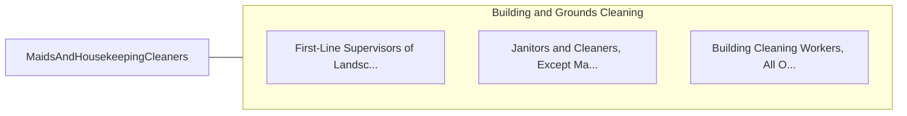

# Maids and Housekeeping Cleaners

> Perform any combination of light cleaning duties to maintain private households or commercial establishments, such as hotels and hospitals, in a clean and orderly manner. Duties may include making beds, replenishing linens, cleaning rooms and halls, and vacuuming.

## Overview

Maids and Housekeeping Cleaners is an occupation within the Building and Grounds Cleaning category. Perform any combination of light cleaning duties to maintain private households or commercial establishments, such as hotels and hospitals, in a clean and orderly manner. 

## Classification Hierarchy

## Key Statistics

| Metric | Value |
|--------|-------|
| SOC Code | 37-2012.00 |
| Category | [Building and Grounds Cleaning](/occupations/Facilities) |
| Task Count | 85 |
| Source | O*NET |

## Core Tasks

### keep.StorageAreasWellStocked

Maids and Housekeeping Cleaners keep storage areas well stocked as part of their core responsibilities.

**Actions:**
- `keep.StorageAreasWellStocked`
- `keep.CartsWellStocked`
- `keep.Clean`
- `keep.Tidy`

### carry.Linens

Maids and Housekeeping Cleaners carry linens as part of their core responsibilities.

**Actions:**
- `carry.Linens`
- `carry.Towels`
- `carry.ToiletItems`
- `carry.CleaningSupplies`

### clean.Hallways

Maids and Housekeeping Cleaners clean hallways as part of their core responsibilities.

**Actions:**
- `clean.Hallways`
- `clean.Lobbies`
- `clean.Lounges`
- `clean.Corridors`

## Skills & Competencies

### Technical Skills
- **Facilities Maintenance** - Advanced
- **Equipment Operation** - Advanced
- **Safety Procedures** - Advanced

### Soft Skills
- **Communication** - Essential
- **Problem Solving** - Essential
- **Critical Thinking** - Important
- **Teamwork** - Important
- **Adaptability** - Important

## Related Occupations

## Industries

This occupation is found across multiple industries. See [Industries](/industries) for sector-specific employment data.

## Career Progression

---

*Source: O*NET 37-2012.00 - ONETOccupation*
