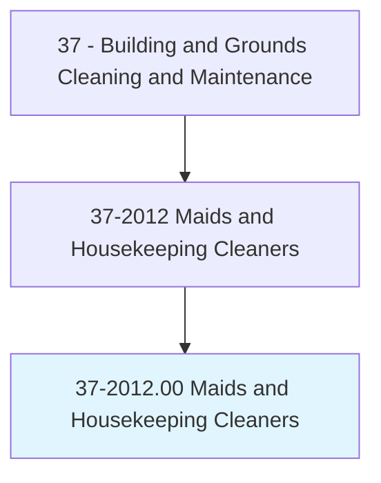
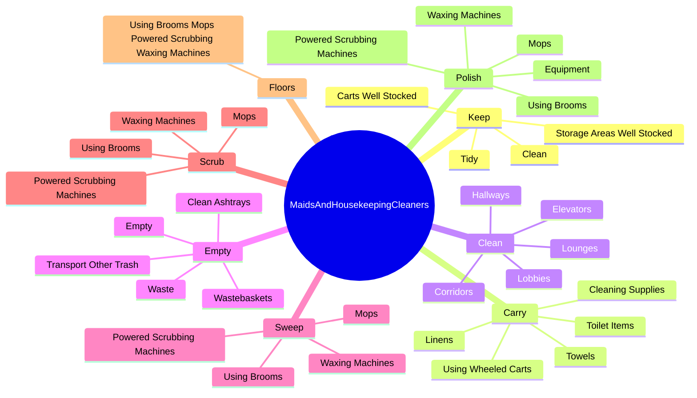
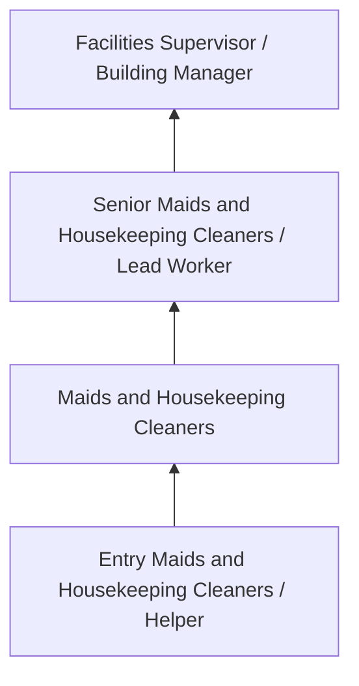
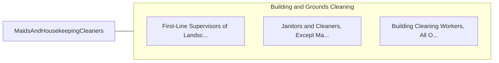

# Maids and Housekeeping Cleaners

> Perform any combination of light cleaning duties to maintain private households or commercial establishments, such as hotels and hospitals, in a clean and orderly manner. Duties may include making beds, replenishing linens, cleaning rooms and halls, and vacuuming.

## Overview

Maids and Housekeeping Cleaners professionals perform any combination of light cleaning duties to maintain private households or commercial establishments, such as hotels and hospitals, in a clean and orderly manner. This occupation falls within the Building and Grounds Cleaning and Maintenance category and requires a combination of specialized knowledge, technical skills, and practical experience.

These professionals work across diverse settings and organizational contexts, applying their expertise to meet the demands of their field. They must stay current with industry standards, emerging practices, and regulatory requirements that affect their work. The role demands both independent judgment and collaborative skills, as practitioners regularly interact with colleagues, stakeholders, and the public.

As the field continues to evolve, Maids and Housekeeping Cleaners professionals increasingly leverage technology and data-driven approaches to enhance their effectiveness. Career opportunities span the public and private sectors, with demand influenced by economic conditions, demographic shifts, and technological advancement.

## Classification Hierarchy



## Key Statistics

| Metric | Value |
|--------|-------|
| SOC Code | 37-2012.00 |
| Job Zone | N/A |
| Category | [Building and Grounds Cleaning and Maintenance](/occupations/Facilities/index) |
| Core Tasks | N/A+ |
| Salary Range | $26,000 - $55,000 |
| Median Salary | $35,000 |
| Growth Outlook | 4% (As fast as average) |
| Source | O*NET |

## Core Tasks



### keep.StorageAreasWellStocked

Maids and Housekeeping Cleaners keep storage areas well stocked as part of their core responsibilities.

**Actions:**
- `keep.StorageAreasWellStocked`
- `keep.CartsWellStocked`
- `keep.Clean`
- `keep.Tidy`

### carry.Linens

Maids and Housekeeping Cleaners carry linens as part of their core responsibilities.

**Actions:**
- `carry.Linens`
- `carry.Towels`
- `carry.ToiletItems`
- `carry.CleaningSupplies`

### clean.Hallways

Maids and Housekeeping Cleaners clean hallways as part of their core responsibilities.

**Actions:**
- `clean.Hallways`
- `clean.Lobbies`
- `clean.Lounges`
- `clean.Corridors`

### Technical Skills
- **Facilities Maintenance** - Advanced
- **Equipment Operation** - Advanced
- **Safety Procedures** - Advanced

### Soft Skills
- **Communication** - Essential
- **Problem Solving** - Essential
- **Critical Thinking** - Important
- **Teamwork** - Important
- **Adaptability** - Important


## Skills & Competencies

### Technical Skills
- **Cleaning Techniques** - Advanced
- **Equipment Operation** - Proficient
- **Chemical Safety** - Proficient
- **Maintenance Procedures** - Proficient
- **Safety Compliance** - Proficient
- **Grounds Maintenance** - Proficient

### Soft Skills
- **Reliability** - Critical
- **Physical Stamina** - Critical
- **Attention to Detail** - Essential
- **Time Management** - Essential
- **Teamwork** - Important

## Education & Certifications

| Requirement | Details |
|-------------|---------|
| Typical Education | High school diploma or equivalent |
| Work Experience | 0-1 years experience |
| On-the-Job Training | Short-term on-the-job training |
| Certifications | OSHA safety certifications, green cleaning certifications |

## Career Progression



## Industry Variations

### Commercial Office Buildings
Maintenance and cleaning of professional office spaces. Maids and Housekeeping Cleaners professionals ensure clean, safe work environments.

### Healthcare Facilities
Specialized cleaning and maintenance meeting stringent infection control standards.

### Educational Institutions
School and university facility maintenance. Focus on safety, cleanliness, and support for educational activities.

### Industrial and Manufacturing
Facility maintenance in production environments with specialized cleaning and safety requirements.

## Technology & Tools

- **Building automation systems**
- **Floor care equipment**
- **HVAC monitoring systems**
- **Cleaning chemical dispensing systems**
- **Work order management software**

## Related Occupations



## Industries

- Services to Buildings and Dwellings - High Employment
- [Education](/industries/Education) - Moderate Employment
- [Healthcare](/industries/Healthcare/index) - Moderate Employment
- [Government](/industries/PublicAdministration) - Moderate Employment

## Departments

This occupation typically works in:
- [Facilities Management](/departments/Operations)
- Building Services
- Grounds Maintenance

## GraphDL Semantic Structure

```graphdl
Maids and Housekeeping Cleaners perform:
- clean.Facilities.using.ProperTechniques
- maintain.Equipment.for.CleaningOperations
- inspect.Areas.for.MaintenanceNeeds
- follow.Procedures.for.SafetyCompliance
- report.Issues.to.FacilitiesManagement
```

---

*Source: O*NET 37-2012.00 - ONETOccupation*
