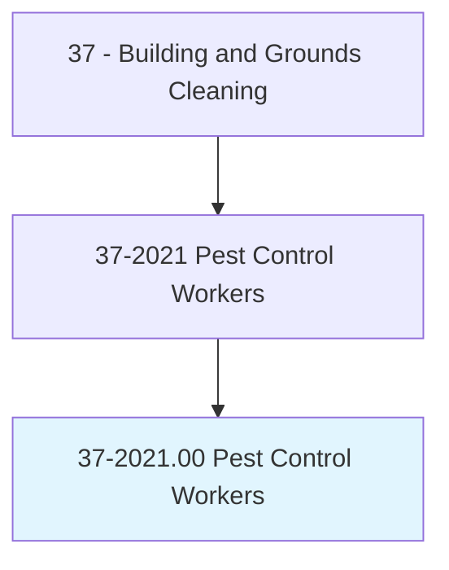
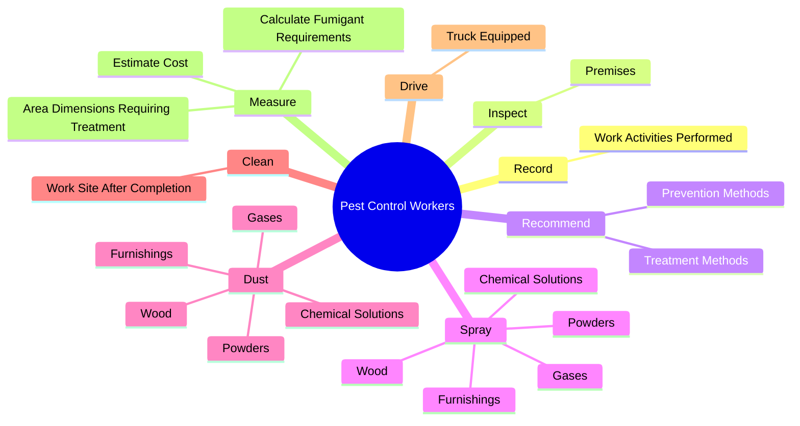
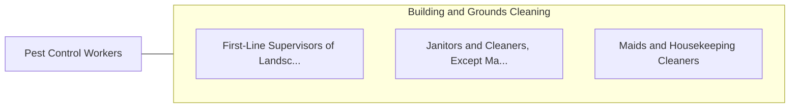

# Pest Control Workers

> Apply or release chemical solutions or toxic gases and set traps to kill or remove pests and vermin that infest buildings and surrounding areas.

## Overview

Pest Control Workers is classified under Building and Grounds Cleaning (SOC 37). Apply or release chemical solutions or toxic gases and set traps to kill or remove pests and vermin that infest buildings and surrounding areas.

## Classification Hierarchy

## Key Statistics

| Metric | Value |
|--------|-------|
| SOC Code | 37-2021.00 |
| Category | [Building and Grounds Cleaning](/occupations/Facilities) |
| Task Count | 69 |
| Source | O*NET |

## Core Tasks

### record.WorkActivitiesPerformed

Pest Control Workers record work activities performed as part of their core responsibilities.

**Actions:**
- `record.WorkActivitiesPerformed`

### inspect.Premises

Pest Control Workers inspect premises as part of their core responsibilities.

**Actions:**
- `inspect.Premises.to.identify.InfestationSourceOfDamageToProperty`
- `inspect.Premises.to.ExtentOfDamageToProperty`
- `inspect.Premises.to.Wall`
- `inspect.Premises.to.RoofPorosity`

### recommend.TreatmentMethods

Pest Control Workers recommend treatment methods as part of their core responsibilities.

**Actions:**
- `recommend.TreatmentMethods.for.PestProblems.to.Clients`
- `recommend.PreventionMethods.for.PestProblems.to.Clients`

## Skills & Competencies

### Technical Skills
- **Facilities Maintenance** - Advanced
- **Equipment Operation** - Advanced
- **Safety Procedures** - Advanced

### Soft Skills
- **Communication** - Essential
- **Problem Solving** - Essential
- **Critical Thinking** - Important
- **Teamwork** - Important
- **Adaptability** - Important

## Related Occupations

## Industries

This occupation is found across multiple industries. See [Industries](/industries) for sector-specific employment data.

## Career Progression

---

*Source: O*NET 37-2021.00 - ONETOccupation*
