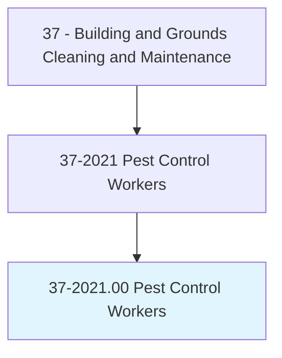
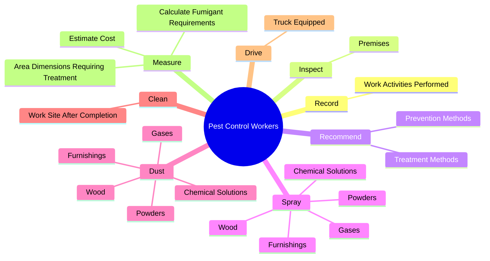
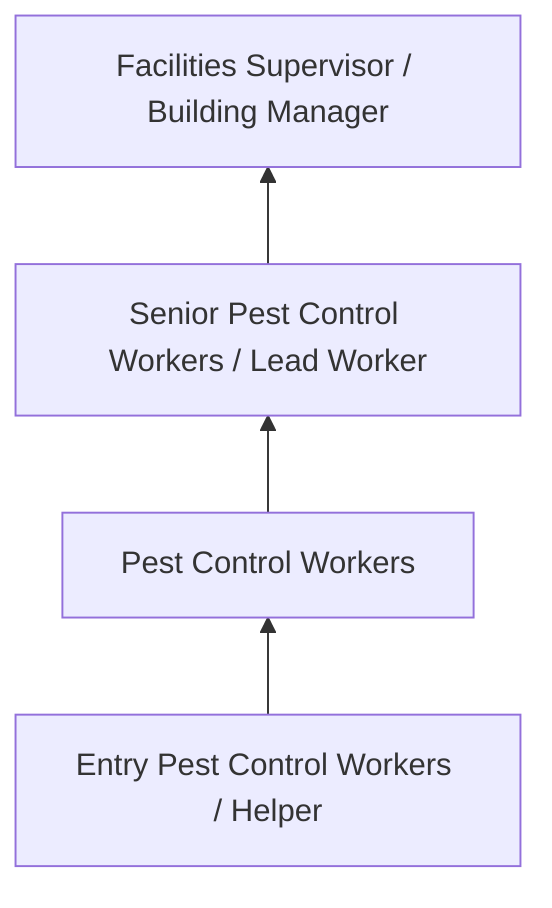
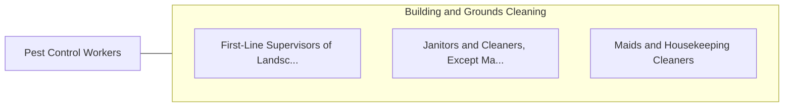

# Pest Control Workers

> Apply or release chemical solutions or toxic gases and set traps to kill or remove pests and vermin that infest buildings and surrounding areas.

## Overview

Pest Control Workers professionals apply or release chemical solutions or toxic gases and set traps to kill or remove pests and vermin that infest buildings and surrounding areas.. This occupation falls within the Building and Grounds Cleaning and Maintenance category and requires a combination of specialized knowledge, technical skills, and practical experience.

These professionals work across diverse settings and organizational contexts, applying their expertise to meet the demands of their field. They must stay current with industry standards, emerging practices, and regulatory requirements that affect their work. The role demands both independent judgment and collaborative skills, as practitioners regularly interact with colleagues, stakeholders, and the public.

As the field continues to evolve, Pest Control Workers professionals increasingly leverage technology and data-driven approaches to enhance their effectiveness. Career opportunities span the public and private sectors, with demand influenced by economic conditions, demographic shifts, and technological advancement.

## Classification Hierarchy



## Key Statistics

| Metric | Value |
|--------|-------|
| SOC Code | 37-2021.00 |
| Job Zone | N/A |
| Category | [Building and Grounds Cleaning and Maintenance](/occupations/Facilities/index) |
| Core Tasks | 69+ |
| Salary Range | $26,000 - $55,000 |
| Median Salary | $35,000 |
| Growth Outlook | 4% (As fast as average) |
| Source | O*NET |

## Core Tasks



### set.MechanicalTraps

Pest Control Workers set mechanical traps as part of their core responsibilities.

**Actions:**
- `set.MechanicalTraps.in.Sewers` - Set mechanical traps, or place poisonous paste or bait in sewers, burrows, or...
- `set.MechanicalTraps.in.Burrows` - Set mechanical traps, or place poisonous paste or bait in sewers, burrows, or...
- `set.MechanicalTraps.in.Ditches` - Set mechanical traps, or place poisonous paste or bait in sewers, burrows, or...
- `set.PlacePoisonousPaste.in.Sewers` - Set mechanical traps, or place poisonous paste or bait in sewers, burrows, or...
- `set.PlacePoisonousPaste.in.Burrows` - Set mechanical traps, or place poisonous paste or bait in sewers, burrows, or...

### spray.ChemicalSolutions

Pest Control Workers spray chemical solutions as part of their core responsibilities.

**Actions:**
- `spray.ChemicalSolutions` - Spray or dust chemical solutions, powders, or gases into rooms, onto clothing...
- `spray.Powders` - Spray or dust chemical solutions, powders, or gases into rooms, onto clothing...
- `spray.Gases.into.Rooms` - Spray or dust chemical solutions, powders, or gases into rooms, onto clothing...
- `spray.Furnishings` - Spray or dust chemical solutions, powders, or gases into rooms, onto clothing...
- `spray.Wood` - Spray or dust chemical solutions, powders, or gases into rooms, onto clothing...

### dust.ChemicalSolutions

Pest Control Workers dust chemical solutions as part of their core responsibilities.

**Actions:**
- `dust.ChemicalSolutions` - Spray or dust chemical solutions, powders, or gases into rooms, onto clothing...
- `dust.Powders` - Spray or dust chemical solutions, powders, or gases into rooms, onto clothing...
- `dust.Gases.into.Rooms` - Spray or dust chemical solutions, powders, or gases into rooms, onto clothing...
- `dust.Furnishings` - Spray or dust chemical solutions, powders, or gases into rooms, onto clothing...
- `dust.Wood` - Spray or dust chemical solutions, powders, or gases into rooms, onto clothing...

### clean.WorkSiteAfterCompletion

Pest Control Workers clean work site after completion as part of their core responsibilities.

**Actions:**
- `clean.WorkSiteAfterCompletion.of.Job` - Clean work site after completion of job.
- `clean.Blockages.from.InfestedAreas.to.facilitate.SprayingProcedures` - Clean and remove blockages from infested areas to facilitate spraying procedu...
- `clean.Blockages.from.ProvideDrainage` - Clean and remove blockages from infested areas to facilitate spraying procedu...
- `clean.Blockages.from.UsingBrooms` - Clean and remove blockages from infested areas to facilitate spraying procedu...
- `clean.Blockages.from.Mops` - Clean and remove blockages from infested areas to facilitate spraying procedu...


## Skills & Competencies

### Technical Skills
- **Cleaning Techniques** - Advanced
- **Equipment Operation** - Proficient
- **Chemical Safety** - Proficient
- **Maintenance Procedures** - Proficient
- **Safety Compliance** - Proficient
- **Grounds Maintenance** - Proficient

### Soft Skills
- **Reliability** - Critical
- **Physical Stamina** - Critical
- **Attention to Detail** - Essential
- **Time Management** - Essential
- **Teamwork** - Important

## Education & Certifications

| Requirement | Details |
|-------------|---------|
| Typical Education | High school diploma or equivalent |
| Work Experience | 0-1 years experience |
| On-the-Job Training | Short-term on-the-job training |
| Certifications | OSHA safety certifications, green cleaning certifications |

## Career Progression



## Industry Variations

### Commercial Office Buildings
Maintenance and cleaning of professional office spaces. Pest Control Workers professionals ensure clean, safe work environments.

### Healthcare Facilities
Specialized cleaning and maintenance meeting stringent infection control standards.

### Educational Institutions
School and university facility maintenance. Focus on safety, cleanliness, and support for educational activities.

### Industrial and Manufacturing
Facility maintenance in production environments with specialized cleaning and safety requirements.

## Technology & Tools

- **Building automation systems**
- **Floor care equipment**
- **HVAC monitoring systems**
- **Cleaning chemical dispensing systems**
- **Work order management software**

## Related Occupations



## Industries

- [Services to Buildings and Dwellings](/industries/BuildingServices) - High Employment
- [Education](/industries/Education) - Moderate Employment
- [Healthcare](/industries/Healthcare/index) - Moderate Employment
- [Government](/industries/Government) - Moderate Employment

## Departments

This occupation typically works in:
- [Facilities Management](/departments/Facilities)
- [Building Services](/departments/BuildingServices)
- [Grounds Maintenance](/departments/GroundsMaintenance)

## GraphDL Semantic Structure

```
Pest Control Workers perform:
- record.WorkActivitiesPerformed
- inspect.Premises.to.identify.InfestationSourceOfDamageToProperty
- inspect.Premises.to.ExtentOfDamageToProperty
- inspect.Premises.to.Wall
- inspect.Premises.to.RoofPorosity
- inspect.Premises.to.access.ToInfestedLocations
```

---

*Source: O*NET 37-2021.00 - ONETOccupation*
