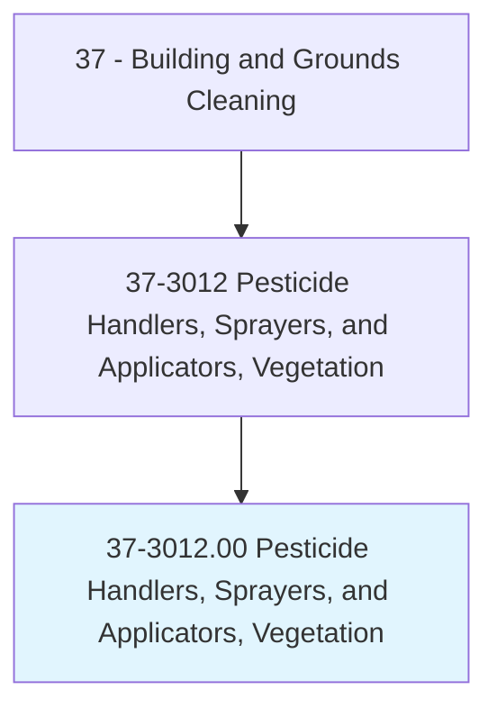
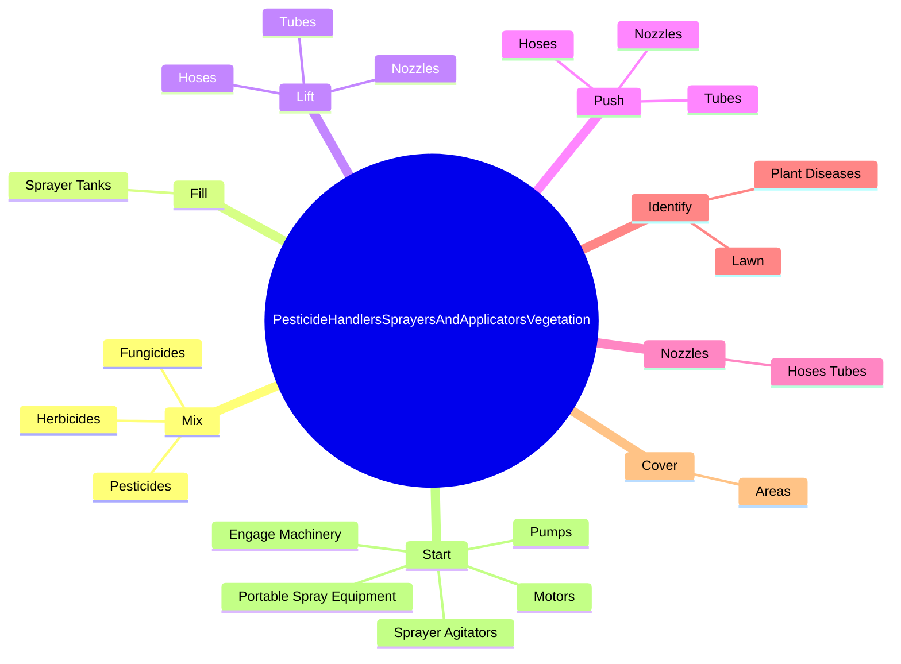
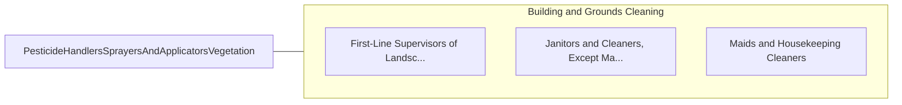

# Pesticide Handlers, Sprayers, and Applicators, Vegetation

> Mix or apply pesticides, herbicides, fungicides, or insecticides through sprays, dusts, vapors, soil incorporation, or chemical application on trees, shrubs, lawns, or crops. Usually requires specific training and state or federal certification.

## Overview

Pesticide Handlers, Sprayers, and Applicators, Vegetation is an occupation within the Building and Grounds Cleaning category. Mix or apply pesticides, herbicides, fungicides, or insecticides through sprays, dusts, vapors, soil incorporation, or chemical application on trees, shrubs, lawns, or crops. 

## Classification Hierarchy

## Key Statistics

| Metric | Value |
|--------|-------|
| SOC Code | 37-3012.00 |
| Category | [Building and Grounds Cleaning](/occupations/Facilities) |
| Task Count | 57 |
| Source | O*NET |

## Core Tasks

### mix.Pesticides

Pesticide Handlers, Sprayers, and Applicators, Vegetation mix pesticides as part of their core responsibilities.

**Actions:**
- `mix.Pesticides.for.Application.to.Trees`
- `mix.Pesticides.for.Shrubs`
- `mix.Pesticides.for.Lawns`
- `mix.Pesticides.for.BotanicalCrops`

### fill.SprayerTanks

Pesticide Handlers, Sprayers, and Applicators, Vegetation fill sprayer tanks as part of their core responsibilities.

**Actions:**
- `fill.SprayerTanks.with.WaterAccording.to.Formulas`
- `fill.SprayerTanks.with.ChemicalsAccording.to.Formulas`

### lift.Nozzles

Pesticide Handlers, Sprayers, and Applicators, Vegetation lift nozzles as part of their core responsibilities.

**Actions:**
- `lift.Nozzles.to.direct.SprayOverDesignatedAreas`
- `lift.Hoses.to.direct.SprayOverDesignatedAreas`
- `lift.Tubes.to.direct.SprayOverDesignatedAreas`

## Skills & Competencies

### Technical Skills
- **Facilities Maintenance** - Advanced
- **Equipment Operation** - Advanced
- **Safety Procedures** - Advanced

### Soft Skills
- **Communication** - Essential
- **Problem Solving** - Essential
- **Critical Thinking** - Important
- **Teamwork** - Important
- **Adaptability** - Important

## Related Occupations

## Industries

This occupation is found across multiple industries. See [Industries](/industries) for sector-specific employment data.

## Career Progression

---

*Source: O*NET 37-3012.00 - ONETOccupation*
