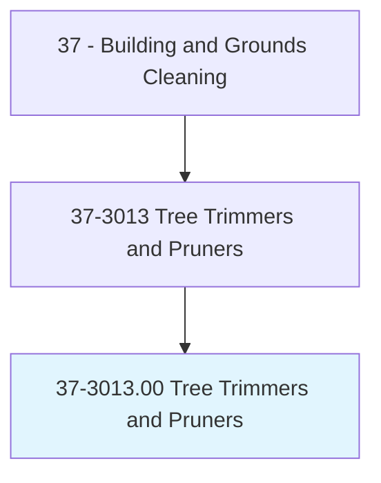
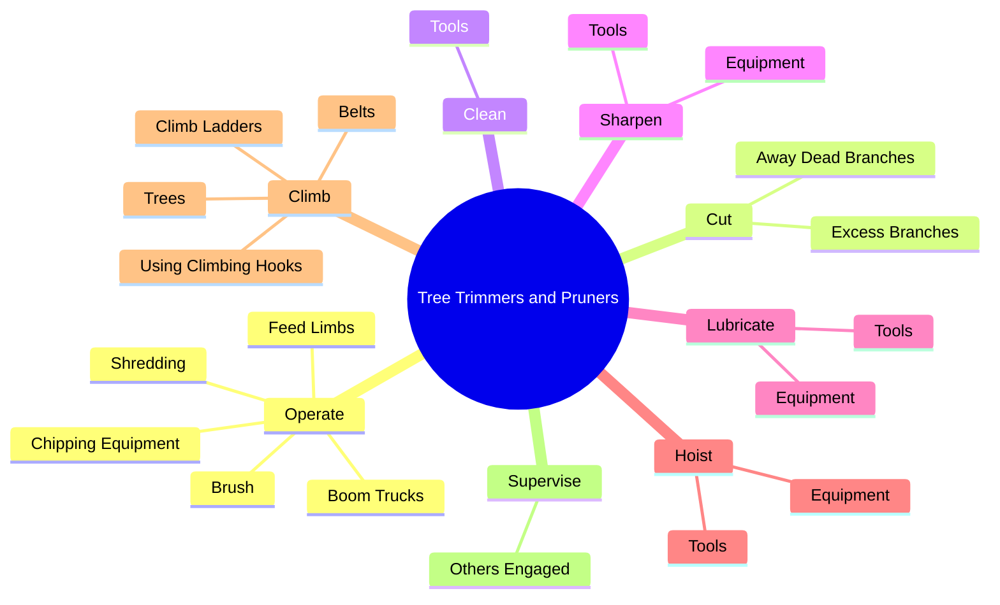
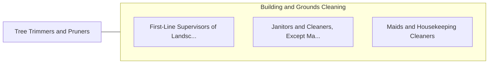

# Tree Trimmers and Pruners

> Using sophisticated climbing and rigging techniques, cut away dead or excess branches from trees or shrubs to maintain right-of-way for roads, sidewalks, or utilities, or to improve appearance, health, and value of tree. Prune or treat trees or shrubs using handsaws, hand pruners, clippers, and power pruners. Works off the ground in the tree canopy and may use truck-mounted lifts.

## Overview

Tree Trimmers and Pruners is an occupation within the Building and Grounds Cleaning category. Using sophisticated climbing and rigging techniques, cut away dead or excess branches from trees or shrubs to maintain right-of-way for roads, sidewalks, or utilities, or to improve appearance, health, and value of tree. Prune or treat trees or shrubs using handsaws, hand pruners, clippers, and power pruners.

## Classification Hierarchy

## Key Statistics

| Metric | Value |
|--------|-------|
| SOC Code | 37-3013.00 |
| Category | [Building and Grounds Cleaning](/occupations/Facilities) |
| Task Count | 132 |
| Source | O*NET |

## Core Tasks

### operate.Shredding

Tree Trimmers and Pruners operate shredding as part of their core responsibilities.

**Actions:**
- `operate.Shredding`
- `operate.ChippingEquipment`
- `operate.FeedLimbs`
- `operate.Brush.into.Machines`

### cut.AwayDeadBranches

Tree Trimmers and Pruners cut away dead branches as part of their core responsibilities.

**Actions:**
- `cut.AwayDeadBranches.from.Trees`
- `cut.AwayDeadBranches.from.ClearBranchesAroundPowerLines`
- `cut.AwayDeadBranches.from.UsingClimbingEquipment`
- `cut.AwayDeadBranches.from.Buckets.of.ExtendedTruckBooms`

### clean.Tools

Tree Trimmers and Pruners clean tools as part of their core responsibilities.

**Actions:**
- `clean.Tools`

## Skills & Competencies

### Technical Skills
- **Facilities Maintenance** - Advanced
- **Equipment Operation** - Advanced
- **Safety Procedures** - Advanced

### Soft Skills
- **Communication** - Essential
- **Problem Solving** - Essential
- **Critical Thinking** - Important
- **Teamwork** - Important
- **Adaptability** - Important

## Related Occupations

## Industries

This occupation is found across multiple industries. See [Industries](/industries) for sector-specific employment data.

## Career Progression

---

*Source: O*NET 37-3013.00 - ONETOccupation*
