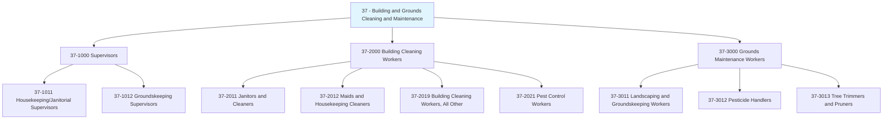
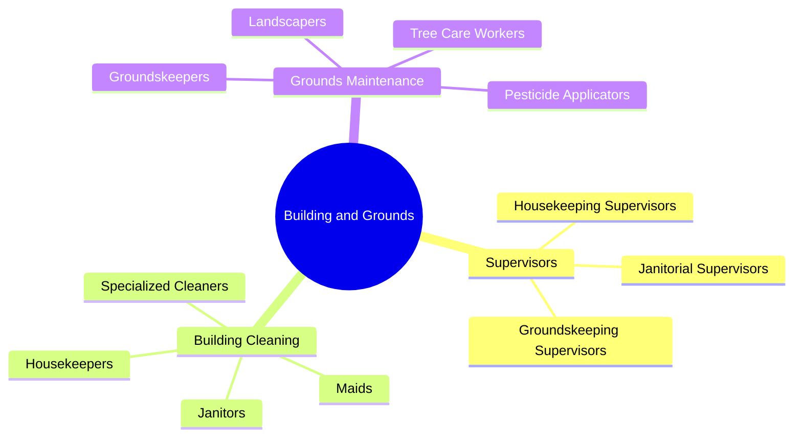
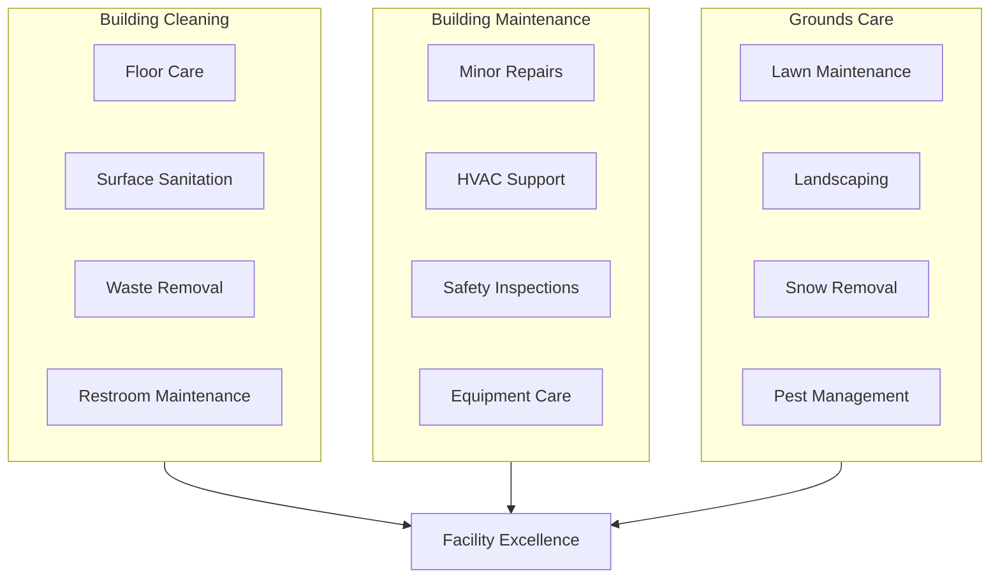
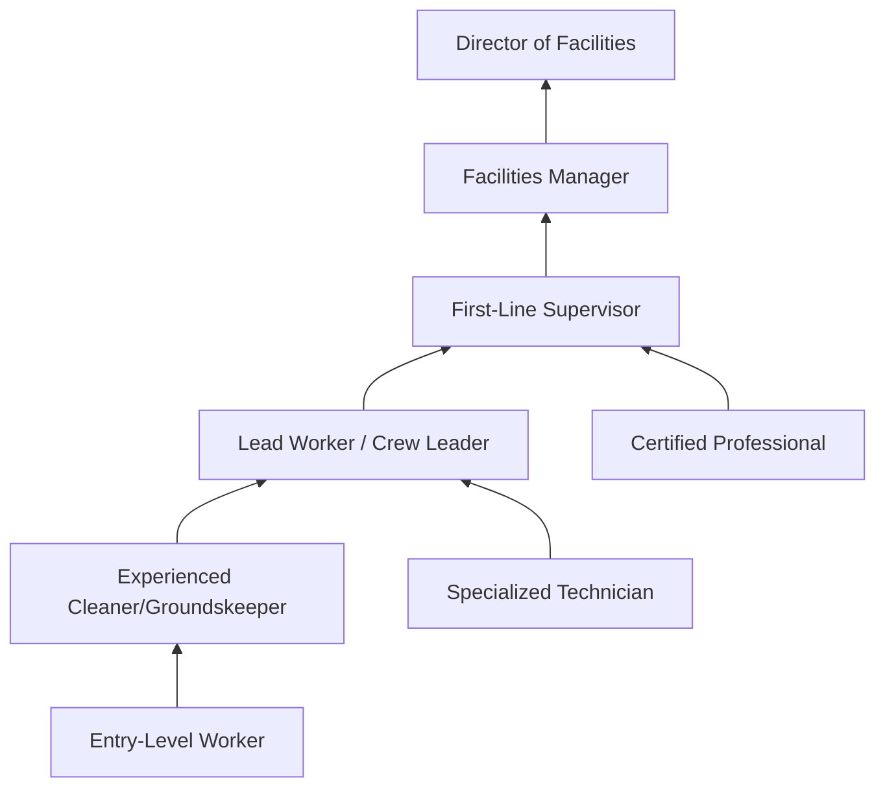

# Building and Grounds Cleaning and Maintenance Occupations

> Category 37 - Occupations involved in keeping buildings, grounds, and associated premises clean, sanitary, and in good condition.

## Overview

Building and Grounds Cleaning and Maintenance Occupations encompass the essential workforce responsible for maintaining the cleanliness, safety, and aesthetic appearance of facilities across all sectors. This category includes supervisory roles who coordinate cleaning and groundskeeping operations, as well as the hands-on workers who perform cleaning, maintenance, and landscaping tasks. These occupations are fundamental to public health, safety, and the professional image of businesses, institutions, and residential properties.

## Classification Hierarchy

## Key Statistics

| Metric | Value |
|--------|-------|
| SOC Category Code | 37 |
| Major Groups | 3 |
| Detailed Occupations | 10+ |
| Source | O*NET / BLS |

## Occupations in this Category

### Supervisors of Building and Grounds Workers (37-1000)

| Occupation | Code | Description |
|------------|------|-------------|
| [First-Line Supervisors of Housekeeping and Janitorial Workers](./HousekeepingSupervisors.mdx) | 37-1011.00 | Supervise and coordinate cleaning personnel activities |
| [First-Line Supervisors of Landscaping and Groundskeeping Workers](./GroundskeepingSupervisors.mdx) | 37-1012.00 | Supervise landscaping and grounds maintenance workers |

### Building Cleaning Workers (37-2000)

| Occupation | Code | Description |
|------------|------|-------------|
| [Janitors and Cleaners](./Janitors.mdx) | 37-2011.00 | Maintain buildings in clean and orderly condition |
| [Maids and Housekeeping Cleaners](./Housekeepers.mdx) | 37-2012.00 | Perform light cleaning duties in households and establishments |
| [Building Cleaning Workers, All Other](./BuildingCleaningWorkers.mdx) | 37-2019.00 | All building cleaning workers not listed separately |

### Grounds Maintenance Workers (37-3000)

| Occupation | Code | Description |
|------------|------|-------------|
| Landscaping and Groundskeeping Workers | 37-3011.00 | Maintain grounds using hand or power tools |
| Pesticide Handlers, Sprayers, and Applicators | 37-3012.00 | Apply pesticides and herbicides to vegetation |
| Tree Trimmers and Pruners | 37-3013.00 | Cut branches from trees and shrubs |

## Category Overview Diagram

## Core Functions

## Career Pathways

## Industry Distribution

- [Accommodation and Food Services](/industries/AccommodationFoodServices) - Highest concentration (hotels, restaurants)
- [Healthcare and Social Assistance](/industries/Healthcare/index) - High employment (hospitals, nursing facilities)
- [Educational Services](/industries/Education) - High employment (schools, universities)
- [Government](/industries/Government) - Significant public sector presence
- [Real Estate and Rental](/industries/RealEstate/index) - Property management and commercial buildings
- [Manufacturing](/industries/Manufacturing/index) - Industrial facility maintenance

## Skills Common to Facilities Occupations

### Technical Skills
- **Equipment Operation** - Floor buffers, vacuums, power washers, landscaping equipment
- **Chemical Handling** - Safe use and mixing of cleaning agents and pesticides
- **Safety Compliance** - OSHA standards, hazard communication, PPE usage
- **Minor Repairs** - Basic plumbing, electrical, and carpentry skills

### Soft Skills
- **Time Management** - Essential for completing assigned areas efficiently
- **Attention to Detail** - Critical for quality standards
- **Physical Stamina** - Standing, walking, lifting required throughout shifts
- **Reliability** - Dependability is highly valued in facilities roles

## Education & Training Trends

| Level | Percentage |
|-------|------------|
| High School Diploma or Less | 60-70% |
| Some College / Vocational Training | 20-25% |
| Associate's Degree or Higher | 5-10% |
| On-the-Job Training | 85-90% (primary training method) |

## Certifications and Professional Development

- **ISSA Cleaning Industry Management Standard (CIMS)** - Organizational certification
- **CMI (Cleaning Management Institute)** - Individual certifications
- **GBAC STAR** - Facility accreditation for outbreak prevention
- **OSHA Safety Certifications** - Required for many positions
- **Pesticide Applicator License** - Required for chemical application roles

## Related Categories

- [Personal Care and Service](/occupations/PersonalService/index) - Category 39
- [Installation, Maintenance, and Repair](/occupations/Maintenance/index) - Category 49
- [Construction and Extraction](/occupations/Construction/index) - Category 47
- [Production](/occupations/Production/index) - Category 51

---

*Source: O*NET / Bureau of Labor Statistics - SOC Category 37*
