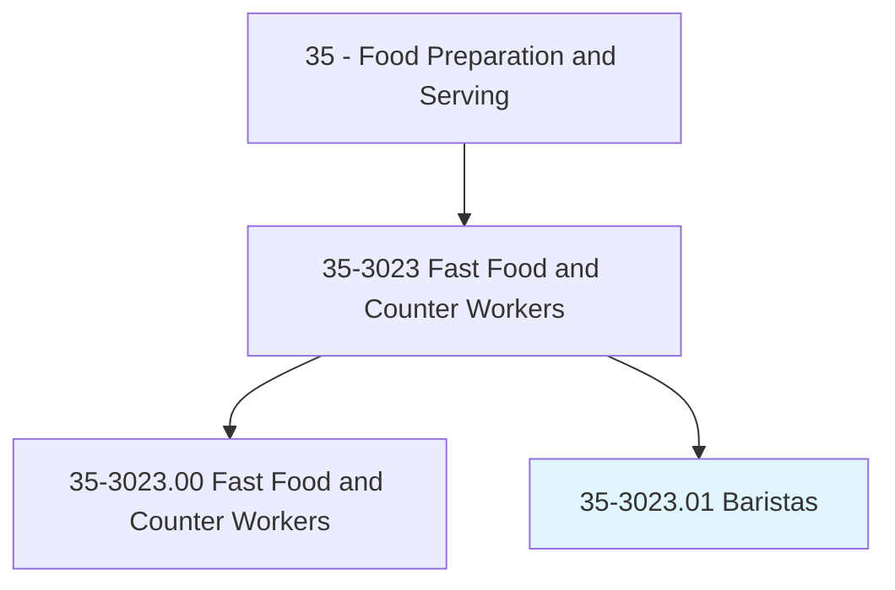
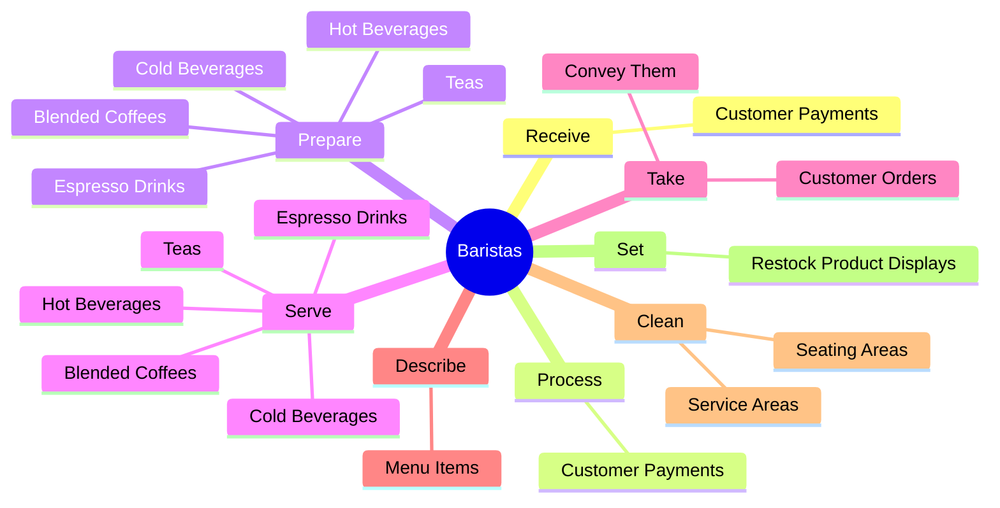
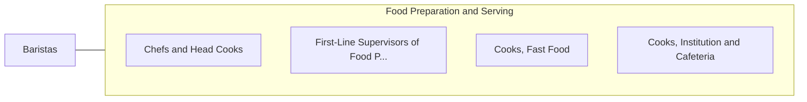

# Baristas

> Prepare or serve specialty coffee or other beverages. Serve food such as baked goods or sandwiches to patrons.

## Overview

Baristas is a specialized variant within the Food Preparation and Serving category. Prepare or serve specialty coffee or other beverages. 

## Classification Hierarchy

## Key Statistics

| Metric | Value |
|--------|-------|
| SOC Code | 35-3023.01 |
| Category | [Food Preparation and Serving](/occupations/FoodService) |
| Task Count | 50 |
| Source | O*NET |

## Core Tasks

### receive.CustomerPayments

Baristas receive customer payments as part of their core responsibilities.

**Actions:**
- `receive.CustomerPayments`

### process.CustomerPayments

Baristas process customer payments as part of their core responsibilities.

**Actions:**
- `process.CustomerPayments`

### prepare.HotBeverages

Baristas prepare hot beverages as part of their core responsibilities.

**Actions:**
- `prepare.HotBeverages`
- `prepare.ColdBeverages`
- `prepare.EspressoDrinks`
- `prepare.BlendedCoffees`

## Skills & Competencies

### Technical Skills
- **Food Preparation** - Advanced
- **Food Safety** - Advanced
- **Customer Service** - Advanced

### Soft Skills
- **Communication** - Essential
- **Problem Solving** - Essential
- **Critical Thinking** - Important
- **Teamwork** - Important
- **Adaptability** - Important

## Related Occupations

## Industries

This occupation is found across multiple industries. See [Industries](/industries) for sector-specific employment data.

## Career Progression

---

*Source: O*NET 35-3023.01 - ONETOccupation*
