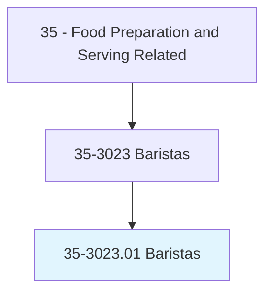
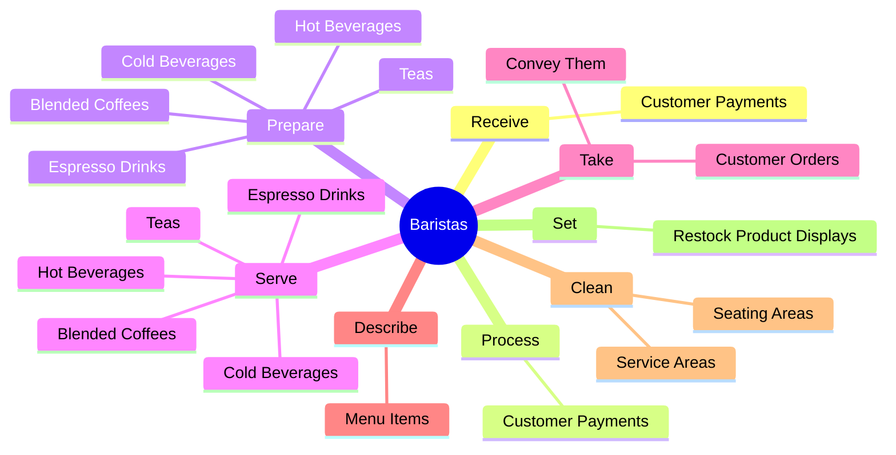
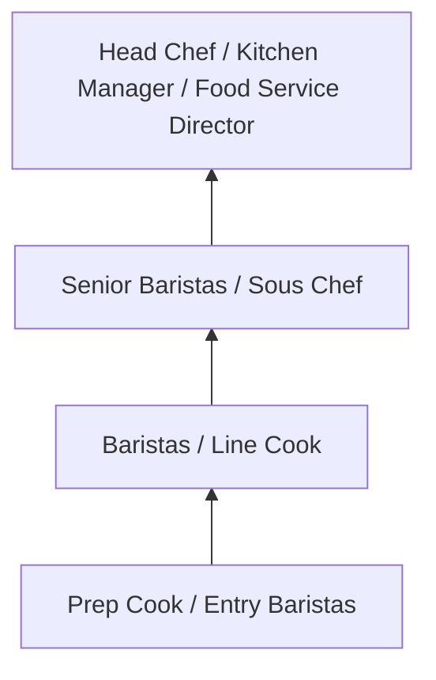
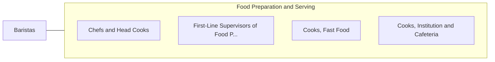

# Baristas

> Prepare or serve specialty coffee or other beverages. Serve food such as baked goods or sandwiches to patrons.

## Overview

Baristas professionals prepare or serve specialty coffee or other beverages. This occupation falls within the Food Preparation and Serving Related category and requires a combination of specialized knowledge, technical skills, and practical experience.

These professionals work across diverse settings and organizational contexts, applying their expertise to meet the demands of their field. They must stay current with industry standards, emerging practices, and regulatory requirements that affect their work. The role demands both independent judgment and collaborative skills, as practitioners regularly interact with colleagues, stakeholders, and the public.

As the field continues to evolve, Baristas professionals increasingly leverage technology and data-driven approaches to enhance their effectiveness. Career opportunities span the public and private sectors, with demand influenced by economic conditions, demographic shifts, and technological advancement.

## Classification Hierarchy



## Key Statistics

| Metric | Value |
|--------|-------|
| SOC Code | 35-3023.01 |
| Job Zone | N/A |
| Category | [Food Preparation and Serving Related](/occupations/FoodService/index) |
| Core Tasks | 50+ |
| Salary Range | $25,000 - $55,000 |
| Median Salary | $32,000 |
| Growth Outlook | 6% (As fast as average) |
| Source | O*NET |

## Core Tasks



### serve.HotBeverages

Baristas serve hot beverages as part of their core responsibilities.

**Actions:**
- `serve.HotBeverages` - Prepare or serve hot or cold beverages, such as coffee, espresso drinks, blen...
- `serve.ColdBeverages` - Prepare or serve hot or cold beverages, such as coffee, espresso drinks, blen...
- `serve.EspressoDrinks` - Prepare or serve hot or cold beverages, such as coffee, espresso drinks, blen...
- `serve.BlendedCoffees` - Prepare or serve hot or cold beverages, such as coffee, espresso drinks, blen...
- `serve.Teas` - Prepare or serve hot or cold beverages, such as coffee, espresso drinks, blen...

### prepare.HotBeverages

Baristas prepare hot beverages as part of their core responsibilities.

**Actions:**
- `prepare.HotBeverages` - Prepare or serve hot or cold beverages, such as coffee, espresso drinks, blen...
- `prepare.ColdBeverages` - Prepare or serve hot or cold beverages, such as coffee, espresso drinks, blen...
- `prepare.EspressoDrinks` - Prepare or serve hot or cold beverages, such as coffee, espresso drinks, blen...
- `prepare.BlendedCoffees` - Prepare or serve hot or cold beverages, such as coffee, espresso drinks, blen...
- `prepare.Teas` - Prepare or serve hot or cold beverages, such as coffee, espresso drinks, blen...

### slice.Fruits

Baristas slice fruits as part of their core responsibilities.

**Actions:**
- `slice.Fruits.for.Use.in.FoodService` - Slice fruits, vegetables, desserts, or meats for use in food service.
- `slice.Vegetables.for.Use.in.FoodService` - Slice fruits, vegetables, desserts, or meats for use in food service.
- `slice.Desserts.for.Use.in.FoodService` - Slice fruits, vegetables, desserts, or meats for use in food service.
- `slice.Meats.for.Use.in.FoodService` - Slice fruits, vegetables, desserts, or meats for use in food service.

### provide.Customers

Baristas provide customers as part of their core responsibilities.

**Actions:**
- `provide.Customers.with.ProductDetails` - Provide customers with product details, such as coffee blend or preparation d...
- `provide.Customers.with.CoffeeBlend` - Provide customers with product details, such as coffee blend or preparation d...
- `provide.Customers.with.PreparationDescriptions` - Provide customers with product details, such as coffee blend or preparation d...


## Skills & Competencies

### Technical Skills
- **Food Preparation** - Advanced
- **Food Safety and Sanitation** - Advanced
- **Menu Knowledge** - Proficient
- **Kitchen Equipment Operation** - Proficient
- **Inventory Management** - Proficient
- **Portion Control** - Proficient

### Soft Skills
- **Time Management** - Critical
- **Teamwork** - Critical
- **Stress Tolerance** - Essential
- **Communication** - Essential
- **Customer Service** - Essential

## Education & Certifications

| Requirement | Details |
|-------------|---------|
| Typical Education | High school diploma; culinary programs beneficial |
| Work Experience | 0-2 years food service experience |
| On-the-Job Training | Short to moderate - food safety and preparation techniques |
| Certifications | Food Handler certification, ServSafe, state health permits |

## Career Progression



## Industry Variations

### Full-Service Restaurants
High-quality food preparation and presentation. Baristas professionals focus on menu creativity and dining experience.

### Institutional Food Service
Large-scale food preparation for schools, hospitals, or corporate cafeterias. Emphasis on nutrition, consistency, and volume.

### Quick-Service and Fast Food
High-volume, standardized food preparation. Focus on speed, consistency, and food safety compliance.

### Catering and Events
Event-based food service requiring planning, coordination, and ability to execute in varied locations and conditions.

## Technology & Tools

- **Point-of-sale (POS) systems**
- **Commercial kitchen equipment**
- **Food safety monitoring systems**
- **Inventory management software**
- **Recipe management and costing tools**

## Related Occupations



## Industries

- [Restaurants and Food Service](/industries/Restaurants) - High Employment
- [Hotels and Hospitality](/industries/Hospitality) - High Employment
- [Healthcare Facilities](/industries/Healthcare/index) - Moderate Employment
- [Education](/industries/Education) - Moderate Employment

## Departments

This occupation typically works in:
- [Kitchen Operations](/departments/Kitchen)
- [Food and Beverage](/departments/FoodBeverage)
- [Hospitality Services](/departments/Hospitality)

## GraphDL Semantic Structure

```
Baristas perform:
- receive.CustomerPayments
- process.CustomerPayments
- prepare.HotBeverages
- prepare.ColdBeverages
- prepare.EspressoDrinks
- prepare.BlendedCoffees
```

---

*Source: O*NET 35-3023.01 - ONETOccupation*
