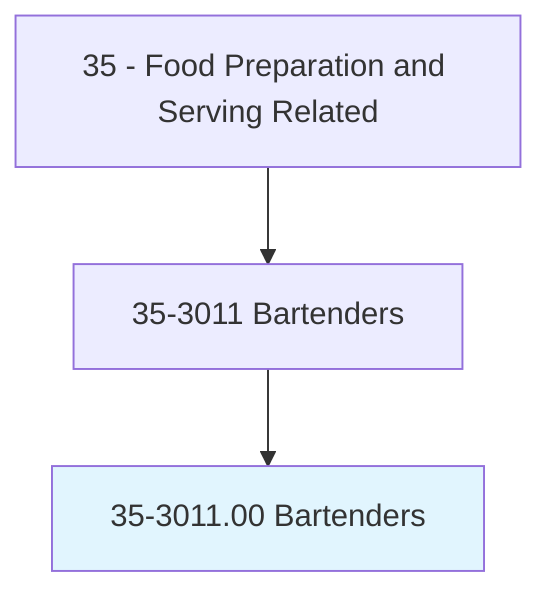
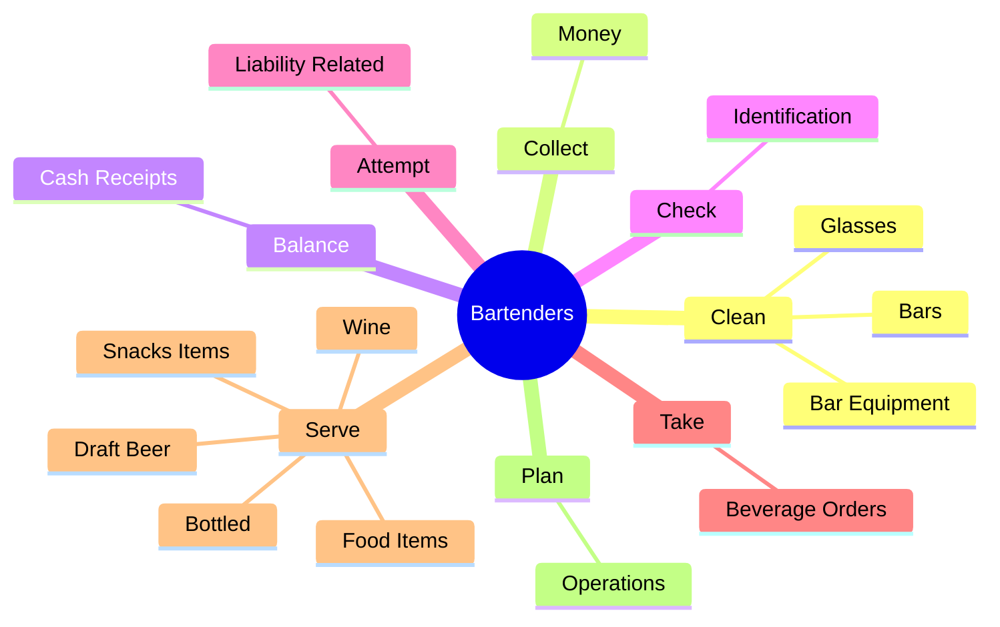
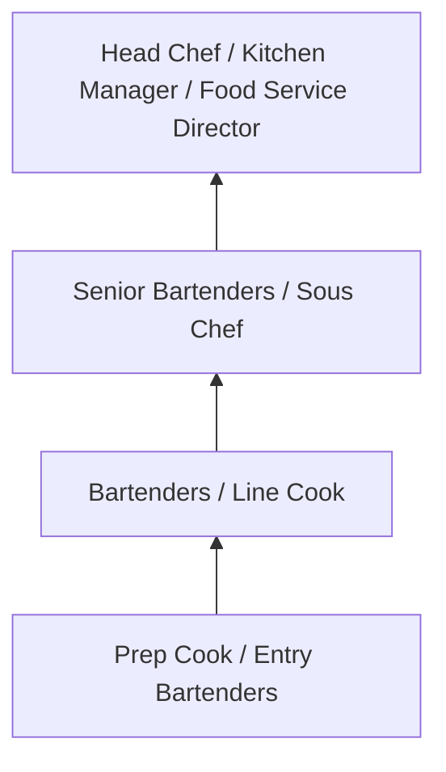
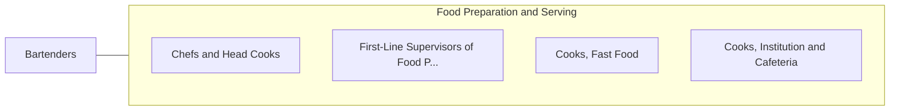

# Bartenders

> Mix and serve drinks to patrons, directly or through waitstaff.

## Overview

Bartenders professionals mix and serve drinks to patrons, directly or through waitstaff.. This occupation falls within the Food Preparation and Serving Related category and requires a combination of specialized knowledge, technical skills, and practical experience.

These professionals work across diverse settings and organizational contexts, applying their expertise to meet the demands of their field. They must stay current with industry standards, emerging practices, and regulatory requirements that affect their work. The role demands both independent judgment and collaborative skills, as practitioners regularly interact with colleagues, stakeholders, and the public.

As the field continues to evolve, Bartenders professionals increasingly leverage technology and data-driven approaches to enhance their effectiveness. Career opportunities span the public and private sectors, with demand influenced by economic conditions, demographic shifts, and technological advancement.

## Classification Hierarchy



## Key Statistics

| Metric | Value |
|--------|-------|
| SOC Code | 35-3011.00 |
| Job Zone | N/A |
| Category | [Food Preparation and Serving Related](/occupations/FoodService/index) |
| Core Tasks | 60+ |
| Salary Range | $25,000 - $55,000 |
| Median Salary | $32,000 |
| Growth Outlook | 6% (As fast as average) |
| Source | O*NET |

## Core Tasks



### mix.Ingredients

Bartenders mix ingredients as part of their core responsibilities.

**Actions:**
- `mix.Ingredients.to.prepare.CocktailsDrinks` - Mix ingredients, such as liquor, soda, water, sugar, and bitters, to prepare ...
- `mix.Ingredients.to.OtherDrinks` - Mix ingredients, such as liquor, soda, water, sugar, and bitters, to prepare ...
- `mix.Liquor.to.prepare.CocktailsDrinks` - Mix ingredients, such as liquor, soda, water, sugar, and bitters, to prepare ...
- `mix.Liquor.to.OtherDrinks` - Mix ingredients, such as liquor, soda, water, sugar, and bitters, to prepare ...
- `mix.Soda.to.prepare.CocktailsDrinks` - Mix ingredients, such as liquor, soda, water, sugar, and bitters, to prepare ...

### stock.Bar

Bartenders stock bar as part of their core responsibilities.

**Actions:**
- `stock.Bar.with.Beer` - Stock bar with beer, wine, liquor, and related supplies such as ice, glasswar...
- `stock.Bar.with.Wine` - Stock bar with beer, wine, liquor, and related supplies such as ice, glasswar...
- `stock.Bar.with.Liquor` - Stock bar with beer, wine, liquor, and related supplies such as ice, glasswar...
- `stock.Bar.with.RelatedSupplies` - Stock bar with beer, wine, liquor, and related supplies such as ice, glasswar...
- `stock.Bar.with.Ice` - Stock bar with beer, wine, liquor, and related supplies such as ice, glasswar...

### serve.Wine

Bartenders serve wine as part of their core responsibilities.

**Actions:**
- `serve.Wine` - Serve wine, and bottled or draft beer.
- `serve.Bottled` - Serve wine, and bottled or draft beer.
- `serve.DraftBeer` - Serve wine, and bottled or draft beer.
- `serve.SnacksItems.to.CustomersSeatedAtBar` - Serve snacks or food items to customers seated at the bar.
- `serve.FoodItems.to.CustomersSeatedAtBar` - Serve snacks or food items to customers seated at the bar.

### attempt.LiabilityRelated

Bartenders attempt liability related as part of their core responsibilities.

**Actions:**
- `attempt.LiabilityRelated.to.CustomersExcessiveDrinkingByTakingSteps` - Attempt to limit problems and liability related to customers' excessive drink...
- `attempt.LiabilityRelated.to.PersuadingCustomersToStopDrinking` - Attempt to limit problems and liability related to customers' excessive drink...
- `attempt.LiabilityRelated.to.OrderingTaxis` - Attempt to limit problems and liability related to customers' excessive drink...
- `attempt.LiabilityRelated.to.OtherTransportationForIntoxicatedPatrons` - Attempt to limit problems and liability related to customers' excessive drink...


## Skills & Competencies

### Technical Skills
- **Food Preparation** - Advanced
- **Food Safety and Sanitation** - Advanced
- **Menu Knowledge** - Proficient
- **Kitchen Equipment Operation** - Proficient
- **Inventory Management** - Proficient
- **Portion Control** - Proficient

### Soft Skills
- **Time Management** - Critical
- **Teamwork** - Critical
- **Stress Tolerance** - Essential
- **Communication** - Essential
- **Customer Service** - Essential

## Education & Certifications

| Requirement | Details |
|-------------|---------|
| Typical Education | High school diploma; culinary programs beneficial |
| Work Experience | 0-2 years food service experience |
| On-the-Job Training | Short to moderate - food safety and preparation techniques |
| Certifications | Food Handler certification, ServSafe, state health permits |

## Career Progression



## Industry Variations

### Full-Service Restaurants
High-quality food preparation and presentation. Bartenders professionals focus on menu creativity and dining experience.

### Institutional Food Service
Large-scale food preparation for schools, hospitals, or corporate cafeterias. Emphasis on nutrition, consistency, and volume.

### Quick-Service and Fast Food
High-volume, standardized food preparation. Focus on speed, consistency, and food safety compliance.

### Catering and Events
Event-based food service requiring planning, coordination, and ability to execute in varied locations and conditions.

## Technology & Tools

- **Point-of-sale (POS) systems**
- **Commercial kitchen equipment**
- **Food safety monitoring systems**
- **Inventory management software**
- **Recipe management and costing tools**

## Related Occupations



## Industries

- [Restaurants and Food Service](/industries/Restaurants) - High Employment
- [Hotels and Hospitality](/industries/Hospitality) - High Employment
- [Healthcare Facilities](/industries/Healthcare/index) - Moderate Employment
- [Education](/industries/Education) - Moderate Employment

## Departments

This occupation typically works in:
- [Kitchen Operations](/departments/Kitchen)
- [Food and Beverage](/departments/FoodBeverage)
- [Hospitality Services](/departments/Hospitality)

## GraphDL Semantic Structure

```
Bartenders perform:
- clean.Glasses
- clean.BarEquipment
- collect.Money.for.DrinksServed
- balance.CashReceipts
- check.Identification.of.Customers.to.verify.AgeRequirementsForPurchaseOfAlcohol
- clean.Bars
```

---

*Source: O*NET 35-3011.00 - ONETOccupation*
