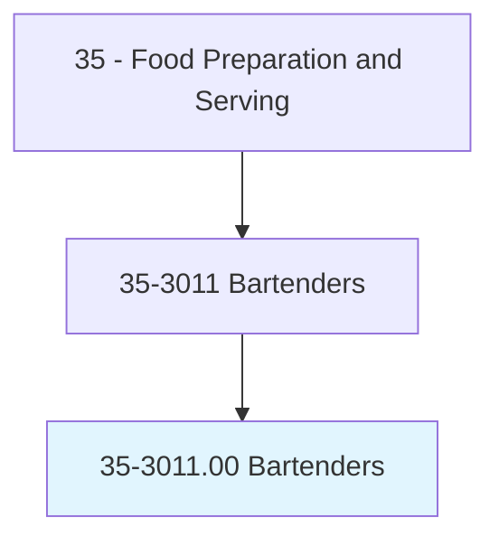
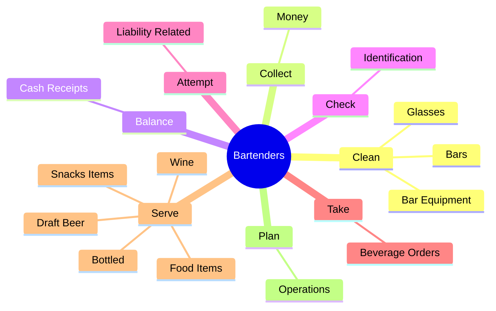
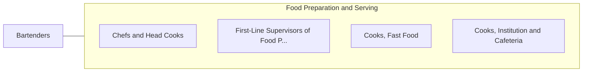

# Bartenders

> Mix and serve drinks to patrons, directly or through waitstaff.

## Overview

Bartenders is classified under Food Preparation and Serving (SOC 35). Mix and serve drinks to patrons, directly or through waitstaff.

## Classification Hierarchy

## Key Statistics

| Metric | Value |
|--------|-------|
| SOC Code | 35-3011.00 |
| Category | [Food Preparation and Serving](/occupations/FoodService) |
| Task Count | 60 |
| Source | O*NET |

## Core Tasks

### clean.Glasses

Bartenders clean glasses as part of their core responsibilities.

**Actions:**
- `clean.Glasses`
- `clean.BarEquipment`
- `clean.Bars`

### collect.Money

Bartenders collect money as part of their core responsibilities.

**Actions:**
- `collect.Money.for.DrinksServed`

### balance.CashReceipts

Bartenders balance cash receipts as part of their core responsibilities.

**Actions:**
- `balance.CashReceipts`

## Skills & Competencies

### Technical Skills
- **Food Preparation** - Advanced
- **Food Safety** - Advanced
- **Customer Service** - Advanced

### Soft Skills
- **Communication** - Essential
- **Problem Solving** - Essential
- **Critical Thinking** - Important
- **Teamwork** - Important
- **Adaptability** - Important

## Related Occupations

## Industries

This occupation is found across multiple industries. See [Industries](/industries) for sector-specific employment data.

## Career Progression

---

*Source: O*NET 35-3011.00 - ONETOccupation*
