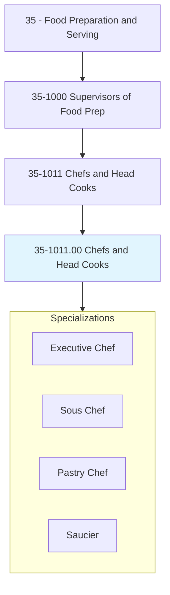
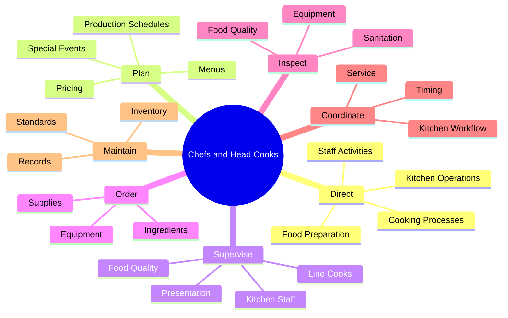
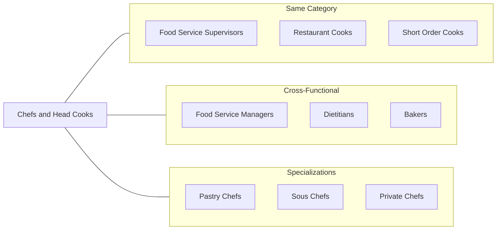
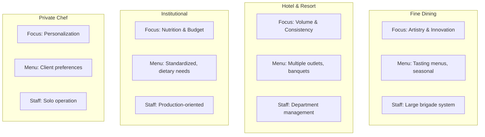
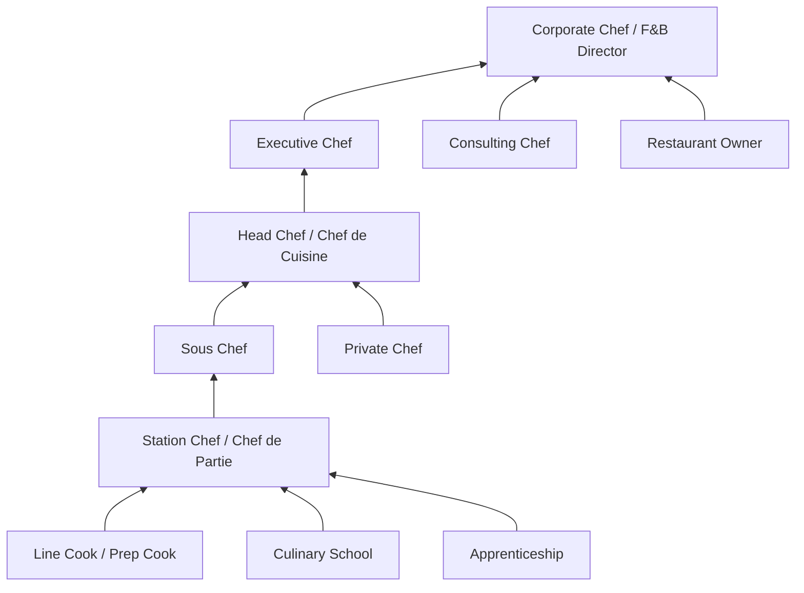

# Chefs and Head Cooks

> Direct and may participate in the preparation, seasoning, and cooking of salads, soups, fish, meats, vegetables, desserts, or other foods. May plan and price menu items, order supplies, and keep records and accounts.

## Overview

Chefs and Head Cooks are culinary leaders who combine artistic creativity with operational management to oversee kitchen operations. They are responsible for the quality, taste, and presentation of all food produced in their kitchens. Beyond cooking, they manage staff, control costs, design menus, and ensure compliance with food safety regulations. This occupation spans diverse settings from fine dining restaurants and hotels to hospitals and corporate cafeterias. The role requires a blend of culinary expertise, leadership ability, and business acumen, with successful chefs often developing signature styles that define their establishments.

## Classification Hierarchy



## Key Statistics

| Metric | Value |
|--------|-------|
| SOC Code | 35-1011.00 |
| Job Zone | 3 (Medium Preparation) |
| Category | [Food Preparation and Serving](/occupations/FoodService/index) |
| Core Tasks | 20+ |
| Experience Required | 2-5 years |
| Source | O*NET |

## Core Tasks



### direct.FoodPreparation

Chefs direct all aspects of food preparation to ensure consistent quality and timely service.

**Actions:**
- `direct.FoodPreparation.for.KitchenStaff` - Guide cooking staff through preparation processes
- `direct.Seasoning.of.Foods` - Oversee flavor development and seasoning techniques
- `direct.Cooking.of.Meats` - Supervise protein preparation and cooking temperatures
- `direct.Cooking.of.Vegetables` - Manage vegetable preparation methods
- `direct.Cooking.of.Desserts` - Guide pastry and dessert production

### plan.MenuItems

Chefs develop menus that balance creativity, cost, and customer preferences.

**Actions:**
- `plan.MenuItems.for.Restaurant` - Design seasonal and permanent menu offerings
- `plan.MenuItems.with.CostAnalysis` - Develop dishes within budget constraints
- `price.MenuItems.for.Profitability` - Set prices balancing value and margins
- `plan.SpecialMenus.for.Events` - Create custom menus for catering and events

### supervise.KitchenStaff

Chefs lead kitchen teams to ensure smooth operations and professional development.

**Actions:**
- `supervise.Cooks.during.Service` - Manage line cooks during meal periods
- `supervise.FoodQuality.for.Consistency` - Monitor dish quality before service
- `supervise.Presentation.of.Dishes` - Ensure plating meets standards
- `train.Staff.on.Techniques` - Develop culinary skills of team members

### order.Supplies

Chefs manage inventory and procurement to maintain quality while controlling costs.

**Actions:**
- `order.Ingredients.from.Suppliers` - Source quality ingredients
- `order.Equipment.for.Kitchen` - Procure necessary tools and equipment
- `maintain.Inventory.of.Supplies` - Track stock levels and usage
- `negotiate.Prices.with.Vendors` - Secure competitive pricing

### inspect.FoodQuality

Chefs ensure all food meets safety and quality standards.

**Actions:**
- `inspect.Food.for.Quality` - Evaluate ingredients and finished dishes
- `inspect.Kitchen.for.Sanitation` - Monitor cleanliness standards
- `inspect.Equipment.for.Safety` - Ensure proper equipment function
- `enforce.Standards.for.FoodSafety` - Maintain HACCP compliance

## Skills & Competencies

### Technical Skills
- **Culinary Arts** - Expert
- **Menu Development** - Advanced
- **Food Costing** - Advanced
- **Kitchen Management** - Advanced
- **Food Safety (ServSafe)** - Expert
- **Inventory Management** - Proficient

### Soft Skills
- **Leadership** - Critical
- **Creativity** - Critical
- **Time Management** - Essential
- **Communication** - Essential
- **Problem Solving** - Essential
- **Stress Management** - Essential

## Related Occupations



### Same Category
- [First-Line Supervisors of Food Preparation and Serving Workers](./FoodServiceSupervisors.mdx)
- Cooks, Restaurant (35-2014.00)
- Cooks, Short Order (35-2015.00)

### Cross-Functional
- Food Service Managers (11-9051.00)
- Dietitians and Nutritionists (29-1031.00)
- Bakers (51-3011.00)

## Industries

- [Restaurants and Other Eating Places](/industries/Restaurants) - High Employment
- [Traveler Accommodation](/industries/Hotels) - High Employment
- [Special Food Services](/industries/Catering) - Moderate Employment
- [Hospitals](/industries/Healthcare/Hospitals/index) - Moderate Employment
- [Educational Services](/industries/Education) - Moderate Employment

## Industry Variations



## Career Progression



## Education & Training

| Requirement | Details |
|-------------|---------|
| Typical Education | High school diploma; culinary degree preferred |
| Work Experience | 2-5 years in professional kitchens |
| On-the-Job Training | Extensive hands-on training and mentorship |
| Common Certifications | ServSafe, Certified Executive Chef (CEC), Certified Culinarian |

## Professional Development

### Certifications
- **ServSafe Manager** - Food safety certification
- **Certified Executive Chef (CEC)** - American Culinary Federation
- **Certified Master Chef (CMC)** - Highest ACF credential
- **Certified Sous Chef (CSC)** - ACF intermediate credential

### Continuing Education
- Culinary competitions and showcases
- International cuisine training
- Wine and beverage pairing courses
- Management and leadership programs

## Departments

This occupation typically works in:
- [Culinary Operations](/departments/Culinary)
- [Food and Beverage](/departments/FoodBeverage)
- [Catering](/departments/Catering)
- [Kitchen Management](/departments/Kitchen)

## Work Environment

| Aspect | Description |
|--------|-------------|
| Setting | Commercial kitchens, often hot and fast-paced |
| Schedule | Long hours, evenings, weekends, holidays |
| Physical | Standing for extended periods, heavy lifting |
| Team Size | Small to large kitchen brigades |

## GraphDL Semantic Structure

```
Chefs.direct.FoodPreparation.for.KitchenStaff
Chefs.plan.MenuItems.with.CostAnalysis
Chefs.supervise.KitchenStaff.during.Service
Chefs.order.Supplies.from.Vendors
Chefs.inspect.FoodQuality.for.Standards
Chefs.coordinate.KitchenWorkflow.for.TimingService
Chefs.maintain.Records.of.Inventory
Chefs.train.Staff.on.CulinaryTechniques
```

---

*Source: O*NET 35-1011.00 - ONETOccupation*
