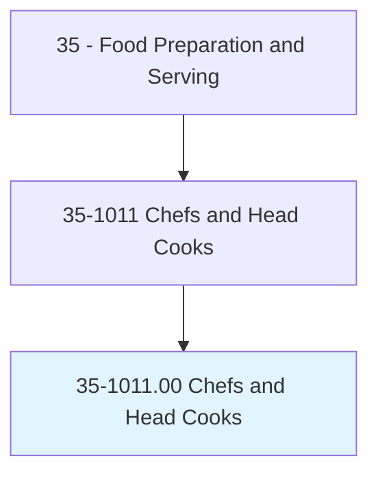
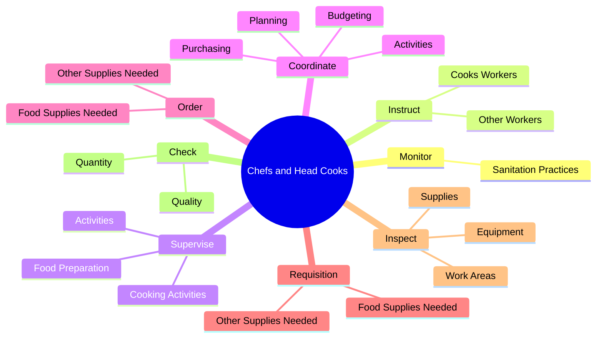
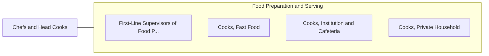

# Chefs and Head Cooks

> Direct and may participate in the preparation, seasoning, and cooking of salads, soups, fish, meats, vegetables, desserts, or other foods. May plan and price menu items, order supplies, and keep records and accounts.

## Overview

Chefs and Head Cooks is an occupation within the Food Preparation and Serving category. Direct and may participate in the preparation, seasoning, and cooking of salads, soups, fish, meats, vegetables, desserts, or other foods. 

## Classification Hierarchy

## Key Statistics

| Metric | Value |
|--------|-------|
| SOC Code | 35-1011.00 |
| Category | [Food Preparation and Serving](/occupations/FoodService/index) |
| Task Count | 98 |
| Source | O*NET |

## Core Tasks

### monitor.SanitationPractices

Chefs and Head Cooks monitor sanitation practices as part of their core responsibilities.

**Actions:**
- `monitor.SanitationPractices.to.ensure.EmployeesFollowStandards`
- `monitor.SanitationPractices.to.Regulations`

### instruct.CooksWorkers

Chefs and Head Cooks instruct cooks workers as part of their core responsibilities.

**Actions:**
- `instruct.CooksWorkers.in.Preparation`
- `instruct.CooksWorkers.in.Cooking`
- `instruct.CooksWorkers.in.Garnishing`
- `instruct.CooksWorkers.in.Presentation.of.Food`

### supervise.Activities

Chefs and Head Cooks supervise activities as part of their core responsibilities.

**Actions:**
- `supervise.Activities.of.Cooks.engaged.in.FoodPreparation`
- `supervise.Activities.of.Workers.engaged.in.FoodPreparation`
- `supervise.FoodPreparation.of.MultipleKitchens.in.Establishment`
- `supervise.FoodPreparation.of.Restaurants.in.Establishment`

## Skills & Competencies

### Technical Skills
- **Food Preparation** - Advanced
- **Food Safety** - Advanced
- **Customer Service** - Advanced

### Soft Skills
- **Communication** - Essential
- **Problem Solving** - Essential
- **Critical Thinking** - Important
- **Teamwork** - Important
- **Adaptability** - Important

## Related Occupations

## Industries

This occupation is found across multiple industries. See [Industries](/industries) for sector-specific employment data.

## Career Progression

---

*Source: O*NET 35-1011.00 - ONETOccupation*
