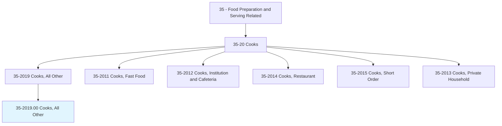
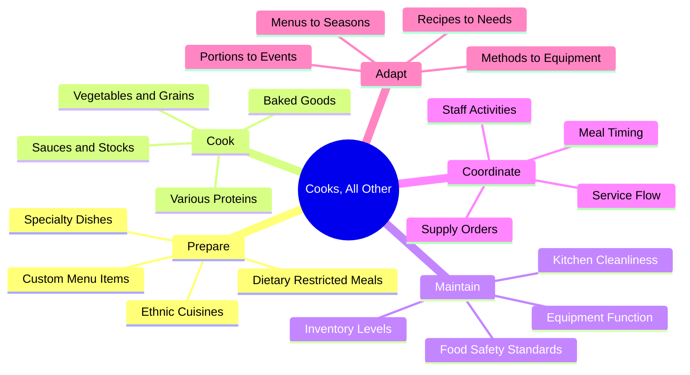
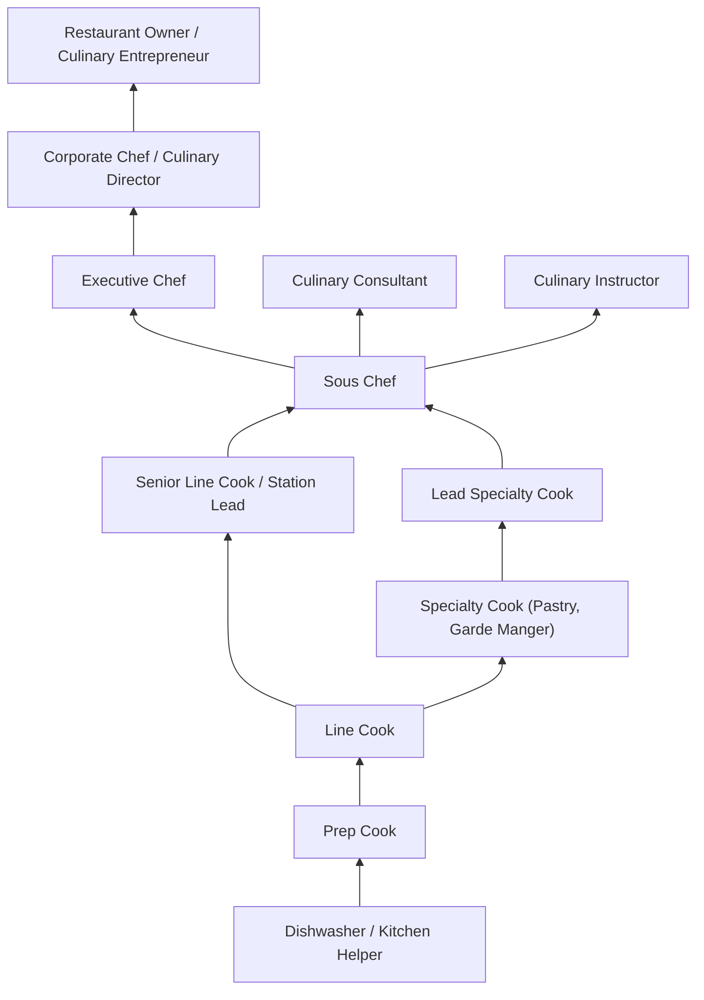
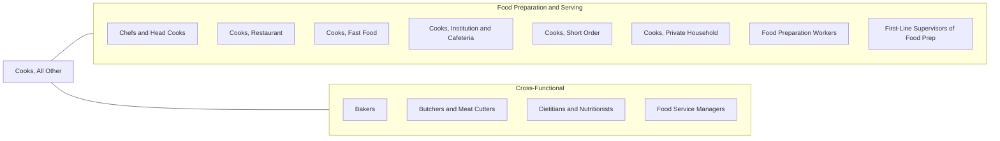

# Cooks, All Other

> All cooks not listed separately, including specialty cooks, ethnic cuisine cooks, and cooks working in non-traditional settings such as research facilities, private estates, cruise ships, and entertainment venues.

## Overview

Cooks, All Other encompasses culinary professionals who prepare food in specialized settings or with unique requirements that distinguish them from standard restaurant, institutional, or fast-food cook classifications. This occupation captures the diversity of cooking roles across industries, from personal chefs and specialty cuisine experts to cooks working in unique environments like research stations, yachts, film sets, and themed entertainment venues.

These professionals combine traditional culinary skills with adaptability to non-standard kitchen environments, specialized dietary requirements, or unique service contexts. They must master multiple cooking techniques, understand diverse cultural cuisines, and often work with limited resources or unconventional equipment. The role demands creativity, flexibility, and the ability to produce quality food under varied and sometimes challenging conditions.

As culinary industries evolve, cooks in this category increasingly specialize in areas like allergen-free cooking, molecular gastronomy, sustainable cuisine, and culturally authentic ethnic foods. Career opportunities span luxury services, entertainment, healthcare specialization, and emerging food service sectors.

## Classification Hierarchy



## Key Statistics

| Metric | Value |
|--------|-------|
| SOC Code | 35-2019.00 |
| Job Zone | 2 (Some Preparation Needed) |
| Category | [Food Preparation and Serving Related](/occupations/FoodService/index) |
| Core Tasks | 25+ specialized tasks |
| Salary Range | $28,000 - $75,000 |
| Median Salary | $38,500 |
| Growth Outlook | 5% (As fast as average) |
| Source | O*NET |

## Core Tasks



### prepare.SpecialtyDishes

Cooks prepare specialty dishes requiring advanced techniques or cultural authenticity as a core responsibility.

**Actions:**
- `prepare.SpecialtyDishes.using.TraditionalMethods`
- `prepare.SpecialtyDishes.according.to.CulturalRecipes`
- `prepare.SpecialtyDishes.for.SpecialEvents`
- `prepare.SpecialtyDishes.with.PremiumIngredients`

### cook.FoodItems.using.VariousTechniques

Cooks apply diverse cooking methods to prepare food items across multiple cuisines and contexts.

**Actions:**
- `cook.FoodItems.using.GrillingTechniques`
- `cook.FoodItems.using.SauteingMethods`
- `cook.FoodItems.using.BraisingProcesses`
- `cook.FoodItems.using.SteamingEquipment`
- `cook.FoodItems.using.RoastingOvens`
- `cook.FoodItems.using.FryingStations`
- `cook.FoodItems.using.SousVideEquipment`
- `cook.FoodItems.using.SmokingApparatus`

### maintain.FoodSafety.according.to.Regulations

Cooks maintain food safety standards in compliance with health regulations and organizational policies.

**Actions:**
- `maintain.FoodSafety.by.MonitoringTemperatures`
- `maintain.FoodSafety.through.ProperStorage`
- `maintain.FoodSafety.via.CrossContaminationPrevention`
- `maintain.FoodSafety.using.SanitationProtocols`
- `maintain.FoodSafety.with.HACCPCompliance`

### adapt.Recipes.for.DietaryRestrictions

Cooks modify recipes to accommodate allergies, medical conditions, and dietary preferences.

**Actions:**
- `adapt.Recipes.for.GlutenFreeRequirements`
- `adapt.Recipes.for.VeganDiets`
- `adapt.Recipes.for.AllergenAvoidance`
- `adapt.Recipes.for.ReligiousDietaryLaws`
- `adapt.Recipes.for.MedicalNutritionTherapy`
- `adapt.Recipes.for.LowSodiumDiets`
- `adapt.Recipes.for.DiabetesFriendlyMenus`

### coordinate.MealService.with.TeamMembers

Cooks coordinate timing and service flow with kitchen and front-of-house staff.

**Actions:**
- `coordinate.MealService.with.ServingStaff`
- `coordinate.MealService.according.to.EventSchedule`
- `coordinate.MealService.for.MultiCourseMenus`
- `coordinate.MealService.during.PeakHours`

### manage.Inventory.of.FoodSupplies

Cooks track, order, and manage food inventory to ensure availability and minimize waste.

**Actions:**
- `manage.Inventory.by.TrackingUsage`
- `manage.Inventory.through.SupplierOrdering`
- `manage.Inventory.for.CostControl`
- `manage.Inventory.using.FIFORotation`
- `manage.Inventory.with.WasteMinimization`

## Specializations

### Line Cook
Operates a specific station (grill, saute, fry, etc.) in a professional kitchen brigade system. Responsible for preparing menu items consistently and efficiently during service.

**Key Tasks:**
- `operate.Station.according.to.ServiceDemands`
- `prepare.Ingredients.for.MiseEnPlace`
- `execute.Dishes.per.RecipeStandards`
- `maintain.Station.for.Cleanliness`

### Prep Cook
Prepares ingredients before service, including washing, cutting, portioning, and pre-cooking components. Foundation role supporting all cooking stations.

**Key Tasks:**
- `prepare.Ingredients.by.WashingAndCleaning`
- `cut.Produce.according.to.Specifications`
- `portion.Proteins.for.ServiceReady`
- `prepare.Stocks.and.Sauces.for.Service`
- `organize.MiseEnPlace.for.LineCooks`

### Sous Chef
Second-in-command in kitchen operations. Supervises cooking staff, manages scheduling, assists head chef with menu development, and ensures quality consistency.

**Key Tasks:**
- `supervise.KitchenStaff.during.Operations`
- `assist.HeadChef.with.MenuPlanning`
- `maintain.QualityStandards.across.AllDishes`
- `manage.StaffScheduling.for.Coverage`
- `train.NewEmployees.on.Procedures`

### Executive Chef
Leads all kitchen operations, develops menus, manages food costs, hires staff, and represents the culinary vision of the establishment.

**Key Tasks:**
- `direct.KitchenOperations.for.Establishment`
- `develop.Menus.according.to.SeasonalAvailability`
- `manage.FoodCosts.within.BudgetTargets`
- `hire.KitchenStaff.for.TeamBuilding`
- `represent.CulinaryVision.to.Stakeholders`

### Pastry Cook / Baker
Specializes in baked goods, desserts, and pastry preparations. Requires precision in measurements and timing.

**Key Tasks:**
- `prepare.Pastries.using.BakingTechniques`
- `create.Desserts.for.MenuOfferings`
- `bake.Breads.according.to.Recipes`
- `decorate.Cakes.for.SpecialOrders`
- `maintain.DessertInventory.for.Service`

### Garde Manger (Cold Kitchen)
Manages cold food preparations including salads, appetizers, charcuterie, and food presentation artistry.

**Key Tasks:**
- `prepare.ColdAppetizers.for.Service`
- `create.Salads.according.to.Recipes`
- `cure.Meats.using.CharcuterieMethods`
- `arrange.Platters.for.Presentation`
- `maintain.ColdStorageAreas.for.Quality`

### Saucier
Specializes in sauces, gravies, stews, and braised dishes. Often considered one of the most skilled positions in the brigade.

**Key Tasks:**
- `prepare.Sauces.using.ClassicalTechniques`
- `create.Stocks.for.SauceFoundations`
- `execute.Braises.according.to.Recipes`
- `finish.Dishes.with.SauceApplications`

### Grill Cook / Broiler Cook
Expert in grilling and broiling proteins to exact specifications. Manages high-heat cooking equipment.

**Key Tasks:**
- `grill.Proteins.to.TemperatureSpecifications`
- `maintain.GrillEquipment.for.OptimalFunction`
- `monitor.CookingTemperatures.using.Thermometers`
- `rest.Meats.for.ProperJuiceDistribution`

### Specialty Cuisine Cook
Focuses on specific ethnic or regional cuisines requiring authentic techniques and ingredient knowledge.

**Key Tasks:**
- `prepare.AuthenticDishes.using.TraditionalMethods`
- `source.SpecialtyIngredients.for.Authenticity`
- `educate.Staff.on.CuisineBackground`
- `adapt.TraditionalRecipes.for.LocalTastes`

## Skills & Competencies

### Technical Skills

#### Knife Skills
- **Precision Cutting** - Expert level required for consistent results
- **Julienne and Brunoise** - Fine cuts for garnishes and mirepoix
- **Butchery** - Breaking down whole proteins efficiently
- **Knife Maintenance** - Sharpening and honing techniques

#### Cooking Techniques
- **Dry Heat Methods** - Grilling, roasting, sauteing, frying - Advanced
- **Moist Heat Methods** - Braising, poaching, steaming, boiling - Advanced
- **Combination Methods** - Stewing, en papillote techniques - Proficient
- **Modern Techniques** - Sous vide, molecular gastronomy - Developing

#### Food Science Knowledge
- **Temperature Control** - Understanding critical temperatures - Expert
- **Maillard Reaction** - Browning and flavor development - Proficient
- **Emulsification** - Sauce stability and creation - Proficient
- **Fermentation** - Controlled microbial processes - Intermediate

#### Food Safety and Sanitation
- **HACCP Principles** - Hazard analysis critical control points - Advanced
- **Temperature Monitoring** - Hot and cold holding requirements - Expert
- **Cross-Contamination Prevention** - Allergen and pathogen control - Advanced
- **Personal Hygiene** - Proper handwashing and protective equipment - Expert
- **Cleaning and Sanitizing** - Equipment and surface protocols - Advanced

#### Menu Planning and Development
- **Recipe Scaling** - Adjusting quantities for different service sizes - Proficient
- **Cost Analysis** - Calculating food costs and pricing - Proficient
- **Seasonal Menu Development** - Utilizing fresh, available ingredients - Intermediate
- **Nutritional Considerations** - Balancing health and taste - Intermediate

#### Inventory and Purchasing
- **Par Level Management** - Maintaining optimal stock levels - Proficient
- **FIFO Rotation** - First in, first out inventory control - Advanced
- **Vendor Relations** - Ordering and receiving procedures - Proficient
- **Waste Tracking** - Monitoring and reducing food waste - Intermediate

### Soft Skills

- **Time Management** - Critical for managing multiple dishes and timing
- **Stress Tolerance** - Essential for high-pressure kitchen environments
- **Teamwork** - Critical for brigade system coordination
- **Communication** - Essential for order accuracy and service coordination
- **Attention to Detail** - Critical for consistency and presentation
- **Physical Stamina** - Essential for long shifts on feet
- **Adaptability** - Important for handling unexpected situations
- **Creativity** - Important for specials and menu development
- **Leadership** - Important for advancement opportunities
- **Problem Solving** - Essential for equipment issues and substitutions

## Technology & Tools

### Commercial Kitchen Equipment

#### Cooking Equipment
- **Commercial Ranges** - Gas and electric with multiple burners
- **Convection Ovens** - Forced-air for even baking
- **Combi Ovens** - Steam, convection, and combination cooking
- **Charbroilers and Grills** - High-heat protein cooking
- **Flat Top Griddles** - Versatile surface cooking
- **Deep Fryers** - Commercial immersion frying
- **Salamanders and Broilers** - High-heat finishing
- **Steamers** - Pressureless and pressure steam cooking
- **Induction Cooktops** - Precision temperature control
- **Sous Vide Equipment** - Immersion circulators and vacuum sealers
- **Smokers** - Hot and cold smoking for flavor development
- **Woks and Wok Ranges** - High-BTU Asian cooking

#### Preparation Equipment
- **Food Processors** - Chopping, pureeing, slicing
- **Commercial Mixers** - Stand mixers for doughs and batters
- **Immersion Blenders** - In-pot blending for soups and sauces
- **Slicers** - Meat and cheese portioning
- **Mandolines** - Precision vegetable slicing
- **Meat Grinders** - In-house grinding for quality control
- **Vacuum Sealers** - Storage and sous vide preparation

#### Refrigeration and Storage
- **Walk-in Coolers** - Bulk cold storage
- **Walk-in Freezers** - Bulk frozen storage
- **Reach-in Refrigerators** - Station-accessible cold storage
- **Prep Tables with Refrigeration** - Integrated cold storage workstations
- **Blast Chillers** - Rapid cooling for food safety

### Kitchen Management Technology

#### Point-of-Sale (POS) Systems
- **Toast POS** - Restaurant-specific order management
- **Square for Restaurants** - Integrated payment and ordering
- **Kitchen Display Systems (KDS)** - Digital ticket management
- **Order Pacing Systems** - Timing and coordination tools

#### Inventory Management Software
- **MarketMan** - Purchasing and inventory tracking
- **BlueCart** - Vendor ordering platform
- **WISK** - Bar and kitchen inventory
- **CrunchTime** - Food cost management

#### Recipe and Menu Management
- **ChefTec** - Recipe costing and menu engineering
- **Culinary Software Services** - Recipe scaling and nutrition
- **Meez** - Recipe development and scaling platform
- **Galley Solutions** - Menu lifecycle management

#### Food Safety Monitoring
- **ComplianceMate** - Automated temperature monitoring
- **Therma** - Wireless temperature sensors
- **FoodDocs** - HACCP compliance documentation
- **iAuditor** - Safety inspection checklists

#### Scheduling and Labor Management
- **7shifts** - Restaurant staff scheduling
- **HotSchedules** - Workforce management
- **When I Work** - Shift scheduling and communication

## Industry Variations

### Full-Service Restaurants
High-quality food preparation with emphasis on presentation and guest experience. Cooks work within traditional brigade system with clear station responsibilities. Focus on consistency, timing for multi-course meals, and handling custom requests.

**Unique Requirements:**
- Multi-course meal timing coordination
- Custom modification handling
- Presentation standards
- Wine and beverage pairing awareness
- High-pressure dinner service execution

### Hotels and Resorts
Multi-venue cooking across restaurants, room service, banquets, and poolside service. Requires versatility to move between outlets and scale from intimate dining to large events.

**Unique Requirements:**
- Multi-outlet flexibility
- Room service packaging and timing
- Banquet volume production
- International guest preferences
- 24-hour operation staffing

### Hospitals and Healthcare Facilities
Therapeutic diet preparation with strict nutritional guidelines. Must understand medical dietary restrictions, texture modifications, and allergen protocols for vulnerable populations.

**Unique Requirements:**
- Therapeutic diet compliance (renal, cardiac, diabetic)
- Texture modifications (pureed, mechanical soft)
- Allergen management for immunocompromised
- Consistent nutrient delivery
- Patient satisfaction within restrictions

### Schools and Universities
Large-scale batch cooking for fixed meal periods. Balance of nutrition requirements, budget constraints, and student preferences. Compliance with federal nutrition standards.

**Unique Requirements:**
- USDA National School Lunch Program compliance
- Allergen management for children
- Budget-conscious ingredient selection
- High-volume batch production
- Limited service windows

### Catering and Events
Off-site cooking and service in varied locations. Requires advance planning, transport logistics, and execution in temporary kitchen setups.

**Unique Requirements:**
- Mobile kitchen operations
- Advance preparation and holding
- Transport and setup logistics
- Client customization
- On-site problem solving
- Varied event types (weddings, corporate, social)

### Cruise Ships and Maritime
Cooking in confined galley spaces for large passenger populations. International menu requirements, extended voyage supply planning, and strict maritime health regulations.

**Unique Requirements:**
- Galley space constraints
- Multi-week supply planning
- International passenger preferences
- Maritime health regulations
- Stability challenges at sea

### Private Households and Estates
Personal cooking for families or individuals. Requires menu customization, grocery shopping, and intimate knowledge of employer preferences and dietary needs.

**Unique Requirements:**
- Individual preference accommodation
- Shopping and menu planning
- Dietary restriction expertise
- Flexible scheduling
- Confidentiality

### Film and Television Production
Craft services and catering for production crews. Long hours, location variability, and diverse dietary needs of cast and crew.

**Unique Requirements:**
- Location cooking capabilities
- Extended hour operations
- Diverse dietary accommodations
- Quick turnaround meals
- Set logistics awareness

### Research Stations and Remote Locations
Cooking in isolated environments like Antarctic research stations, oil rigs, or remote camps. Requires supply management with infrequent deliveries and psychological consideration for isolated teams.

**Unique Requirements:**
- Limited supply availability
- Extended storage management
- Morale through food variety
- Extreme environment adaptations
- Self-reliant operations

### Corporate Dining and Cafeterias
Executive dining and employee cafeteria operations. Balance of quality expectations, budget management, and daily menu variety.

**Unique Requirements:**
- Daily menu rotation
- Multiple service style (grab-and-go, made-to-order)
- Cost per meal targets
- Wellness program integration
- Dietary trend responsiveness

## Career Progression



### Entry Level (0-1 years)
**Positions:** Dishwasher, Kitchen Helper, Food Prep Assistant
- Learn kitchen operations and flow
- Develop basic sanitation habits
- Observe cooking techniques
- Build stamina for kitchen work

### Prep Cook (1-2 years)
**Positions:** Prep Cook, Pantry Cook
- Master knife skills and basic cuts
- Learn mise en place organization
- Understand ingredient storage and rotation
- Develop timing awareness

### Line Cook (2-4 years)
**Positions:** Line Cook, Station Cook, Grill Cook
- Master specific station operations
- Execute dishes under pressure
- Maintain consistency and speed
- Coordinate with other stations

### Senior Line Cook (4-6 years)
**Positions:** Senior Cook, Station Lead, Lead Line Cook
- Train new cooks
- Cover multiple stations
- Assist with ordering and inventory
- Troubleshoot service issues

### Sous Chef (6-10 years)
**Positions:** Sous Chef, Assistant Kitchen Manager
- Supervise kitchen staff
- Manage scheduling and labor
- Assist with menu development
- Ensure quality across all dishes

### Executive Chef (10+ years)
**Positions:** Executive Chef, Head Chef, Kitchen Manager
- Lead entire kitchen operation
- Develop menus and concepts
- Manage food costs and budgets
- Hire, train, and evaluate staff

### Advanced Leadership (15+ years)
**Positions:** Corporate Chef, Culinary Director, F&B Director
- Oversee multiple locations
- Develop brand culinary standards
- Strategic planning and concept development
- Industry leadership and recognition

## Education & Certifications

### Formal Education

| Level | Program | Duration | Description |
|-------|---------|----------|-------------|
| Certificate | Culinary Arts Certificate | 6-12 months | Basic culinary techniques and food safety |
| Associate | Culinary Arts (AOS/AAS) | 2 years | Comprehensive culinary training with externship |
| Bachelor | Culinary Management (BS/BA) | 4 years | Culinary arts plus business management |
| Master | Hospitality Management (MBA) | 2 years | Executive-level food service leadership |

### Professional Certifications

#### ServSafe Certifications
- **ServSafe Food Handler** - Basic food safety awareness (entry level)
- **ServSafe Manager** - Managerial food safety responsibilities (required for supervisors)
- **ServSafe Alcohol** - Responsible alcohol service
- **ServSafe Allergens** - Allergen awareness and management

#### American Culinary Federation (ACF) Certifications
- **Certified Culinarian (CC)** - Entry-level professional cook
- **Certified Sous Chef (CSC)** - Supervisory cooking role
- **Certified Chef de Cuisine (CCC)** - Chef in charge of kitchen
- **Certified Executive Chef (CEC)** - Executive kitchen management
- **Certified Master Chef (CMC)** - Highest ACF certification (8-day exam)
- **Certified Pastry Culinarian (CPC)** - Entry-level pastry professional
- **Certified Working Pastry Chef (CWPC)** - Experienced pastry chef

#### Specialty Certifications
- **Certified Food Scientist (CFS)** - Institute of Food Technologists
- **HACCP Certification** - Food safety management systems
- **Allergen Awareness Certification** - Multiple providers
- **Plant-Based Culinary Certification** - Rouxbe Online Culinary School
- **Sommelier Certification** - Court of Master Sommeliers

#### State and Local Requirements
- **Food Handler's Card** - Required in most jurisdictions
- **Health Department Permits** - Establishment-specific
- **Alcohol Server Certification** - Where applicable

## Related Occupations



### Same Category
- [Chefs and Head Cooks](/occupations/FoodService/ChefsAndHeadCooks) - Kitchen leadership
- [Cooks, Restaurant](/occupations/FoodService/CooksRestaurant) - Restaurant-specific cooking
- [Cooks, Fast Food](/occupations/FoodService/CooksFastFood) - Quick-service cooking
- [Cooks, Institution and Cafeteria](/occupations/FoodService/CooksInstitutionAndCafeteria) - Large-scale institutional cooking
- [Cooks, Short Order](/occupations/FoodService/CooksShortOrder) - Quick preparation cooking
- [Cooks, Private Household](/occupations/FoodService/CooksPrivateHousehold) - Domestic cooking

### Cross-Functional
- [Bakers](/occupations/Production/Bakers) - Baking and pastry specialists
- [Food Service Managers](/occupations/Management/FoodServiceManagers) - Operations management
- [Dietitians and Nutritionists](/occupations/Healthcare/DietitiansAndNutritionists) - Nutrition expertise

## Industries

- [Restaurants and Food Service](/industries/Restaurants) - High Employment
- [Hotels and Hospitality](/industries/Hospitality) - High Employment
- [Healthcare Facilities](/industries/Healthcare/index) - Moderate Employment
- [Education](/industries/Education) - Moderate Employment
- [Cruise Lines and Maritime](/industries/Transportation/CruiseLines) - Specialized Employment
- [Catering Services](/industries/FoodService/Catering) - Moderate Employment
- [Corporate Dining](/industries/FoodService/CorporateDining) - Growing Employment
- [Entertainment and Recreation](/industries/Entertainment) - Specialized Employment

## Departments

This occupation typically works in:
- Kitchen Operations
- Food and Beverage
- Culinary Services
- Hospitality Services
- Nutrition Services (Healthcare)
- Dining Services (Education)

## Work Environment

### Physical Demands
- Standing for extended periods (8-12 hours)
- Lifting up to 50 pounds regularly
- Repetitive motions (chopping, stirring)
- Exposure to heat from cooking equipment
- Fast-paced movement during service

### Work Conditions
- Hot kitchen environments
- Sharp equipment and tools
- Potential burns and cuts
- Irregular hours (evenings, weekends, holidays)
- High-pressure during service periods

### Safety Considerations
- Proper footwear (slip-resistant)
- Cut-resistant gloves when appropriate
- Heat protection (oven mitts, pot holders)
- Ventilation systems for smoke and fumes
- Fire suppression systems

## GraphDL Semantic Structure

```graphdl
Cooks, All Other perform:
- prepare.Food.according.to.Recipes
- cook.Dishes.using.VariousTechniques
- maintain.Kitchen.for.SanitaryConditions
- follow.Procedures.for.FoodSafety
- adapt.Recipes.for.DietaryRestrictions
- manage.Inventory.of.FoodSupplies
- coordinate.MealService.with.TeamMembers
- operate.Equipment.in.CommercialKitchen
- plate.Dishes.for.Presentation
- monitor.Temperatures.during.Cooking
- train.Staff.on.CulinaryTechniques
- develop.Specials.for.DailyMenus
- receive.Deliveries.from.Suppliers
- store.Ingredients.using.FIFOMethods
- clean.Equipment.after.Service
```

---

*Source: O*NET 35-2019.00 - ONETOccupation*
