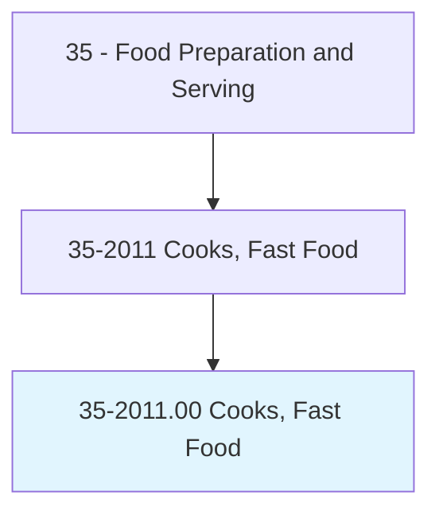
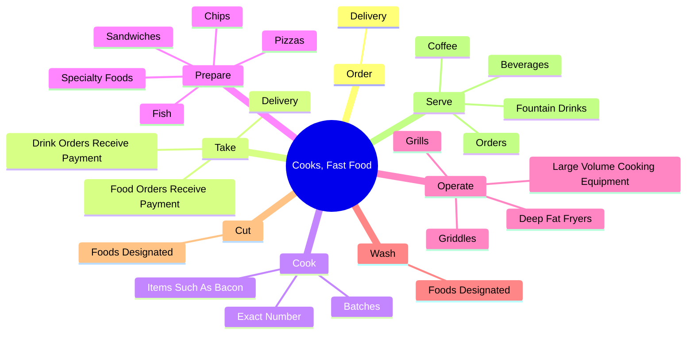
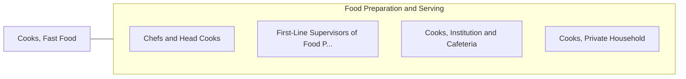

# Cooks, Fast Food

> Prepare and cook food in a fast food restaurant with a limited menu. Duties of these cooks are limited to preparation of a few basic items and normally involve operating large-volume single-purpose cooking equipment.

## Overview

Cooks, Fast Food is an occupation within the Food Preparation and Serving category. Prepare and cook food in a fast food restaurant with a limited menu. 

## Classification Hierarchy

## Key Statistics

| Metric | Value |
|--------|-------|
| SOC Code | 35-2011.00 |
| Category | [Food Preparation and Serving](/occupations/FoodService/index) |
| Task Count | 70 |
| Source | O*NET |

## Core Tasks

### order.Delivery

Cooks, Fast Food order delivery as part of their core responsibilities.

**Actions:**
- `order.Delivery.of.Supplies`

### take.Delivery

Cooks, Fast Food take delivery as part of their core responsibilities.

**Actions:**
- `take.Delivery.of.Supplies`
- `take.FoodOrdersReceivePayment.from.Customers`
- `take.DrinkOrdersReceivePayment.from.Customers`

### cook.ExactNumber

Cooks, Fast Food cook exact number as part of their core responsibilities.

**Actions:**
- `cook.ExactNumber.of.ItemsOrdered.by.Customer`
- `cook.ExactNumber.of.Working.on.DifferentOrdersSimultaneously`
- `cook.Batches.of.Food`
- `cook.Batches.of.Hamburgers`

## Skills & Competencies

### Technical Skills
- **Food Preparation** - Advanced
- **Food Safety** - Advanced
- **Customer Service** - Advanced

### Soft Skills
- **Communication** - Essential
- **Problem Solving** - Essential
- **Critical Thinking** - Important
- **Teamwork** - Important
- **Adaptability** - Important

## Related Occupations

## Industries

This occupation is found across multiple industries. See [Industries](/industries) for sector-specific employment data.

## Career Progression

---

*Source: O*NET 35-2011.00 - ONETOccupation*
