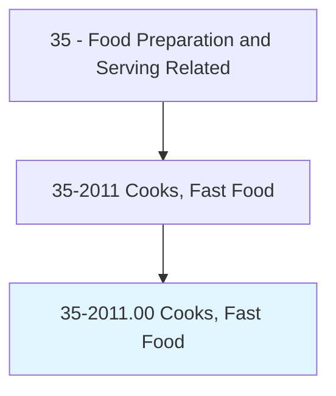
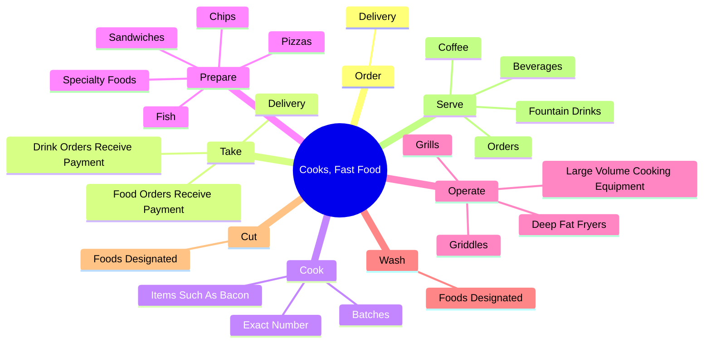
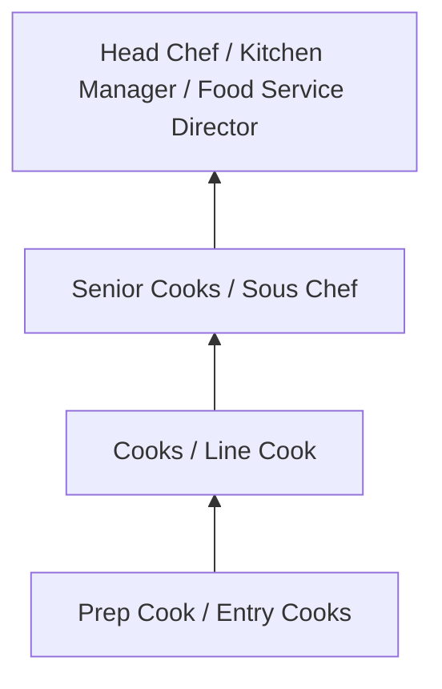
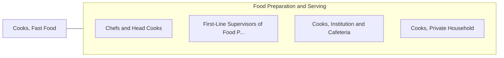

# Cooks, Fast Food

> Prepare and cook food in a fast food restaurant with a limited menu. Duties of these cooks are limited to preparation of a few basic items and normally involve operating large-volume single-purpose cooking equipment.

## Overview

Cooks, Fast Food professionals prepare and cook food in a fast food restaurant with a limited menu. This occupation falls within the Food Preparation and Serving Related category and requires a combination of specialized knowledge, technical skills, and practical experience.

These professionals work across diverse settings and organizational contexts, applying their expertise to meet the demands of their field. They must stay current with industry standards, emerging practices, and regulatory requirements that affect their work. The role demands both independent judgment and collaborative skills, as practitioners regularly interact with colleagues, stakeholders, and the public.

As the field continues to evolve, Cooks professionals increasingly leverage technology and data-driven approaches to enhance their effectiveness. Career opportunities span the public and private sectors, with demand influenced by economic conditions, demographic shifts, and technological advancement.

## Classification Hierarchy



## Key Statistics

| Metric | Value |
|--------|-------|
| SOC Code | 35-2011.00 |
| Job Zone | N/A |
| Category | [Food Preparation and Serving Related](/occupations/FoodService/index) |
| Core Tasks | N/A+ |
| Salary Range | $25,000 - $55,000 |
| Median Salary | $32,000 |
| Growth Outlook | 6% (As fast as average) |
| Source | O*NET |

## Core Tasks



### order.Delivery

Cooks, Fast Food order delivery as part of their core responsibilities.

**Actions:**
- `order.Delivery.of.Supplies`

### take.Delivery

Cooks, Fast Food take delivery as part of their core responsibilities.

**Actions:**
- `take.Delivery.of.Supplies`
- `take.FoodOrdersReceivePayment.from.Customers`
- `take.DrinkOrdersReceivePayment.from.Customers`

### cook.ExactNumber

Cooks, Fast Food cook exact number as part of their core responsibilities.

**Actions:**
- `cook.ExactNumber.of.ItemsOrdered.by.Customer`
- `cook.ExactNumber.of.Working.on.DifferentOrdersSimultaneously`
- `cook.Batches.of.Food`
- `cook.Batches.of.Hamburgers`

### Technical Skills
- **Food Preparation** - Advanced
- **Food Safety** - Advanced
- **Customer Service** - Advanced

### Soft Skills
- **Communication** - Essential
- **Problem Solving** - Essential
- **Critical Thinking** - Important
- **Teamwork** - Important
- **Adaptability** - Important


## Skills & Competencies

### Technical Skills
- **Food Preparation** - Advanced
- **Food Safety and Sanitation** - Advanced
- **Menu Knowledge** - Proficient
- **Kitchen Equipment Operation** - Proficient
- **Inventory Management** - Proficient
- **Portion Control** - Proficient

### Soft Skills
- **Time Management** - Critical
- **Teamwork** - Critical
- **Stress Tolerance** - Essential
- **Communication** - Essential
- **Customer Service** - Essential

## Education & Certifications

| Requirement | Details |
|-------------|---------|
| Typical Education | High school diploma; culinary programs beneficial |
| Work Experience | 0-2 years food service experience |
| On-the-Job Training | Short to moderate - food safety and preparation techniques |
| Certifications | Food Handler certification, ServSafe, state health permits |

## Career Progression



## Industry Variations

### Full-Service Restaurants
High-quality food preparation and presentation. Cooks professionals focus on menu creativity and dining experience.

### Institutional Food Service
Large-scale food preparation for schools, hospitals, or corporate cafeterias. Emphasis on nutrition, consistency, and volume.

### Quick-Service and Fast Food
High-volume, standardized food preparation. Focus on speed, consistency, and food safety compliance.

### Catering and Events
Event-based food service requiring planning, coordination, and ability to execute in varied locations and conditions.

## Technology & Tools

- **Point-of-sale (POS) systems**
- **Commercial kitchen equipment**
- **Food safety monitoring systems**
- **Inventory management software**
- **Recipe management and costing tools**

## Related Occupations



## Industries

- [Restaurants and Food Service](/industries/Restaurants) - High Employment
- Hotels and Hospitality - High Employment
- [Healthcare Facilities](/industries/Healthcare/index) - Moderate Employment
- [Education](/industries/Education) - Moderate Employment

## Departments

This occupation typically works in:
- Kitchen Operations
- Food and Beverage
- Hospitality Services

## GraphDL Semantic Structure

```graphdl
Cooks, Fast Food perform:
- prepare.Food.according.to.Recipes
- maintain.Kitchen.for.SanitaryConditions
- follow.Procedures.for.FoodSafety
- serve.Customers.with.QualityService
- manage.Inventory.of.FoodSupplies
```

---

*Source: O*NET 35-2011.00 - ONETOccupation*
