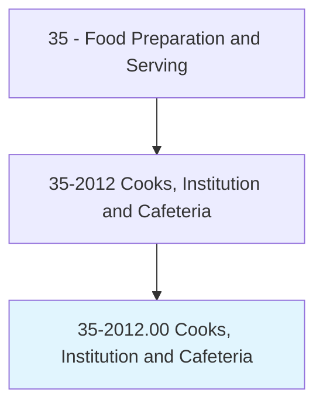
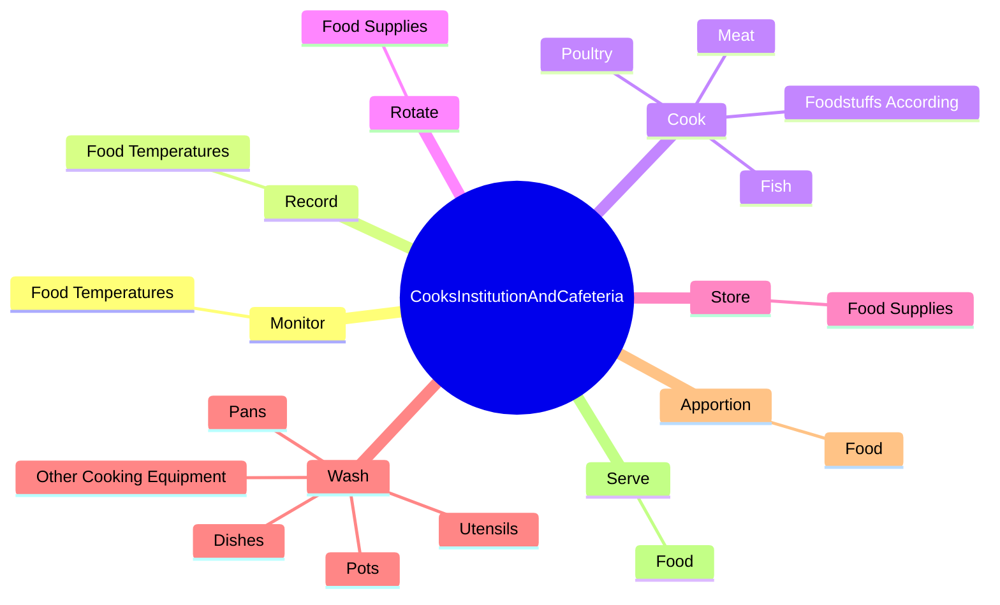
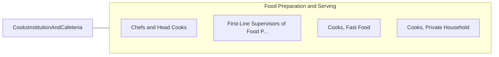

# Cooks, Institution and Cafeteria

> Prepare and cook large quantities of food for institutions, such as schools, hospitals, or cafeterias.

## Overview

Cooks, Institution and Cafeteria is classified under Food Preparation and Serving (SOC 35). Prepare and cook large quantities of food for institutions, such as schools, hospitals, or cafeterias.

## Classification Hierarchy

## Key Statistics

| Metric | Value |
|--------|-------|
| SOC Code | 35-2012.00 |
| Category | [Food Preparation and Serving](/occupations/FoodService) |
| Task Count | 69 |
| Source | O*NET |

## Core Tasks

### monitor.FoodTemperatures

Cooks, Institution and Cafeteria monitor food temperatures as part of their core responsibilities.

**Actions:**
- `monitor.FoodTemperatures.to.ensure.FoodSafety`

### record.FoodTemperatures

Cooks, Institution and Cafeteria record food temperatures as part of their core responsibilities.

**Actions:**
- `record.FoodTemperatures.to.ensure.FoodSafety`

### cook.FoodstuffsAccording

Cooks, Institution and Cafeteria cook foodstuffs according as part of their core responsibilities.

**Actions:**
- `cook.FoodstuffsAccording.to.Menus`
- `cook.FoodstuffsAccording.to.SpecialDietary`
- `cook.FoodstuffsAccording.to.NutritionalRestrictions`
- `cook.FoodstuffsAccording.to.NumbersOfPortionsToBeServed`

## Skills & Competencies

### Technical Skills
- **Food Preparation** - Advanced
- **Food Safety** - Advanced
- **Customer Service** - Advanced

### Soft Skills
- **Communication** - Essential
- **Problem Solving** - Essential
- **Critical Thinking** - Important
- **Teamwork** - Important
- **Adaptability** - Important

## Related Occupations

## Industries

This occupation is found across multiple industries. See [Industries](/industries) for sector-specific employment data.

## Career Progression

---

*Source: O*NET 35-2012.00 - ONETOccupation*
