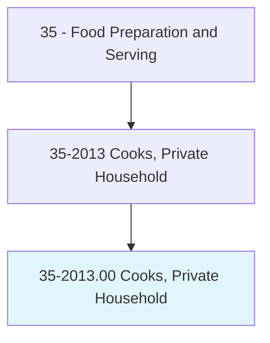
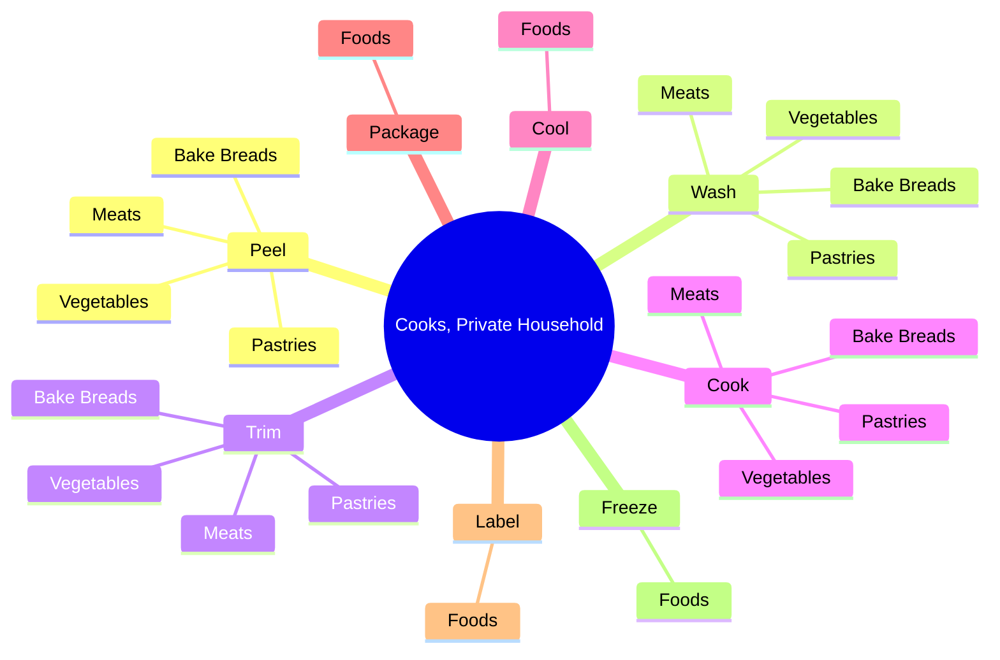

# Cooks, Private Household

> Prepare meals in private homes. Includes personal chefs.

## Overview

Cooks, Private Household is an occupation within the Food Preparation and Serving category. Prepare meals in private homes. 

## Classification Hierarchy

## Key Statistics

| Metric | Value |
|--------|-------|
| SOC Code | 35-2013.00 |
| Category | [Food Preparation and Serving](/occupations/FoodService/index) |
| Task Count | 67 |
| Source | O*NET |

## Core Tasks

### peel.Vegetables

Cooks, Private Household peel vegetables as part of their core responsibilities.

**Actions:**
- `peel.Vegetables`
- `peel.Meats`
- `peel.BakeBreads`
- `peel.Pastries`

### wash.Vegetables

Cooks, Private Household wash vegetables as part of their core responsibilities.

**Actions:**
- `wash.Vegetables`
- `wash.Meats`
- `wash.BakeBreads`
- `wash.Pastries`

### trim.Vegetables

Cooks, Private Household trim vegetables as part of their core responsibilities.

**Actions:**
- `trim.Vegetables`
- `trim.Meats`
- `trim.BakeBreads`
- `trim.Pastries`

## Skills & Competencies

### Technical Skills
- **Food Preparation** - Advanced
- **Food Safety** - Advanced
- **Customer Service** - Advanced

### Soft Skills
- **Communication** - Essential
- **Problem Solving** - Essential
- **Critical Thinking** - Important
- **Teamwork** - Important
- **Adaptability** - Important

## Related Occupations

## Industries

This occupation is found across multiple industries. See [Industries](/industries) for sector-specific employment data.

## Career Progression

---

*Source: O*NET 35-2013.00 - ONETOccupation*
