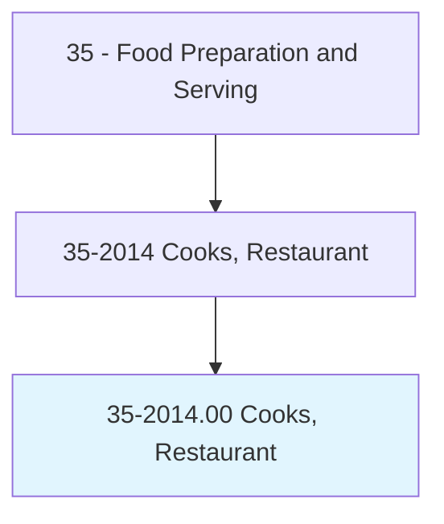
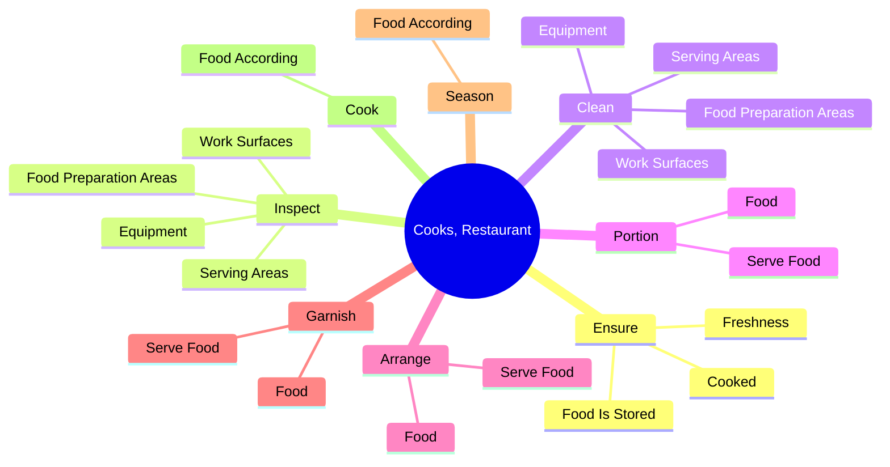
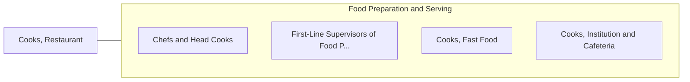

# Cooks, Restaurant

> Prepare, season, and cook dishes such as soups, meats, vegetables, or desserts in restaurants. May order supplies, keep records and accounts, price items on menu, or plan menu.

## Overview

Cooks, Restaurant is an occupation within the Food Preparation and Serving category. Prepare, season, and cook dishes such as soups, meats, vegetables, or desserts in restaurants. 

## Classification Hierarchy

## Key Statistics

| Metric | Value |
|--------|-------|
| SOC Code | 35-2014.00 |
| Category | [Food Preparation and Serving](/occupations/FoodService/index) |
| Task Count | 155 |
| Source | O*NET |

## Core Tasks

### ensure.FoodIsStored

Cooks, Restaurant ensure food is stored as part of their core responsibilities.

**Actions:**
- `ensure.FoodIsStored.at.CorrectTemperature.by.RegulatingTemperatureOfOvens`
- `ensure.FoodIsStored.at.Broilers`
- `ensure.FoodIsStored.at.Grills`
- `ensure.FoodIsStored.at.Roasters`

### inspect.FoodPreparationAreas

Cooks, Restaurant inspect food preparation areas as part of their core responsibilities.

**Actions:**
- `inspect.FoodPreparationAreas.to.ensure.SafeFoodHandlingPractices`
- `inspect.FoodPreparationAreas.to.SanitaryFoodHandlingPractices`
- `inspect.Equipment.to.ensure.SafeFoodHandlingPractices`
- `inspect.Equipment.to.SanitaryFoodHandlingPractices`

### clean.FoodPreparationAreas

Cooks, Restaurant clean food preparation areas as part of their core responsibilities.

**Actions:**
- `clean.FoodPreparationAreas.to.ensure.SafeFoodHandlingPractices`
- `clean.FoodPreparationAreas.to.SanitaryFoodHandlingPractices`
- `clean.Equipment.to.ensure.SafeFoodHandlingPractices`
- `clean.Equipment.to.SanitaryFoodHandlingPractices`

## Skills & Competencies

### Technical Skills
- **Food Preparation** - Advanced
- **Food Safety** - Advanced
- **Customer Service** - Advanced

### Soft Skills
- **Communication** - Essential
- **Problem Solving** - Essential
- **Critical Thinking** - Important
- **Teamwork** - Important
- **Adaptability** - Important

## Related Occupations

## Industries

This occupation is found across multiple industries. See [Industries](/industries) for sector-specific employment data.

## Career Progression

---

*Source: O*NET 35-2014.00 - ONETOccupation*
