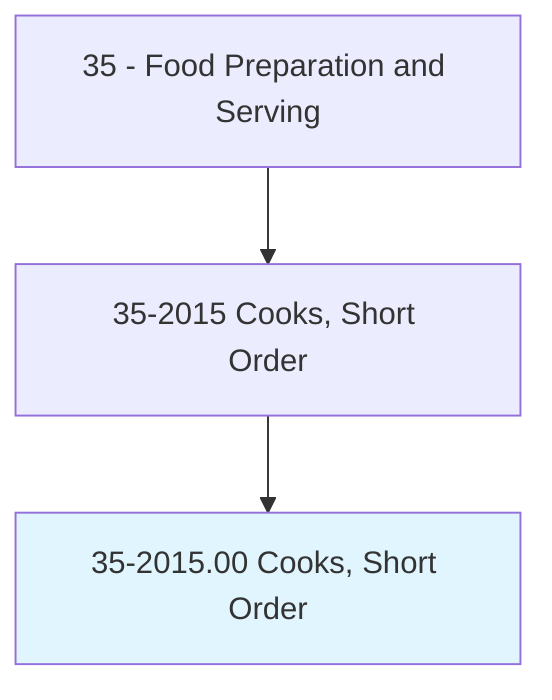
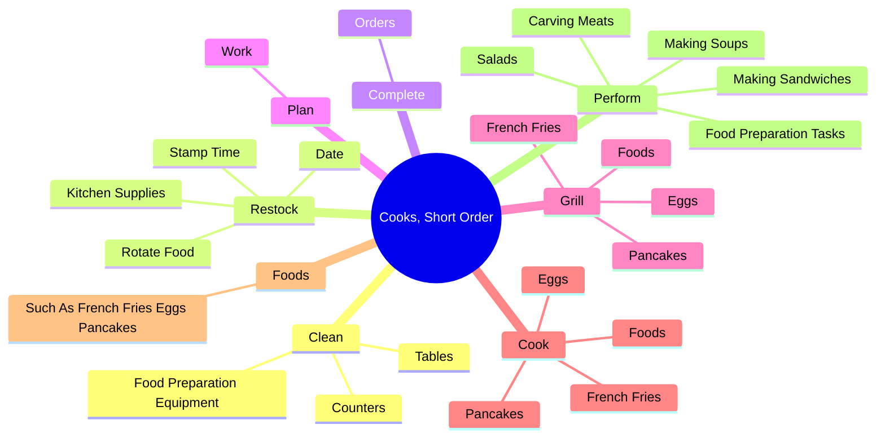
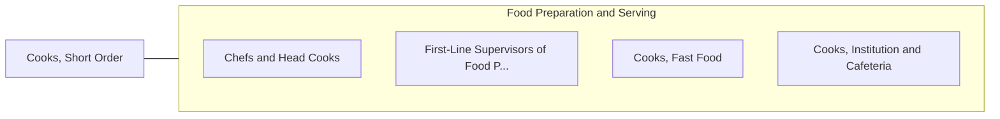

# Cooks, Short Order

> Prepare and cook to order a variety of foods that require only a short preparation time. May take orders from customers and serve patrons at counters or tables.

## Overview

Cooks, Short Order is an occupation within the Food Preparation and Serving category. Prepare and cook to order a variety of foods that require only a short preparation time. 

## Classification Hierarchy

## Key Statistics

| Metric | Value |
|--------|-------|
| SOC Code | 35-2015.00 |
| Category | [Food Preparation and Serving](/occupations/FoodService) |
| Task Count | 48 |
| Source | O*NET |

## Core Tasks

### clean.FoodPreparationEquipment

Cooks, Short Order clean food preparation equipment as part of their core responsibilities.

**Actions:**
- `clean.FoodPreparationEquipment`
- `clean.Counters`
- `clean.Tables`

### restock.KitchenSupplies

Cooks, Short Order restock kitchen supplies as part of their core responsibilities.

**Actions:**
- `restock.KitchenSupplies.on.Food.in.Coolers`
- `restock.RotateFood.on.Food.in.Coolers`
- `restock.StampTime.on.Food.in.Coolers`
- `restock.Date.on.Food.in.Coolers`

### complete.Orders

Cooks, Short Order complete orders as part of their core responsibilities.

**Actions:**
- `complete.Orders.from.SteamTables`
- `complete.Orders.from.PlacingFood.on.Plates`
- `complete.Orders.from.ServingCustomers.at.Tables`
- `complete.Orders.from.Counters`

## Skills & Competencies

### Technical Skills
- **Food Preparation** - Advanced
- **Food Safety** - Advanced
- **Customer Service** - Advanced

### Soft Skills
- **Communication** - Essential
- **Problem Solving** - Essential
- **Critical Thinking** - Important
- **Teamwork** - Important
- **Adaptability** - Important

## Related Occupations

## Industries

This occupation is found across multiple industries. See [Industries](/industries) for sector-specific employment data.

## Career Progression

---

*Source: O*NET 35-2015.00 - ONETOccupation*
