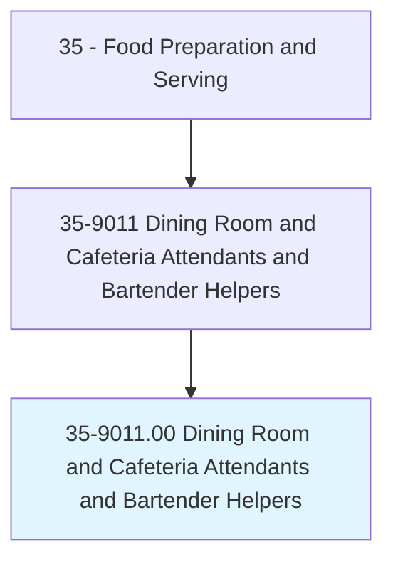
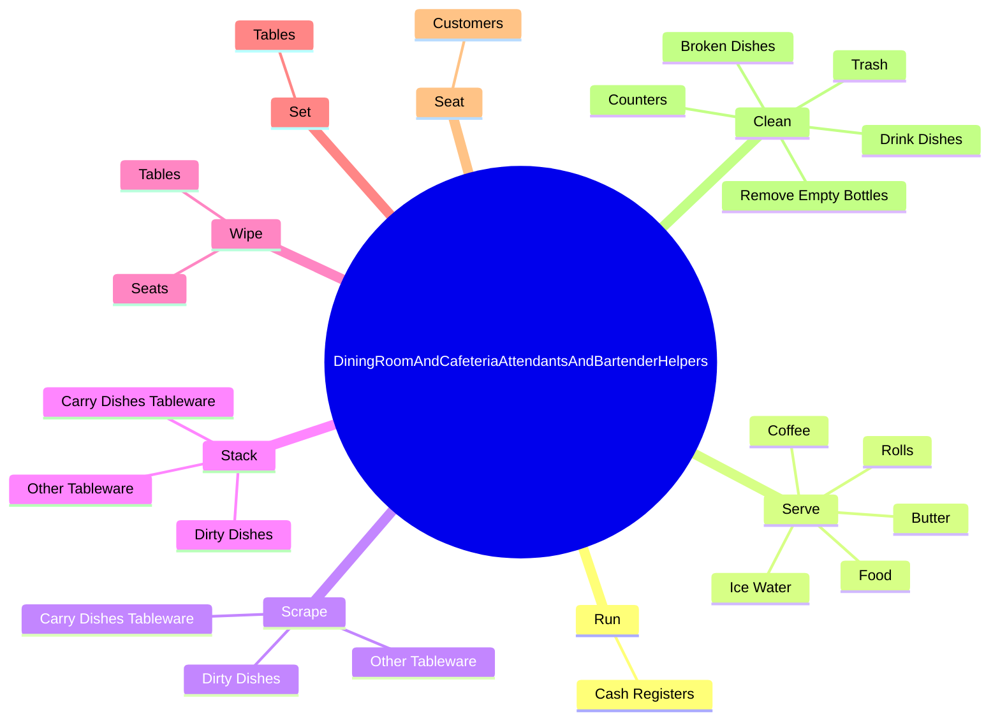
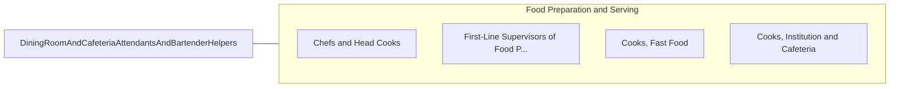

# Dining Room and Cafeteria Attendants and Bartender Helpers

> Facilitate food service. Clean tables; remove dirty dishes; replace soiled table linens; set tables; replenish supply of clean linens, silverware, glassware, and dishes; supply service bar with food; and serve items such as water, condiments, and coffee to patrons.

## Overview

Dining Room and Cafeteria Attendants and Bartender Helpers is an occupation within the Food Preparation and Serving category. Facilitate food service. 

## Classification Hierarchy

## Key Statistics

| Metric | Value |
|--------|-------|
| SOC Code | 35-9011.00 |
| Category | [Food Preparation and Serving](/occupations/FoodService/index) |
| Task Count | 93 |
| Source | O*NET |

## Core Tasks

### run.CashRegisters

Dining Room and Cafeteria Attendants and Bartender Helpers run cash registers as part of their core responsibilities.

**Actions:**
- `run.CashRegisters`

### serve.IceWater

Dining Room and Cafeteria Attendants and Bartender Helpers serve ice water as part of their core responsibilities.

**Actions:**
- `serve.IceWater.to.Patrons`
- `serve.Coffee.to.Patrons`
- `serve.Rolls.to.Patrons`
- `serve.Butter.to.Patrons`

### scrape.DirtyDishes

Dining Room and Cafeteria Attendants and Bartender Helpers scrape dirty dishes as part of their core responsibilities.

**Actions:**
- `scrape.DirtyDishes.to.KitchensForCleaning`
- `scrape.CarryDishesTableware.to.KitchensForCleaning`
- `scrape.OtherTableware.to.KitchensForCleaning`

## Skills & Competencies

### Technical Skills
- **Food Preparation** - Advanced
- **Food Safety** - Advanced
- **Customer Service** - Advanced

### Soft Skills
- **Communication** - Essential
- **Problem Solving** - Essential
- **Critical Thinking** - Important
- **Teamwork** - Important
- **Adaptability** - Important

## Related Occupations

## Industries

This occupation is found across multiple industries. See [Industries](/industries) for sector-specific employment data.

## Career Progression

---

*Source: O*NET 35-9011.00 - ONETOccupation*
