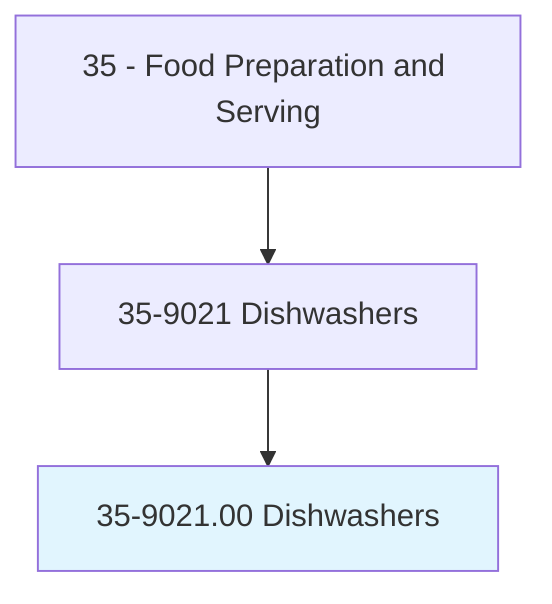
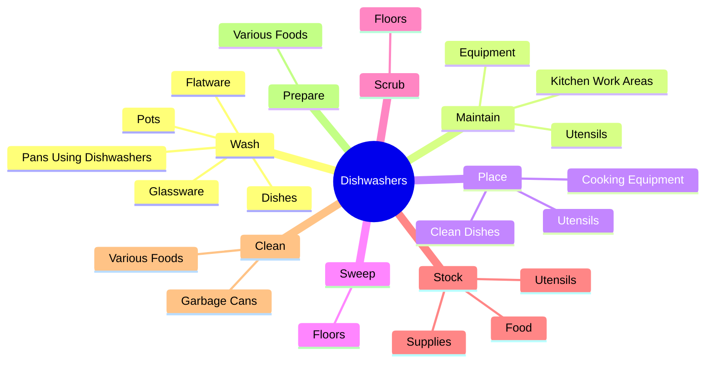
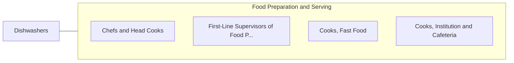

# Dishwashers

> Clean dishes, kitchen, food preparation equipment, or utensils.

## Overview

Dishwashers is classified under Food Preparation and Serving (SOC 35). Clean dishes, kitchen, food preparation equipment, or utensils.

## Classification Hierarchy

## Key Statistics

| Metric | Value |
|--------|-------|
| SOC Code | 35-9021.00 |
| Category | [Food Preparation and Serving](/occupations/FoodService) |
| Task Count | 51 |
| Source | O*NET |

## Core Tasks

### wash.Dishes

Dishwashers wash dishes as part of their core responsibilities.

**Actions:**
- `wash.Dishes.by.Hand`
- `wash.Glassware.by.Hand`
- `wash.Flatware.by.Hand`
- `wash.Pots.by.Hand`

### maintain.KitchenWorkAreas

Dishwashers maintain kitchen work areas as part of their core responsibilities.

**Actions:**
- `maintain.KitchenWorkAreas.in.CleanCondition`
- `maintain.KitchenWorkAreas.in.OrderlyCondition`
- `maintain.Equipment.in.CleanCondition`
- `maintain.Equipment.in.OrderlyCondition`

### place.CleanDishes

Dishwashers place clean dishes as part of their core responsibilities.

**Actions:**
- `place.CleanDishes.in.StorageAreas`
- `place.Utensils.in.StorageAreas`
- `place.CookingEquipment.in.StorageAreas`

## Skills & Competencies

### Technical Skills
- **Food Preparation** - Advanced
- **Food Safety** - Advanced
- **Customer Service** - Advanced

### Soft Skills
- **Communication** - Essential
- **Problem Solving** - Essential
- **Critical Thinking** - Important
- **Teamwork** - Important
- **Adaptability** - Important

## Related Occupations

## Industries

This occupation is found across multiple industries. See [Industries](/industries) for sector-specific employment data.

## Career Progression

---

*Source: O*NET 35-9021.00 - ONETOccupation*
