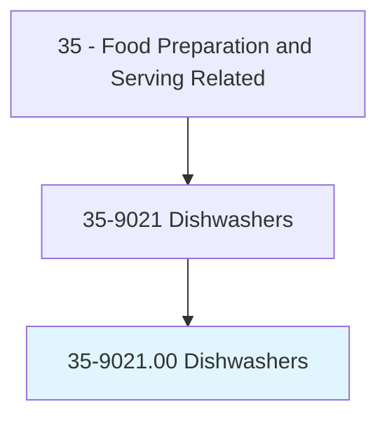
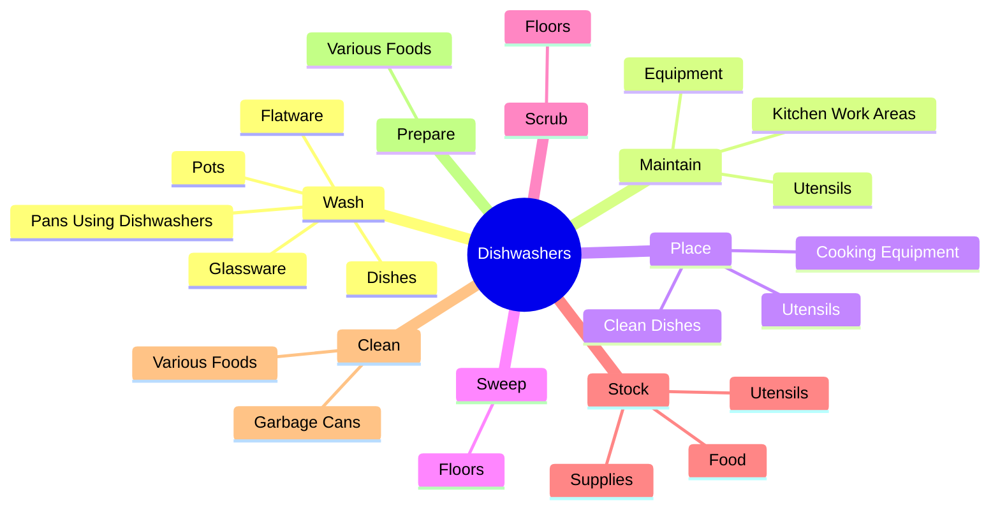
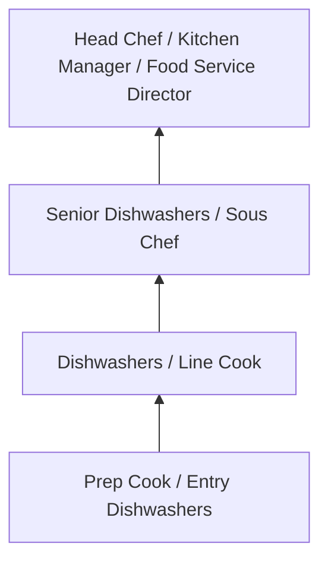
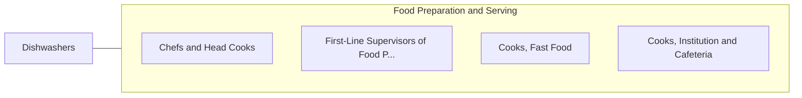

# Dishwashers

> Clean dishes, kitchen, food preparation equipment, or utensils.

## Overview

Dishwashers professionals clean dishes, kitchen, food preparation equipment, or utensils.. This occupation falls within the Food Preparation and Serving Related category and requires a combination of specialized knowledge, technical skills, and practical experience.

These professionals work across diverse settings and organizational contexts, applying their expertise to meet the demands of their field. They must stay current with industry standards, emerging practices, and regulatory requirements that affect their work. The role demands both independent judgment and collaborative skills, as practitioners regularly interact with colleagues, stakeholders, and the public.

As the field continues to evolve, Dishwashers professionals increasingly leverage technology and data-driven approaches to enhance their effectiveness. Career opportunities span the public and private sectors, with demand influenced by economic conditions, demographic shifts, and technological advancement.

## Classification Hierarchy



## Key Statistics

| Metric | Value |
|--------|-------|
| SOC Code | 35-9021.00 |
| Job Zone | N/A |
| Category | [Food Preparation and Serving Related](/occupations/FoodService/index) |
| Core Tasks | 51+ |
| Salary Range | $25,000 - $55,000 |
| Median Salary | $32,000 |
| Growth Outlook | 6% (As fast as average) |
| Source | O*NET |

## Core Tasks



### stock.Supplies

Dishwashers stock supplies as part of their core responsibilities.

**Actions:**
- `stock.Supplies.in.ServingStations` - Stock supplies, such as food or utensils, in serving stations, cupboards, ref...
- `stock.Supplies.in.Cupboards` - Stock supplies, such as food or utensils, in serving stations, cupboards, ref...
- `stock.Supplies.in.Refrigerators` - Stock supplies, such as food or utensils, in serving stations, cupboards, ref...
- `stock.Supplies.in.SaladBars` - Stock supplies, such as food or utensils, in serving stations, cupboards, ref...
- `stock.Food.in.ServingStations` - Stock supplies, such as food or utensils, in serving stations, cupboards, ref...

### maintain.KitchenWorkAreas

Dishwashers maintain kitchen work areas as part of their core responsibilities.

**Actions:**
- `maintain.KitchenWorkAreas.in.CleanCondition` - Maintain kitchen work areas, equipment, or utensils in clean and orderly cond...
- `maintain.KitchenWorkAreas.in.OrderlyCondition` - Maintain kitchen work areas, equipment, or utensils in clean and orderly cond...
- `maintain.Equipment.in.CleanCondition` - Maintain kitchen work areas, equipment, or utensils in clean and orderly cond...
- `maintain.Equipment.in.OrderlyCondition` - Maintain kitchen work areas, equipment, or utensils in clean and orderly cond...
- `maintain.Utensils.in.CleanCondition` - Maintain kitchen work areas, equipment, or utensils in clean and orderly cond...

### wash.Dishes

Dishwashers wash dishes as part of their core responsibilities.

**Actions:**
- `wash.Dishes.by.Hand` - Wash dishes, glassware, flatware, pots, or pans, using dishwashers or by hand.
- `wash.Glassware.by.Hand` - Wash dishes, glassware, flatware, pots, or pans, using dishwashers or by hand.
- `wash.Flatware.by.Hand` - Wash dishes, glassware, flatware, pots, or pans, using dishwashers or by hand.
- `wash.Pots.by.Hand` - Wash dishes, glassware, flatware, pots, or pans, using dishwashers or by hand.
- `wash.PansUsingDishwashers.by.Hand` - Wash dishes, glassware, flatware, pots, or pans, using dishwashers or by hand.

### clean.VariousFoods

Dishwashers clean various foods as part of their core responsibilities.

**Actions:**
- `clean.VariousFoods.for.Cooking` - Clean or prepare various foods for cooking or serving.
- `clean.VariousFoods.for.Serving` - Clean or prepare various foods for cooking or serving.
- `clean.GarbageCans.with.Water` - Clean garbage cans with water or steam.
- `clean.GarbageCans.with.Steam` - Clean garbage cans with water or steam.


## Skills & Competencies

### Technical Skills
- **Food Preparation** - Advanced
- **Food Safety and Sanitation** - Advanced
- **Menu Knowledge** - Proficient
- **Kitchen Equipment Operation** - Proficient
- **Inventory Management** - Proficient
- **Portion Control** - Proficient

### Soft Skills
- **Time Management** - Critical
- **Teamwork** - Critical
- **Stress Tolerance** - Essential
- **Communication** - Essential
- **Customer Service** - Essential

## Education & Certifications

| Requirement | Details |
|-------------|---------|
| Typical Education | High school diploma; culinary programs beneficial |
| Work Experience | 0-2 years food service experience |
| On-the-Job Training | Short to moderate - food safety and preparation techniques |
| Certifications | Food Handler certification, ServSafe, state health permits |

## Career Progression



## Industry Variations

### Full-Service Restaurants
High-quality food preparation and presentation. Dishwashers professionals focus on menu creativity and dining experience.

### Institutional Food Service
Large-scale food preparation for schools, hospitals, or corporate cafeterias. Emphasis on nutrition, consistency, and volume.

### Quick-Service and Fast Food
High-volume, standardized food preparation. Focus on speed, consistency, and food safety compliance.

### Catering and Events
Event-based food service requiring planning, coordination, and ability to execute in varied locations and conditions.

## Technology & Tools

- **Point-of-sale (POS) systems**
- **Commercial kitchen equipment**
- **Food safety monitoring systems**
- **Inventory management software**
- **Recipe management and costing tools**

## Related Occupations



## Industries

- [Restaurants and Food Service](/industries/Restaurants) - High Employment
- [Hotels and Hospitality](/industries/Hospitality) - High Employment
- [Healthcare Facilities](/industries/Healthcare/index) - Moderate Employment
- [Education](/industries/Education) - Moderate Employment

## Departments

This occupation typically works in:
- [Kitchen Operations](/departments/Kitchen)
- [Food and Beverage](/departments/FoodBeverage)
- [Hospitality Services](/departments/Hospitality)

## GraphDL Semantic Structure

```
Dishwashers perform:
- wash.Dishes.by.Hand
- wash.Glassware.by.Hand
- wash.Flatware.by.Hand
- wash.Pots.by.Hand
- wash.PansUsingDishwashers.by.Hand
- maintain.KitchenWorkAreas.in.CleanCondition
```

---

*Source: O*NET 35-9021.00 - ONETOccupation*
