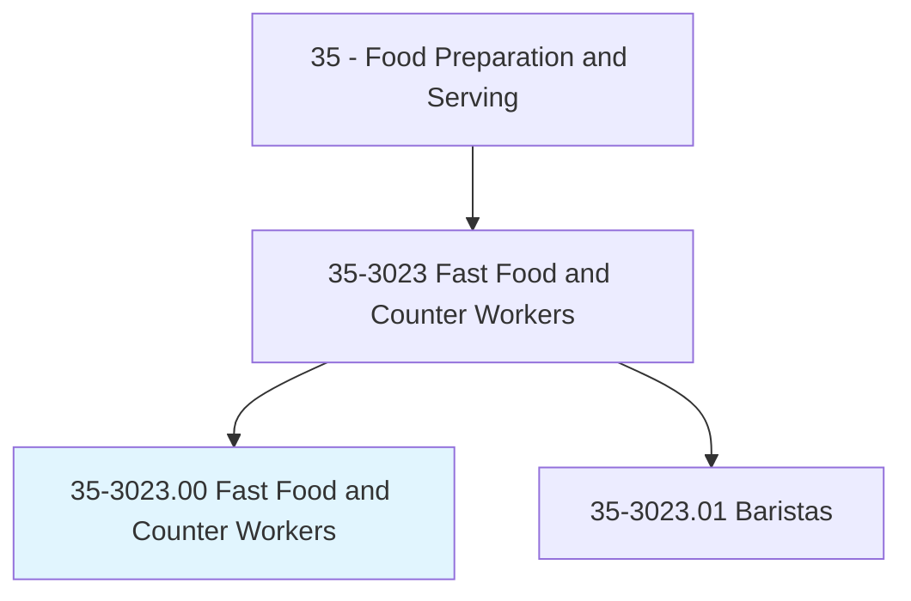
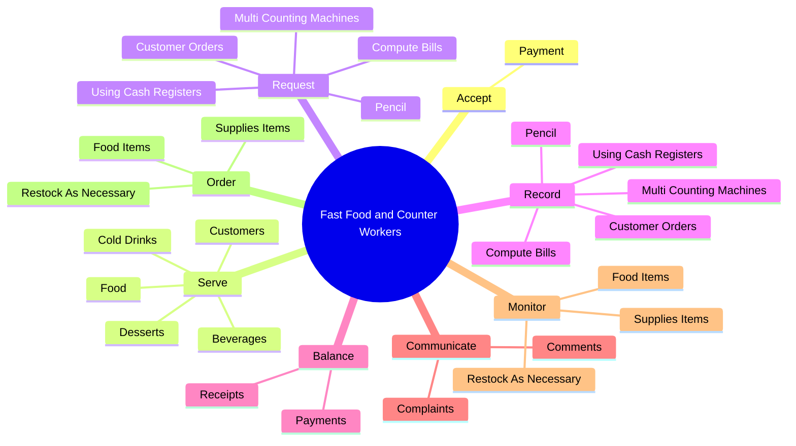
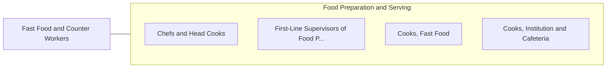

# Fast Food and Counter Workers

> Perform duties such as taking orders and serving food and beverages. Serve customers at counter or from a steam table. May take payment. May prepare food and beverages.

## Overview

Fast Food and Counter Workers is an occupation within the Food Preparation and Serving category. Perform duties such as taking orders and serving food and beverages. Serve customers at counter or from a steam table.

## Classification Hierarchy

## Key Statistics

| Metric | Value |
|--------|-------|
| SOC Code | 35-3023.00 |
| Category | [Food Preparation and Serving](/occupations/FoodService) |
| Task Count | 130 |
| Source | O*NET |

## Core Tasks

### accept.Payment

Fast Food and Counter Workers accept payment as part of their core responsibilities.

**Actions:**
- `accept.Payment.from.Customers`
- `accept.Payment.from.MakeChangeAsNecessary`

### serve.Customers

Fast Food and Counter Workers serve customers as part of their core responsibilities.

**Actions:**
- `serve.Customers.in.EatingPlacesSpecialize.in.FastServiceCarryOutFood`
- `serve.Customers.in.InexpensiveCarryOutFood`
- `serve.Food.to.CustomersInSuchSettingsAsTakeOutCountersOfRestaurants`
- `serve.Food.to.Lunchrooms`

### request.CustomerOrders

Fast Food and Counter Workers request customer orders as part of their core responsibilities.

**Actions:**
- `request.CustomerOrders`
- `request.ComputeBills`
- `request.UsingCashRegisters`
- `request.MultiCountingMachines`

## Skills & Competencies

### Technical Skills
- **Food Preparation** - Advanced
- **Food Safety** - Advanced
- **Customer Service** - Advanced

### Soft Skills
- **Communication** - Essential
- **Problem Solving** - Essential
- **Critical Thinking** - Important
- **Teamwork** - Important
- **Adaptability** - Important

## Related Occupations

## Industries

This occupation is found across multiple industries. See [Industries](/industries) for sector-specific employment data.

## Career Progression

---

*Source: O*NET 35-3023.00 - ONETOccupation*
