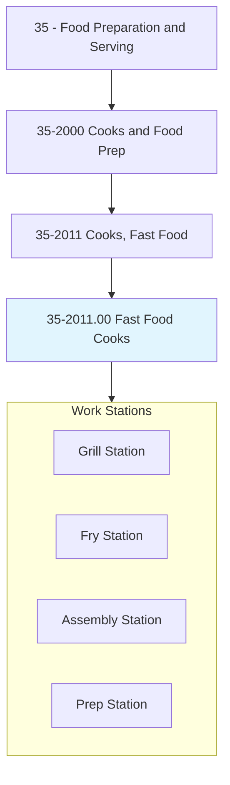
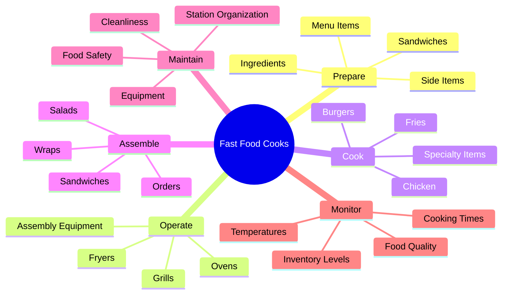
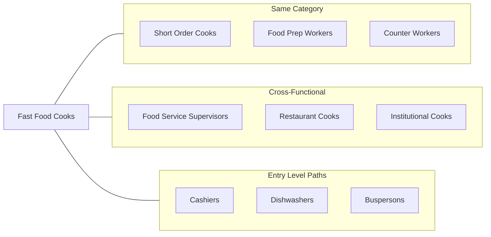
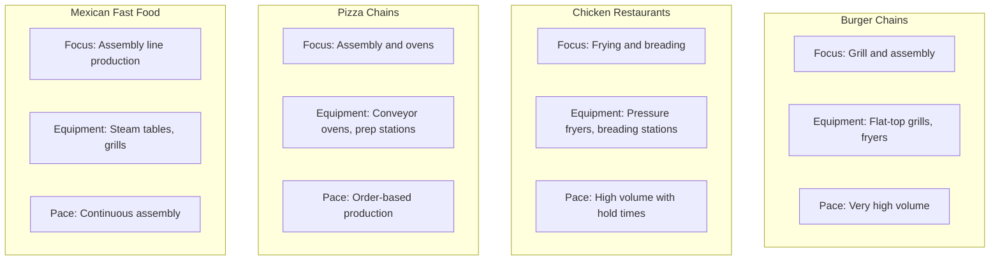
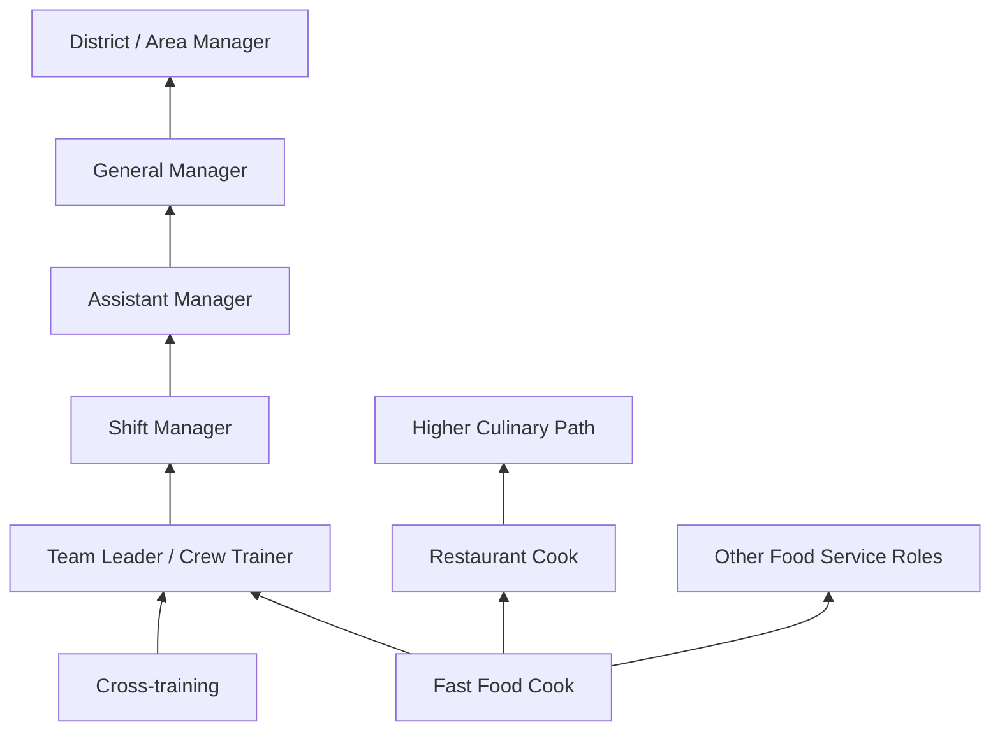

# Cooks, Fast Food

> Prepare and cook food in a fast food restaurant with a limited menu. Duties of these cooks are limited to preparation of a few basic items and normally involve operating large-volume single-purpose cooking equipment.

## Overview

Fast Food Cooks work in quick-service restaurants preparing standardized menu items at high speed and volume. Unlike traditional cooks, they specialize in operating specific equipment designed for rapid food production, such as fryers, grills, and assembly stations. The role emphasizes speed, consistency, and adherence to strict preparation standards rather than culinary creativity. Fast food cooks are essential to the quick-service restaurant industry, serving millions of customers daily through efficient production systems. This entry-level position offers opportunities to learn food service fundamentals and advance into supervisory roles.

## Classification Hierarchy



## Key Statistics

| Metric | Value |
|--------|-------|
| SOC Code | 35-2011.00 |
| Job Zone | 1 (Little or No Preparation) |
| Category | [Food Preparation and Serving](/occupations/FoodService) |
| Core Tasks | 10+ |
| Experience Required | None required |
| Source | O*NET |

## Core Tasks



### prepare.Food

Fast Food Cooks prepare ingredients and menu items according to standardized recipes.

**Actions:**
- `prepare.Ingredients.for.MenuItems` - Ready ingredients for cooking and assembly
- `prepare.Sandwiches.to.Standards` - Build menu items following specifications
- `prepare.SideItems.for.Orders` - Cook and portion side dishes
- `prepare.Beverages.for.Customers` - Fill drink orders as needed

### operate.Equipment

Fast Food Cooks use specialized high-volume cooking equipment efficiently.

**Actions:**
- `operate.Fryers.for.CookingFood` - Use deep fryers for fries, chicken, fish
- `operate.Grills.for.CookingProteins` - Cook burgers, chicken, breakfast items
- `operate.Ovens.for.HeatingFood` - Use warming ovens and specialty ovens
- `operate.AssemblyEquipment.for.Production` - Use toasters, steamers, warming units

### cook.MenuItems

Fast Food Cooks prepare food items quickly while maintaining quality standards.

**Actions:**
- `cook.Burgers.on.Grill` - Grill hamburger patties to specification
- `cook.Chicken.in.Fryer` - Fry chicken items to proper temperature
- `cook.Fries.in.Fryer` - Prepare french fries and fried sides
- `cook.BreakfastItems.during.MorningShift` - Prepare eggs, pancakes, breakfast sandwiches

### maintain.Standards

Fast Food Cooks ensure cleanliness and food safety compliance.

**Actions:**
- `maintain.Cleanliness.of.Station` - Keep work area clean during shifts
- `maintain.Equipment.in.WorkingOrder` - Clean and check equipment function
- `maintain.FoodSafety.at.Station` - Follow HACCP and sanitation guidelines
- `maintain.Inventory.at.Station` - Stock and rotate supplies

## Skills & Competencies

### Technical Skills
- **Equipment Operation** - Proficient
- **Food Safety Basics** - Proficient
- **Speed and Efficiency** - Critical
- **Recipe Following** - Proficient
- **Portion Control** - Proficient
- **Basic Math** - Basic

### Soft Skills
- **Teamwork** - Essential
- **Time Management** - Essential
- **Attention to Detail** - Important
- **Physical Stamina** - Essential
- **Stress Tolerance** - Important
- **Reliability** - Critical

## Related Occupations



### Same Category
- Cooks, Short Order (35-2015.00)
- Food Preparation Workers (35-2021.00)
- Fast Food and Counter Workers (35-3023.00)

### Cross-Functional
- [First-Line Supervisors of Food Preparation and Serving Workers](./FoodServiceSupervisors.mdx)
- Cooks, Restaurant (35-2014.00)
- [Cooks, Institution and Cafeteria](./InstitutionalCooks.mdx)

## Industries

- [Limited-Service Restaurants](/industries/QuickService) - Primary Employment
- [Snack and Nonalcoholic Beverage Bars](/industries/Cafes) - Moderate Employment
- [Gasoline Stations with Convenience Stores](/industries/ConvenienceStores) - Some Employment
- [Grocery Stores](/industries/GroceryStores) - Some Employment
- [Amusement Parks](/industries/Entertainment) - Seasonal Employment

## Industry Variations



## Career Progression



## Education & Training

| Requirement | Details |
|-------------|---------|
| Typical Education | No formal education required |
| Work Experience | None required; on-the-job training provided |
| On-the-Job Training | Short-term (few days to weeks) |
| Common Certifications | Food Handler's Card (varies by jurisdiction) |

## Professional Development

### Entry Requirements
- Minimum age typically 16+
- Basic communication skills
- Ability to work on feet for extended periods
- Availability for varied shifts

### Advancement Paths
- **Crew Trainer** - Train new employees on stations
- **Shift Manager** - Supervise shift operations
- **Restaurant Management** - Move into management track
- **Culinary Career** - Transfer skills to restaurant cooking

## Departments

This occupation typically works in:
- [Kitchen Operations](/departments/Kitchen)
- [Production Line](/departments/Production)
- [Food Service](/departments/FoodService)

## Work Environment

| Aspect | Description |
|--------|-------------|
| Setting | Fast food restaurant kitchen |
| Schedule | Part-time or full-time; varied shifts including evenings and weekends |
| Physical | Standing, repetitive motions, hot environment |
| Pace | Very fast-paced with high volume during peak hours |
| Team | Works as part of coordinated crew |

## Equipment Used

| Equipment | Purpose |
|-----------|---------|
| Deep Fryer | Cook fries, chicken, fish items |
| Flat-Top Grill | Cook burgers, breakfast items |
| Toaster / Conveyor Oven | Toast buns, heat items |
| Steam Table | Hold prepared food at temperature |
| Prep Tables | Assemble sandwiches and orders |
| Timer Systems | Track cooking and holding times |

## Safety Considerations

- Hot oil and grease handling
- Hot surface burns prevention
- Knife safety for prep work
- Slip prevention on wet floors
- Proper lifting techniques
- Food temperature monitoring

## GraphDL Semantic Structure

```
FastFoodCooks.prepare.Food.in.FastFoodRestaurant
FastFoodCooks.cook.Food.with.LimitedMenu
FastFoodCooks.operate.Equipment.for.LargeVolume
FastFoodCooks.assemble.Orders.to.Standards
FastFoodCooks.maintain.Cleanliness.of.Station
FastFoodCooks.monitor.CookingTimes.for.Quality
FastFoodCooks.follow.Recipes.for.Consistency
FastFoodCooks.stock.Supplies.at.Station
```

---

*Source: O*NET 35-2011.00 - ONETOccupation*
