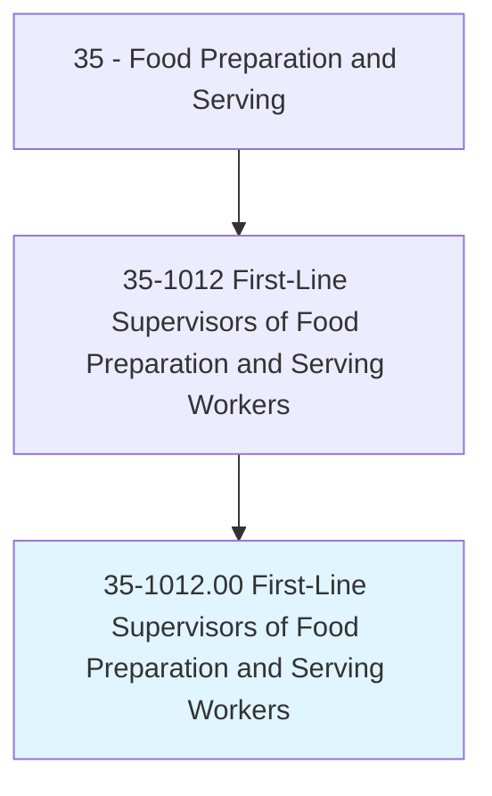
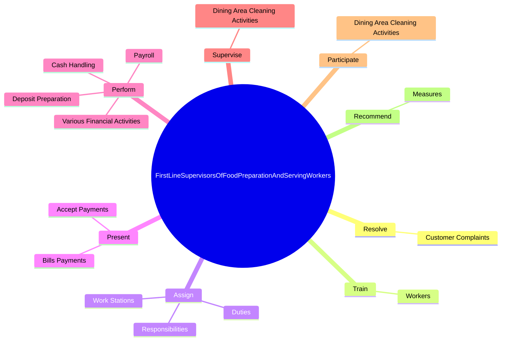
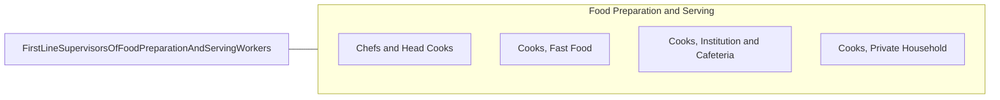

# First-Line Supervisors of Food Preparation and Serving Workers

> Directly supervise and coordinate activities of workers engaged in preparing and serving food.

## Overview

First-Line Supervisors of Food Preparation and Serving Workers is classified under Food Preparation and Serving (SOC 35). Directly supervise and coordinate activities of workers engaged in preparing and serving food.

## Classification Hierarchy

## Key Statistics

| Metric | Value |
|--------|-------|
| SOC Code | 35-1012.00 |
| Category | [Food Preparation and Serving](/occupations/FoodService) |
| Task Count | 106 |
| Source | O*NET |

## Core Tasks

### resolve.CustomerComplaints

First-Line Supervisors of Food Preparation and Serving Workers resolve customer complaints as part of their core responsibilities.

**Actions:**
- `resolve.CustomerComplaints.regarding.FoodService`

### train.Workers

First-Line Supervisors of Food Preparation and Serving Workers train workers as part of their core responsibilities.

**Actions:**
- `train.Workers.in.FoodPreparation`
- `train.Workers.in.InService`
- `train.Workers.in.Sanitation`
- `train.Workers.in.SafetyProcedures`

### assign.Duties

First-Line Supervisors of Food Preparation and Serving Workers assign duties as part of their core responsibilities.

**Actions:**
- `assign.Duties.to.EmployeesInAccordanceWithWorkRequirements`
- `assign.Responsibilities.to.EmployeesInAccordanceWithWorkRequirements`
- `assign.WorkStations.to.EmployeesInAccordanceWithWorkRequirements`

## Skills & Competencies

### Technical Skills
- **Food Preparation** - Advanced
- **Food Safety** - Advanced
- **Customer Service** - Advanced

### Soft Skills
- **Communication** - Essential
- **Problem Solving** - Essential
- **Critical Thinking** - Important
- **Teamwork** - Important
- **Adaptability** - Important

## Related Occupations

## Industries

This occupation is found across multiple industries. See [Industries](/industries) for sector-specific employment data.

## Career Progression

---

*Source: O*NET 35-1012.00 - ONETOccupation*
