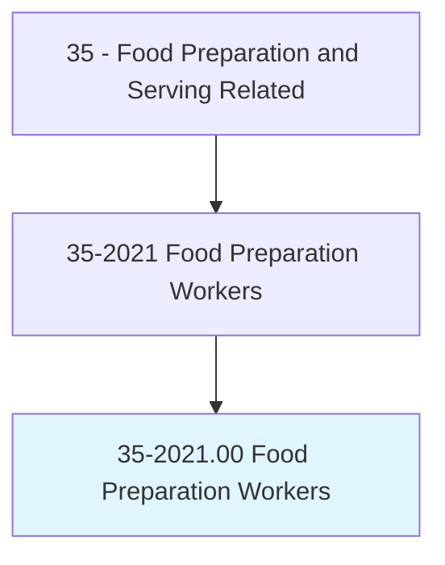
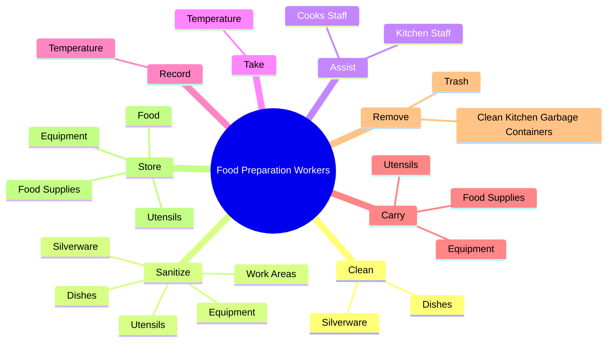
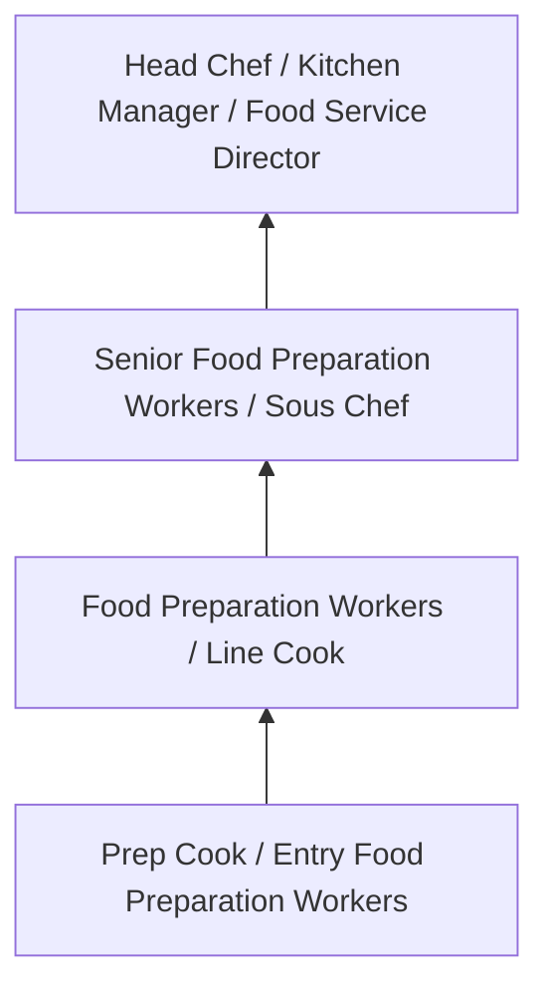
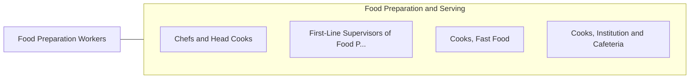

# Food Preparation Workers

> Perform a variety of food preparation duties other than cooking, such as preparing cold foods and shellfish, slicing meat, and brewing coffee or tea.

## Overview

Food Preparation Workers professionals perform a variety of food preparation duties other than cooking, such as preparing cold foods and shellfish, slicing meat, and brewing coffee or tea.. This occupation falls within the Food Preparation and Serving Related category and requires a combination of specialized knowledge, technical skills, and practical experience.

These professionals work across diverse settings and organizational contexts, applying their expertise to meet the demands of their field. They must stay current with industry standards, emerging practices, and regulatory requirements that affect their work. The role demands both independent judgment and collaborative skills, as practitioners regularly interact with colleagues, stakeholders, and the public.

As the field continues to evolve, Food Preparation Workers professionals increasingly leverage technology and data-driven approaches to enhance their effectiveness. Career opportunities span the public and private sectors, with demand influenced by economic conditions, demographic shifts, and technological advancement.

## Classification Hierarchy



## Key Statistics

| Metric | Value |
|--------|-------|
| SOC Code | 35-2021.00 |
| Job Zone | N/A |
| Category | [Food Preparation and Serving Related](/occupations/FoodService/index) |
| Core Tasks | 170+ |
| Salary Range | $25,000 - $55,000 |
| Median Salary | $32,000 |
| Growth Outlook | 6% (As fast as average) |
| Source | O*NET |

## Core Tasks



### add.Cutlery

Food Preparation Workers add cutlery as part of their core responsibilities.

**Actions:**
- `add.Cutlery.to.TraysOnAssemblyLinesInHospitals` - Add cutlery, napkins, food, and other items to trays on assembly lines in hos...
- `add.Cutlery.to.Cafeterias` - Add cutlery, napkins, food, and other items to trays on assembly lines in hos...
- `add.Cutlery.to.AirlineKitchens` - Add cutlery, napkins, food, and other items to trays on assembly lines in hos...
- `add.Cutlery.to.SimilarEstablishments` - Add cutlery, napkins, food, and other items to trays on assembly lines in hos...
- `add.Napkins.to.TraysOnAssemblyLinesInHospitals` - Add cutlery, napkins, food, and other items to trays on assembly lines in hos...

### store.Food

Food Preparation Workers store food as part of their core responsibilities.

**Actions:**
- `store.Food.in.DesignatedContainersAreas.to.prevent.Spoilage` - Store food in designated containers and storage areas to prevent spoilage.
- `store.Food.in.StorageAreas.to.prevent.Spoilage` - Store food in designated containers and storage areas to prevent spoilage.
- `store.FoodSupplies.in.Refrigerators` - Receive and store food supplies, equipment, and utensils in refrigerators, cu...
- `store.FoodSupplies.in.Cupboards` - Receive and store food supplies, equipment, and utensils in refrigerators, cu...
- `store.FoodSupplies.in.OtherStorageAreas` - Receive and store food supplies, equipment, and utensils in refrigerators, cu...

### prepare.Variety

Food Preparation Workers prepare variety as part of their core responsibilities.

**Actions:**
- `prepare.Variety.of.Foods` - Prepare a variety of foods, such as meats, vegetables, or desserts, according...
- `prepare.Variety.of.Meats` - Prepare a variety of foods, such as meats, vegetables, or desserts, according...
- `prepare.Variety.of.Vegetables` - Prepare a variety of foods, such as meats, vegetables, or desserts, according...
- `prepare.Variety.of.Desserts` - Prepare a variety of foods, such as meats, vegetables, or desserts, according...
- `prepare.Variety.of.AccordingToCustomersOrders` - Prepare a variety of foods, such as meats, vegetables, or desserts, according...

### clean.Dishes

Food Preparation Workers clean dishes as part of their core responsibilities.

**Actions:**
- `clean.Dishes` - Clean and sanitize work areas, equipment, utensils, dishes, or silverware.
- `clean.Silverware` - Clean and sanitize work areas, equipment, utensils, dishes, or silverware.
- `clean.Fowl.to.prepare.ForCooking` - Butcher and clean fowl, fish, poultry, and shellfish to prepare for cooking o...
- `clean.Fowl.to.Serving` - Butcher and clean fowl, fish, poultry, and shellfish to prepare for cooking o...
- `clean.Fish.to.prepare.ForCooking` - Butcher and clean fowl, fish, poultry, and shellfish to prepare for cooking o...


## Skills & Competencies

### Technical Skills
- **Food Preparation** - Advanced
- **Food Safety and Sanitation** - Advanced
- **Menu Knowledge** - Proficient
- **Kitchen Equipment Operation** - Proficient
- **Inventory Management** - Proficient
- **Portion Control** - Proficient

### Soft Skills
- **Time Management** - Critical
- **Teamwork** - Critical
- **Stress Tolerance** - Essential
- **Communication** - Essential
- **Customer Service** - Essential

## Education & Certifications

| Requirement | Details |
|-------------|---------|
| Typical Education | High school diploma; culinary programs beneficial |
| Work Experience | 0-2 years food service experience |
| On-the-Job Training | Short to moderate - food safety and preparation techniques |
| Certifications | Food Handler certification, ServSafe, state health permits |

## Career Progression



## Industry Variations

### Full-Service Restaurants
High-quality food preparation and presentation. Food Preparation Workers professionals focus on menu creativity and dining experience.

### Institutional Food Service
Large-scale food preparation for schools, hospitals, or corporate cafeterias. Emphasis on nutrition, consistency, and volume.

### Quick-Service and Fast Food
High-volume, standardized food preparation. Focus on speed, consistency, and food safety compliance.

### Catering and Events
Event-based food service requiring planning, coordination, and ability to execute in varied locations and conditions.

## Technology & Tools

- **Point-of-sale (POS) systems**
- **Commercial kitchen equipment**
- **Food safety monitoring systems**
- **Inventory management software**
- **Recipe management and costing tools**

## Related Occupations



## Industries

- [Restaurants and Food Service](/industries/Restaurants) - High Employment
- [Hotels and Hospitality](/industries/Hospitality) - High Employment
- [Healthcare Facilities](/industries/Healthcare/index) - Moderate Employment
- [Education](/industries/Education) - Moderate Employment

## Departments

This occupation typically works in:
- [Kitchen Operations](/departments/Kitchen)
- [Food and Beverage](/departments/FoodBeverage)
- [Hospitality Services](/departments/Hospitality)

## GraphDL Semantic Structure

```
Food Preparation Workers perform:
- clean.Dishes
- clean.Silverware
- sanitize.WorkAreas
- sanitize.Equipment
- sanitize.Utensils
- sanitize.Dishes
```

---

*Source: O*NET 35-2021.00 - ONETOccupation*
