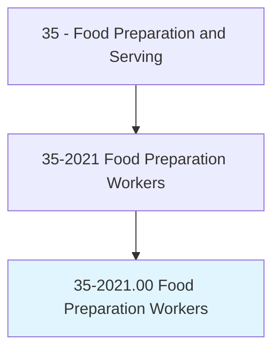
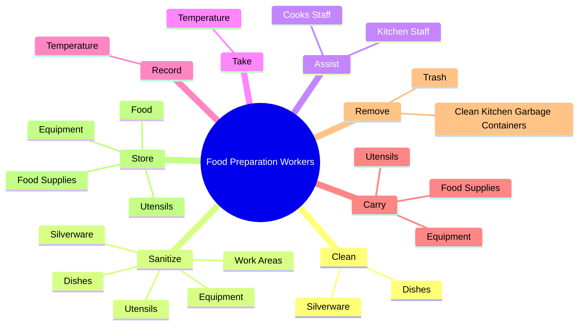
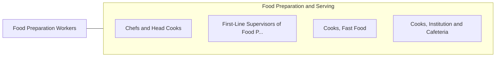

# Food Preparation Workers

> Perform a variety of food preparation duties other than cooking, such as preparing cold foods and shellfish, slicing meat, and brewing coffee or tea.

## Overview

Food Preparation Workers is classified under Food Preparation and Serving (SOC 35). Perform a variety of food preparation duties other than cooking, such as preparing cold foods and shellfish, slicing meat, and brewing coffee or tea.

## Classification Hierarchy

## Key Statistics

| Metric | Value |
|--------|-------|
| SOC Code | 35-2021.00 |
| Category | [Food Preparation and Serving](/occupations/FoodService/index) |
| Task Count | 170 |
| Source | O*NET |

## Core Tasks

### clean.Dishes

Food Preparation Workers clean dishes as part of their core responsibilities.

**Actions:**
- `clean.Dishes`
- `clean.Silverware`

### sanitize.WorkAreas

Food Preparation Workers sanitize work areas as part of their core responsibilities.

**Actions:**
- `sanitize.WorkAreas`
- `sanitize.Equipment`
- `sanitize.Utensils`
- `sanitize.Dishes`

### assist.CooksStaff

Food Preparation Workers assist cooks staff as part of their core responsibilities.

**Actions:**
- `assist.CooksStaff.with.VariousTasksAsNeeded`
- `assist.CooksStaff.with.ProvideCooks.with.NeededItems`
- `assist.KitchenStaff.with.VariousTasksAsNeeded`
- `assist.KitchenStaff.with.ProvideCooks.with.NeededItems`

## Skills & Competencies

### Technical Skills
- **Food Preparation** - Advanced
- **Food Safety** - Advanced
- **Customer Service** - Advanced

### Soft Skills
- **Communication** - Essential
- **Problem Solving** - Essential
- **Critical Thinking** - Important
- **Teamwork** - Important
- **Adaptability** - Important

## Related Occupations

## Industries

This occupation is found across multiple industries. See [Industries](/industries) for sector-specific employment data.

## Career Progression

---

*Source: O*NET 35-2021.00 - ONETOccupation*
