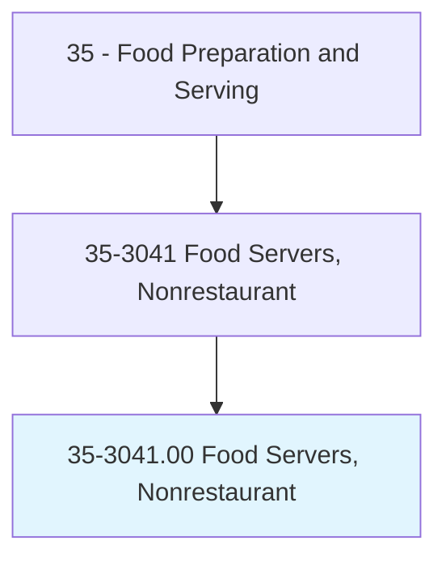
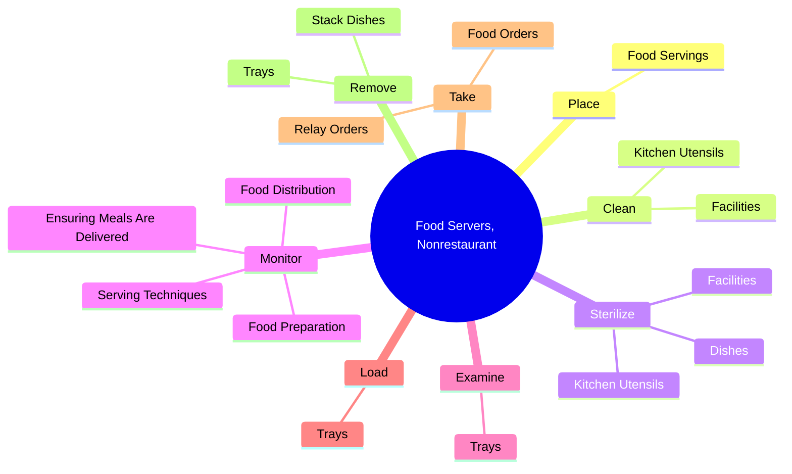
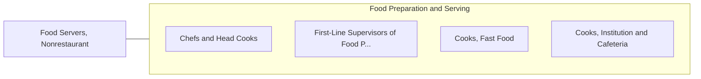

# Food Servers, Nonrestaurant

> Serve food to individuals outside of a restaurant environment, such as in hotel rooms, hospital rooms, residential care facilities, or cars.

## Overview

Food Servers, Nonrestaurant is classified under Food Preparation and Serving (SOC 35). Serve food to individuals outside of a restaurant environment, such as in hotel rooms, hospital rooms, residential care facilities, or cars.

## Classification Hierarchy

## Key Statistics

| Metric | Value |
|--------|-------|
| SOC Code | 35-3041.00 |
| Category | [Food Preparation and Serving](/occupations/FoodService/index) |
| Task Count | 51 |
| Source | O*NET |

## Core Tasks

### place.FoodServings

Food Servers, Nonrestaurant place food servings as part of their core responsibilities.

**Actions:**
- `place.FoodServings.on.PlatesAccording.to.orders.Instructions`
- `place.FoodServings.on.TraysAccording.to.orders.Instructions`

### clean.KitchenUtensils

Food Servers, Nonrestaurant clean kitchen utensils as part of their core responsibilities.

**Actions:**
- `clean.KitchenUtensils`
- `clean.Facilities`

### sterilize.Dishes

Food Servers, Nonrestaurant sterilize dishes as part of their core responsibilities.

**Actions:**
- `sterilize.Dishes`
- `sterilize.KitchenUtensils`
- `sterilize.Facilities`

## Skills & Competencies

### Technical Skills
- **Food Preparation** - Advanced
- **Food Safety** - Advanced
- **Customer Service** - Advanced

### Soft Skills
- **Communication** - Essential
- **Problem Solving** - Essential
- **Critical Thinking** - Important
- **Teamwork** - Important
- **Adaptability** - Important

## Related Occupations

## Industries

This occupation is found across multiple industries. See [Industries](/industries) for sector-specific employment data.

## Career Progression

---

*Source: O*NET 35-3041.00 - ONETOccupation*
