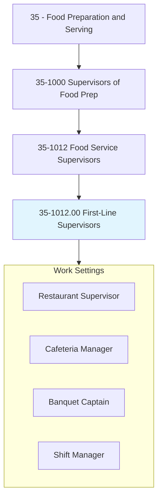
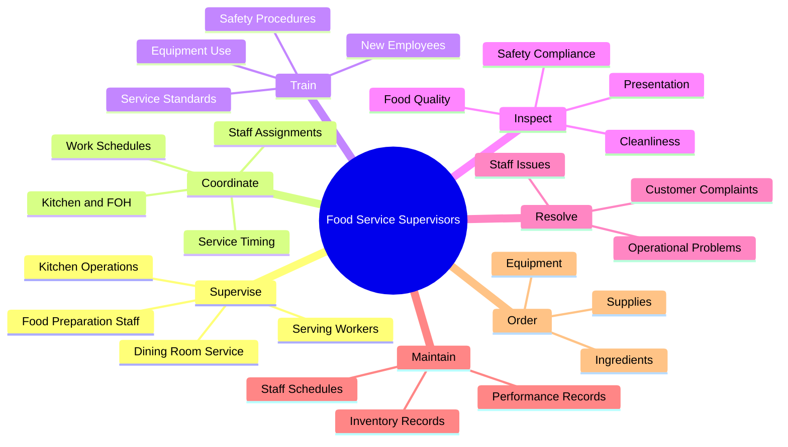
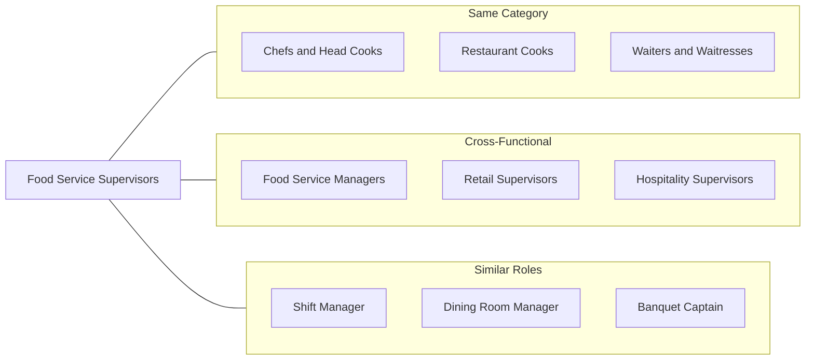
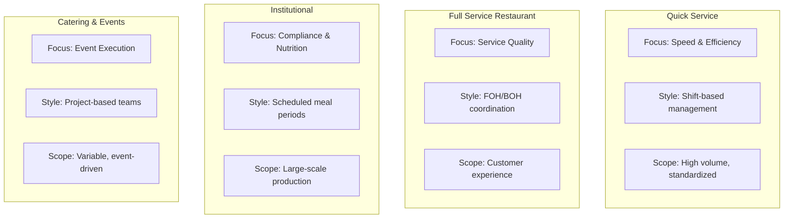
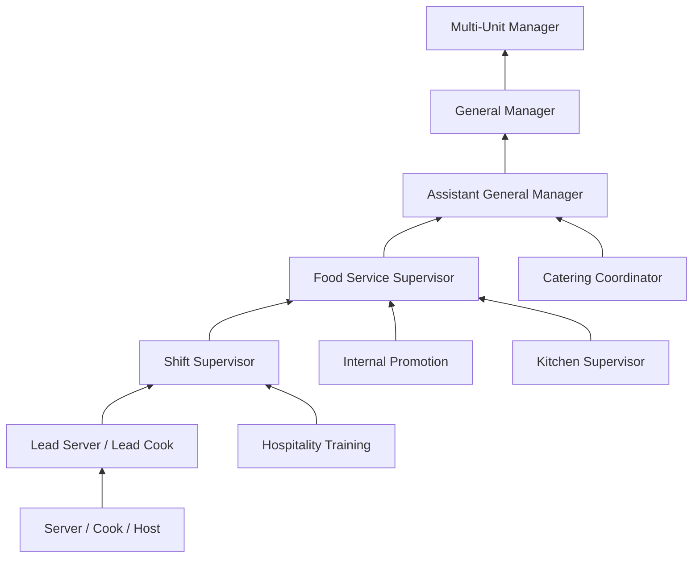

# First-Line Supervisors of Food Preparation and Serving Workers

> Directly supervise and coordinate activities of workers engaged in preparing and serving food.

## Overview

First-Line Supervisors of Food Preparation and Serving Workers are frontline managers who oversee the daily operations of food service teams. They bridge the gap between management and line staff, ensuring that food preparation and service meet quality standards while maintaining efficient operations. These supervisors work in diverse settings including restaurants, cafeterias, hotels, hospitals, and catering operations. Their role combines hands-on involvement with administrative responsibilities such as scheduling, training, and performance management. Success requires balancing customer satisfaction, employee relations, and operational efficiency in fast-paced environments.

## Classification Hierarchy



## Key Statistics

| Metric | Value |
|--------|-------|
| SOC Code | 35-1012.00 |
| Job Zone | 2 (Some Preparation) |
| Category | [Food Preparation and Serving](/occupations/FoodService/index) |
| Core Tasks | 15+ |
| Experience Required | 1-3 years |
| Source | O*NET |

## Core Tasks



### supervise.Workers

Food Service Supervisors directly manage staff performing food preparation and service duties.

**Actions:**
- `supervise.Workers.engaged.in.PreparingFood` - Oversee kitchen staff during food preparation
- `supervise.Workers.engaged.in.ServingFood` - Monitor serving staff performance
- `supervise.Activities.of.KitchenStaff` - Coordinate back-of-house operations
- `supervise.Activities.of.ServingStaff` - Manage front-of-house service flow

### coordinate.WorkSchedules

Food Service Supervisors organize staffing to meet operational demands.

**Actions:**
- `coordinate.Schedules.for.Staff` - Create and manage employee work schedules
- `coordinate.Assignments.for.Shifts` - Allocate staff to appropriate positions
- `coordinate.Timing.for.Service` - Synchronize kitchen and service operations
- `coordinate.Breaks.for.Employees` - Manage staff rest periods during shifts

### train.Employees

Food Service Supervisors develop staff skills and ensure compliance with standards.

**Actions:**
- `train.Employees.on.ServiceStandards` - Teach customer service expectations
- `train.Employees.on.SafetyProcedures` - Instruct on food safety and workplace safety
- `train.Employees.on.EquipmentUse` - Demonstrate proper equipment operation
- `train.Employees.on.MenuKnowledge` - Educate staff on menu items and preparation

### inspect.Operations

Food Service Supervisors monitor quality and compliance across all operations.

**Actions:**
- `inspect.Food.for.Quality` - Check food preparation meets standards
- `inspect.Areas.for.Cleanliness` - Verify sanitation of work areas
- `inspect.Presentation.of.Food` - Ensure plating and presentation standards
- `inspect.Equipment.for.Maintenance` - Monitor equipment condition and function

### resolve.Issues

Food Service Supervisors address problems to maintain service quality.

**Actions:**
- `resolve.Complaints.from.Customers` - Handle customer concerns professionally
- `resolve.Conflicts.among.Staff` - Mediate employee disputes
- `resolve.Problems.in.Operations` - Address operational challenges quickly
- `resolve.Issues.with.Quality` - Correct food quality problems

## Skills & Competencies

### Technical Skills
- **Food Service Operations** - Advanced
- **Food Safety (ServSafe)** - Proficient
- **Inventory Management** - Proficient
- **Scheduling Software** - Proficient
- **Point of Sale Systems** - Proficient
- **Basic Cooking Skills** - Proficient

### Soft Skills
- **Leadership** - Critical
- **Communication** - Critical
- **Problem Solving** - Essential
- **Customer Service** - Essential
- **Time Management** - Essential
- **Conflict Resolution** - Important

## Related Occupations



### Same Category
- [Chefs and Head Cooks](./Chefs.mdx)
- [Cooks, Fast Food](./FastFoodCooks.mdx)
- [Cooks, Institution and Cafeteria](./InstitutionalCooks.mdx)

### Cross-Functional
- Food Service Managers (11-9051.00)
- First-Line Supervisors of Retail Sales Workers (41-1011.00)
- Lodging Managers (11-9081.00)

## Industries

- [Restaurants and Other Eating Places](/industries/Restaurants) - High Employment
- [Traveler Accommodation](/industries/Hotels) - High Employment
- [Educational Services](/industries/Education) - Moderate Employment
- [Hospitals](/industries/Healthcare/Hospitals/index) - Moderate Employment
- Nursing Care Facilities - Moderate Employment

## Industry Variations



## Career Progression



## Education & Training

| Requirement | Details |
|-------------|---------|
| Typical Education | High school diploma or equivalent |
| Work Experience | 1-3 years in food service |
| On-the-Job Training | Moderate; company-specific training programs |
| Common Certifications | ServSafe Manager, TIPS Certification |

## Professional Development

### Certifications
- **ServSafe Manager** - Food safety certification (required by most employers)
- **TIPS Certification** - Alcohol service training
- **Certified Food Manager** - State-specific certifications
- **First Aid/CPR** - Emergency response training

### Growth Opportunities
- Restaurant management training programs
- Hospitality management courses
- Leadership development programs
- Cross-training in multiple service areas

## Departments

This occupation typically works in:
- Front of House Operations
- Back of House Operations
- Food and Beverage
- Dining Services

## Work Environment

| Aspect | Description |
|--------|-------------|
| Setting | Restaurants, cafeterias, hotels, hospitals |
| Schedule | Varied shifts including evenings, weekends, holidays |
| Physical | Standing, walking, occasional lifting |
| Pace | Fast-paced, especially during peak service periods |

## Key Performance Metrics

| Metric | Description |
|--------|-------------|
| Customer Satisfaction | Guest feedback scores and complaint resolution |
| Labor Cost | Staff scheduling efficiency and overtime management |
| Food Cost | Waste reduction and portion control |
| Turnover Rate | Employee retention and training effectiveness |
| Safety Compliance | Health inspection scores and incident reports |

## GraphDL Semantic Structure

```graphdl
FoodServiceSupervisors.supervise.Workers.engaged.in.PreparingFood
FoodServiceSupervisors.supervise.Workers.engaged.in.ServingFood
FoodServiceSupervisors.coordinate.Schedules.for.Staff
FoodServiceSupervisors.train.Employees.on.ServiceStandards
FoodServiceSupervisors.inspect.Food.for.Quality
FoodServiceSupervisors.resolve.Complaints.from.Customers
FoodServiceSupervisors.maintain.Records.of.Inventory
FoodServiceSupervisors.order.Supplies.for.Operations
```

---

*Source: O*NET 35-1012.00 - ONETOccupation*
