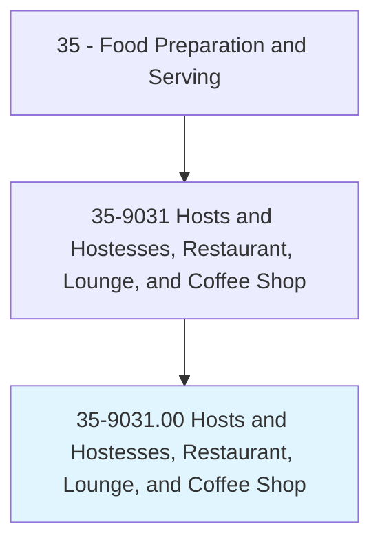
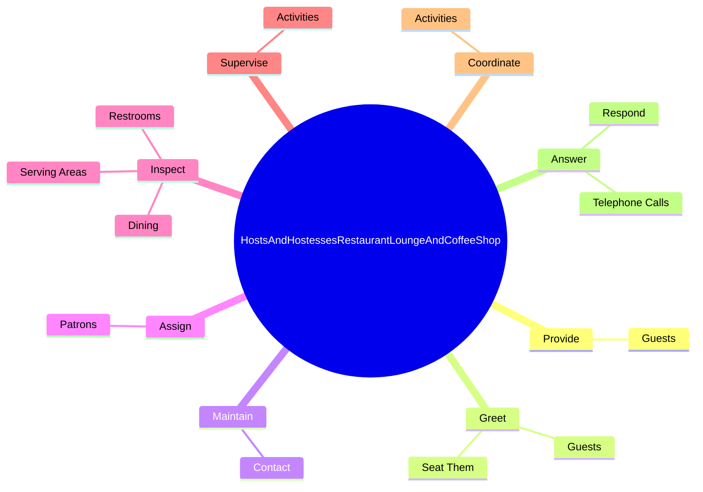
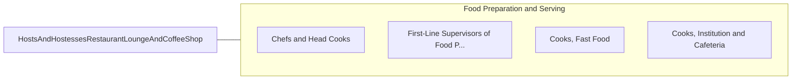

# Hosts and Hostesses, Restaurant, Lounge, and Coffee Shop

> Welcome patrons, seat them at tables or in lounge, and help ensure quality of facilities and service.

## Overview

Hosts and Hostesses, Restaurant, Lounge, and Coffee Shop is classified under Food Preparation and Serving (SOC 35). Welcome patrons, seat them at tables or in lounge, and help ensure quality of facilities and service.

## Classification Hierarchy

## Key Statistics

| Metric | Value |
|--------|-------|
| SOC Code | 35-9031.00 |
| Category | [Food Preparation and Serving](/occupations/FoodService) |
| Task Count | 57 |
| Source | O*NET |

## Core Tasks

### provide.Guests

Hosts and Hostesses, Restaurant, Lounge, and Coffee Shop provide guests as part of their core responsibilities.

**Actions:**
- `provide.Guests.with.Menus`

### greet.Guests

Hosts and Hostesses, Restaurant, Lounge, and Coffee Shop greet guests as part of their core responsibilities.

**Actions:**
- `greet.Guests.at.TablesWaitingAreas`
- `greet.Guests.at.InWaitingAreas`
- `greet.SeatThem.at.TablesWaitingAreas`
- `greet.SeatThem.at.InWaitingAreas`

### maintain.Contact

Hosts and Hostesses, Restaurant, Lounge, and Coffee Shop maintain contact as part of their core responsibilities.

**Actions:**
- `maintain.Contact.with.KitchenStaff`
- `maintain.Contact.with.Management`
- `maintain.Contact.with.ServingStaff`
- `maintain.Contact.with.Customers.to.ensure.DiningDetailsAreHandledProperlyConcernsAreAddressed`

## Skills & Competencies

### Technical Skills
- **Food Preparation** - Advanced
- **Food Safety** - Advanced
- **Customer Service** - Advanced

### Soft Skills
- **Communication** - Essential
- **Problem Solving** - Essential
- **Critical Thinking** - Important
- **Teamwork** - Important
- **Adaptability** - Important

## Related Occupations

## Industries

This occupation is found across multiple industries. See [Industries](/industries) for sector-specific employment data.

## Career Progression

---

*Source: O*NET 35-9031.00 - ONETOccupation*
