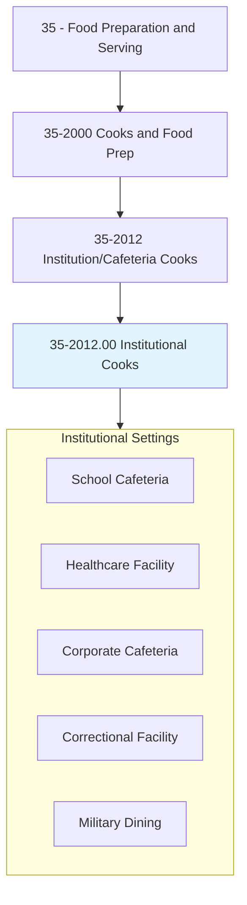
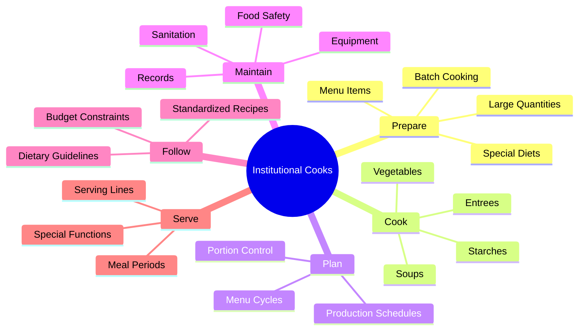
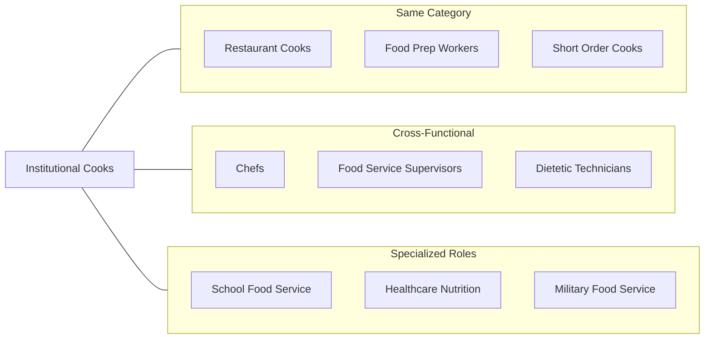
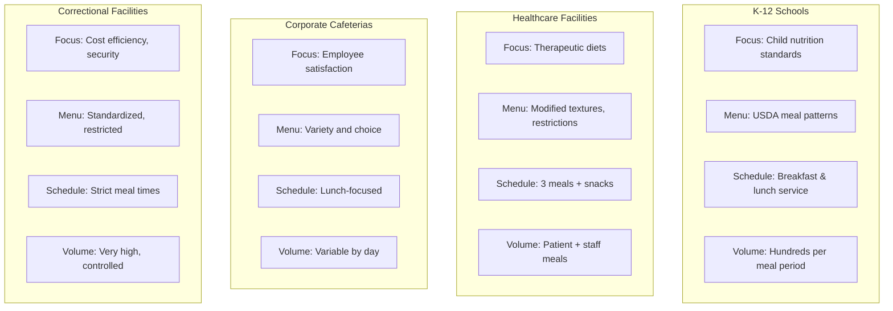
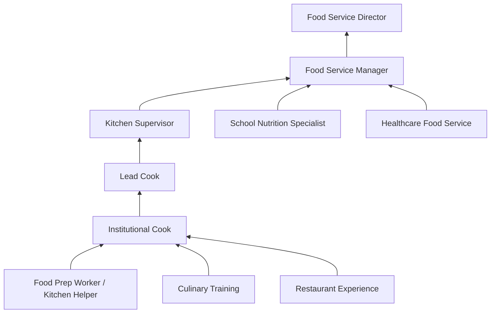

# Cooks, Institution and Cafeteria

> Prepare and cook large quantities of food for institutions, such as schools, hospitals, or cafeterias.

## Overview

Institutional and Cafeteria Cooks specialize in preparing large-volume meals for groups in non-restaurant settings such as schools, hospitals, nursing homes, prisons, military bases, and corporate cafeterias. Unlike restaurant cooks who prepare individual orders, institutional cooks work with standardized recipes scaled for dozens to thousands of servings. The role requires understanding of batch cooking, nutritional requirements, dietary restrictions, and food safety at scale. These cooks balance efficiency with nutrition, often working within strict budgetary constraints while meeting regulatory requirements for specific populations such as students, patients, or elderly residents.

## Classification Hierarchy



## Key Statistics

| Metric | Value |
|--------|-------|
| SOC Code | 35-2012.00 |
| Job Zone | 2 (Some Preparation) |
| Category | [Food Preparation and Serving](/occupations/FoodService) |
| Core Tasks | 12+ |
| Experience Required | Some experience preferred |
| Source | O*NET |

## Core Tasks



### prepare.LargeQuantities

Institutional Cooks specialize in scaling recipes for volume production.

**Actions:**
- `prepare.Food.for.LargeGroups` - Scale recipes for institutional volume
- `prepare.Meals.for.Institutions` - Cook for schools, hospitals, cafeterias
- `prepare.SpecialDiets.for.Patients` - Accommodate dietary restrictions and medical needs
- `prepare.MenuItems.in.Batches` - Use batch cooking methods for efficiency

### cook.InstitutionalMeals

Institutional Cooks prepare balanced meals for specific populations.

**Actions:**
- `cook.Entrees.for.MealService` - Prepare main dishes for scheduled meal times
- `cook.Vegetables.in.Volume` - Steam, roast, or prepare vegetables at scale
- `cook.Starches.for.Nutrition` - Prepare rice, potatoes, pasta in quantity
- `cook.Soups.in.Kettles` - Make soups and stews in large steam kettles

### follow.Standards

Institutional Cooks adhere to strict guidelines and regulations.

**Actions:**
- `follow.Recipes.for.Consistency` - Use standardized recipes exactly
- `follow.Guidelines.for.Nutrition` - Meet dietary requirements (USDA, healthcare)
- `follow.Budgets.for.FoodCosts` - Work within per-meal cost constraints
- `follow.Regulations.for.Safety` - Comply with health department standards

### maintain.Operations

Institutional Cooks ensure smooth daily operations and compliance.

**Actions:**
- `maintain.Records.of.Production` - Document quantities produced and served
- `maintain.Equipment.in.Kitchen` - Clean and maintain large-scale equipment
- `maintain.Sanitation.of.Areas` - Ensure kitchen meets health codes
- `maintain.Inventory.of.Supplies` - Track stock and assist with ordering

## Skills & Competencies

### Technical Skills
- **Large-Batch Cooking** - Expert
- **Recipe Scaling** - Advanced
- **Food Safety (ServSafe)** - Proficient
- **Nutritional Knowledge** - Proficient
- **Commercial Equipment** - Proficient
- **Inventory Management** - Proficient

### Soft Skills
- **Time Management** - Critical
- **Teamwork** - Essential
- **Organization** - Essential
- **Physical Stamina** - Essential
- **Attention to Detail** - Important
- **Adaptability** - Important

## Related Occupations



### Same Category
- Cooks, Restaurant (35-2014.00)
- Food Preparation Workers (35-2021.00)
- [Cooks, Fast Food](./FastFoodCooks.mdx)

### Cross-Functional
- [Chefs and Head Cooks](./Chefs.mdx)
- [First-Line Supervisors of Food Preparation and Serving Workers](./FoodServiceSupervisors.mdx)
- Dietetic Technicians (29-2051.00)

## Industries

- [Elementary and Secondary Schools](/industries/Education) - High Employment
- [Hospitals](/industries/Hospitals) - High Employment
- [Nursing Care Facilities](/industries/NursingCare) - High Employment
- [Colleges and Universities](/industries/HigherEducation) - Moderate Employment
- [Correctional Institutions](/industries/Corrections) - Moderate Employment

## Industry Variations



## Career Progression



## Education & Training

| Requirement | Details |
|-------------|---------|
| Typical Education | High school diploma or equivalent |
| Work Experience | Less than 1 year to 2 years |
| On-the-Job Training | Moderate; institutional-specific training |
| Common Certifications | ServSafe, School Nutrition Specialist (SNS) |

## Professional Development

### Certifications
- **ServSafe Manager** - Food safety certification
- **School Nutrition Specialist (SNS)** - School food service credential
- **Certified Dietary Manager (CDM)** - Healthcare food service
- **State Food Handler's Permit** - Jurisdiction-specific requirement

### Specialized Training
- USDA meal pattern requirements (school food service)
- Therapeutic diet preparation (healthcare)
- Allergen awareness and management
- Large-scale equipment operation

## Departments

This occupation typically works in:
- [Nutrition Services](/departments/NutritionServices)
- [Food Services](/departments/FoodServices)
- [Dining Services](/departments/DiningServices)
- [Dietary Department](/departments/Dietary)

## Work Environment

| Aspect | Description |
|--------|-------------|
| Setting | Large institutional kitchens |
| Schedule | Regular hours aligned with meal service; may include early mornings |
| Physical | Standing, lifting heavy pots, working in hot environments |
| Pace | Steady with peak periods during meal service |
| Supervision | Works under food service manager or chef supervision |

## Equipment Used

| Equipment | Purpose |
|-----------|---------|
| Steam Kettles | Cook soups, stews, sauces in volume |
| Tilt Skillets | Brown, braise, and steam large quantities |
| Convection Ovens | Bake and roast multiple pans simultaneously |
| Steamers | Cook vegetables and starches efficiently |
| Slicers / Mixers | Prep vegetables and doughs |
| Blast Chillers | Rapidly cool foods for safety |
| Serving Lines | Portion and serve meals |

## Regulatory Compliance

### Key Regulations by Setting
- **Schools**: USDA National School Lunch Program, Child Nutrition Act
- **Healthcare**: Joint Commission standards, CMS regulations
- **General**: State and local health department codes

### Documentation Requirements
- Temperature logs
- Production records
- Receiving logs
- Cleaning schedules
- Allergen tracking

## GraphDL Semantic Structure

```
InstitutionalCooks.prepare.Food.for.LargeGroups
InstitutionalCooks.cook.Meals.for.Institutions
InstitutionalCooks.follow.Recipes.for.Consistency
InstitutionalCooks.follow.Guidelines.for.Nutrition
InstitutionalCooks.maintain.Records.of.Production
InstitutionalCooks.maintain.Sanitation.of.Areas
InstitutionalCooks.serve.Meals.during.MealPeriods
InstitutionalCooks.accommodate.Diets.for.SpecialNeeds
```

---

*Source: O*NET 35-2012.00 - ONETOccupation*
