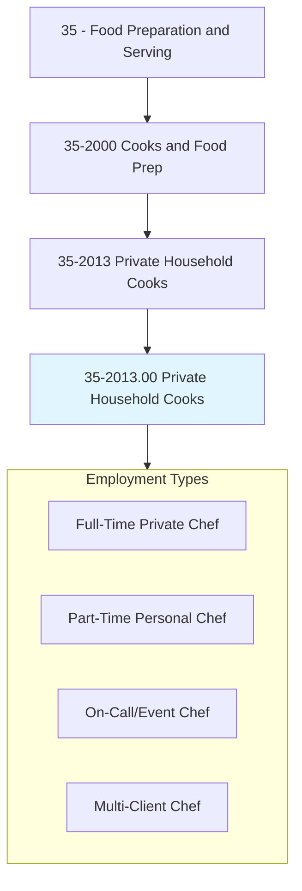
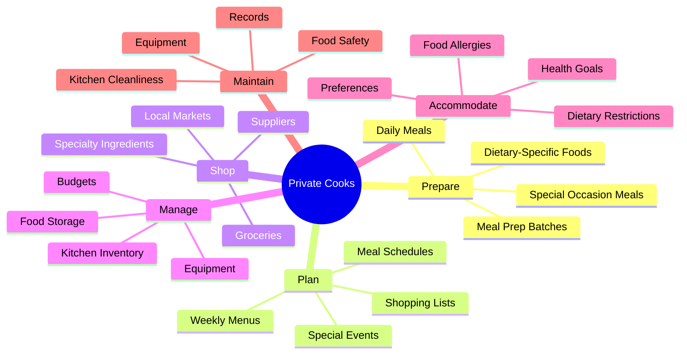
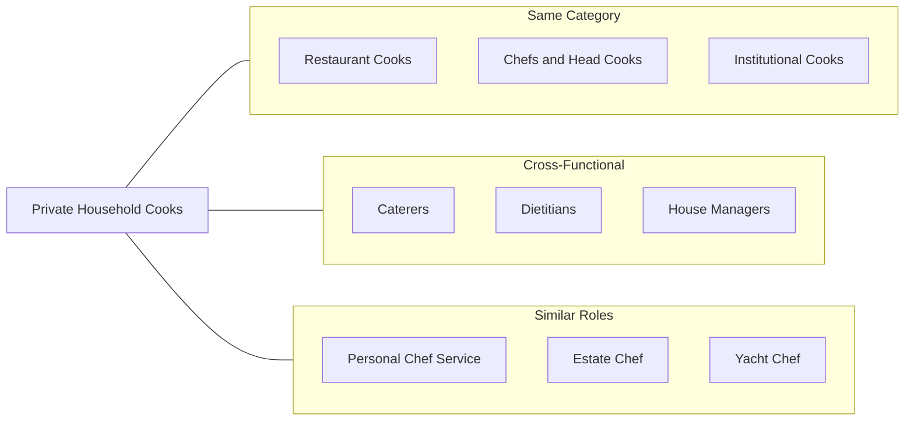
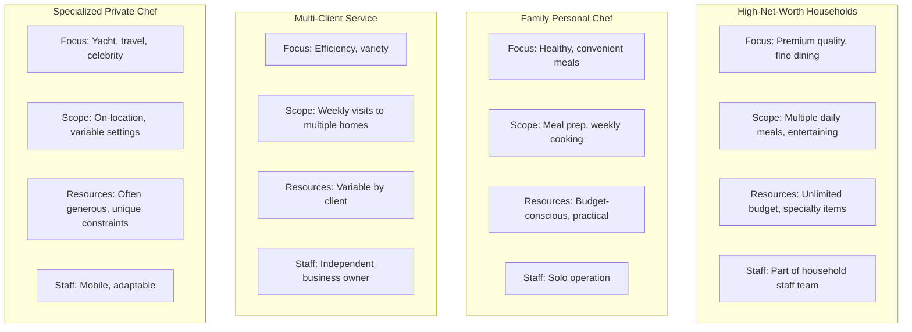
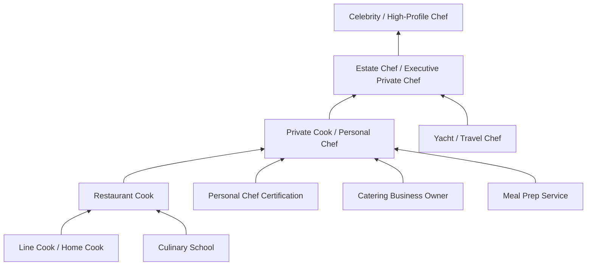

# Cooks, Private Household

> Prepare meals in private homes. Includes personal chefs.

## Overview

Private Household Cooks, also known as personal chefs or private chefs, prepare meals in private homes for individuals or families. Unlike restaurant or institutional cooks, they work intimately with their employers to create customized menus based on personal preferences, dietary requirements, and lifestyle needs. This occupation ranges from daily meal preparation for busy families to high-end culinary services for affluent households, celebrities, or executives. The role combines culinary expertise with discretion, flexibility, and the ability to adapt to the unique requirements of each household. Personal chefs may work full-time for a single employer or serve multiple clients on a rotating basis.

## Classification Hierarchy



## Key Statistics

| Metric | Value |
|--------|-------|
| SOC Code | 35-2013.00 |
| Job Zone | 2-3 (Some to Medium Preparation) |
| Category | [Food Preparation and Serving](/occupations/FoodService/index) |
| Core Tasks | 12+ |
| Experience Required | 2+ years culinary experience |
| Source | O*NET |

## Core Tasks



### prepare.Meals

Private Cooks create customized meals tailored to employer preferences.

**Actions:**
- `prepare.Meals.in.PrivateHomes` - Cook daily meals for household members
- `prepare.Meals.for.SpecialOccasions` - Create dishes for dinner parties and events
- `prepare.Meals.for.DietaryNeeds` - Accommodate allergies, restrictions, health goals
- `prepare.MealPrep.for.Week` - Batch cook and store meals for convenience

### plan.Menus

Private Cooks develop personalized menu plans for their employers.

**Actions:**
- `plan.Menus.for.Households` - Create weekly or monthly meal plans
- `plan.Menus.for.Events` - Design menus for entertaining and special occasions
- `plan.Menus.with.Preferences` - Incorporate family preferences and favorites
- `plan.Menus.for.Nutrition` - Balance meals for health and dietary goals

### shop.Ingredients

Private Cooks source and procure quality ingredients.

**Actions:**
- `shop.Groceries.for.Household` - Purchase food and supplies
- `shop.Ingredients.at.Markets` - Source specialty and fresh items
- `shop.Supplies.within.Budget` - Manage food purchasing budget
- `shop.Ingredients.for.Quality` - Select premium ingredients as required

### accommodate.Requirements

Private Cooks adapt to diverse dietary and personal needs.

**Actions:**
- `accommodate.Allergies.in.Cooking` - Avoid allergens and cross-contamination
- `accommodate.Diets.for.Health` - Prepare keto, vegan, diabetic, etc. meals
- `accommodate.Preferences.of.Family` - Cater to individual tastes
- `accommodate.Schedules.of.Household` - Time meals to family routines

## Skills & Competencies

### Technical Skills
- **Culinary Arts** - Expert
- **Menu Planning** - Advanced
- **Dietary Knowledge** - Advanced
- **Food Safety** - Proficient
- **Budgeting** - Proficient
- **Meal Prep Techniques** - Advanced

### Soft Skills
- **Discretion** - Critical
- **Flexibility** - Critical
- **Communication** - Essential
- **Organization** - Essential
- **Self-Direction** - Essential
- **Interpersonal Skills** - Essential

## Related Occupations



### Same Category
- [Chefs and Head Cooks](./Chefs.mdx)
- Cooks, Restaurant (35-2014.00)
- [Cooks, Institution and Cafeteria](./InstitutionalCooks.mdx)

### Cross-Functional
- Food Service Managers (11-9051.00)
- Dietitians and Nutritionists (29-1031.00)
- Personal Care Aides (39-9021.00)

## Industries

- [Private Households](/industries/OtherServices/PrivateHouseholds) - Primary Employment
- [Personal Care Services](/industries/OtherServices/LaundryServices/PersonalServices/index) - Moderate Employment
- [Traveler Accommodation](/industries/Hotels) - Some Employment (estate properties)
- [Other Support Services](/industries/Administrative/SupportServices/index) - Some Employment (personal chef services)

## Industry Variations



## Career Progression



## Education & Training

| Requirement | Details |
|-------------|---------|
| Typical Education | Culinary degree preferred but not required |
| Work Experience | 2+ years in professional cooking |
| On-the-Job Training | Minimal; expected to be self-sufficient |
| Common Certifications | ServSafe, Personal Chef Certification (USPCA) |

## Professional Development

### Certifications
- **Personal Chef Certification** - United States Personal Chef Association (USPCA)
- **ServSafe Manager** - Food safety certification
- **Certified Personal Chef (CPC)** - American Culinary Federation
- **Specialized Diet Certifications** - Plant-based, allergy-aware, etc.

### Professional Organizations
- United States Personal Chef Association (USPCA)
- American Personal & Private Chef Association (APPCA)
- American Culinary Federation (ACF)

### Continuing Education
- Dietary specialization courses (keto, paleo, vegan, etc.)
- Wine and beverage pairing
- International cuisine training
- Food photography and presentation

## Departments

This occupation typically works in:
- Private Household Staff
- Estate Management
- Personal Services

## Work Environment

| Aspect | Description |
|--------|-------------|
| Setting | Private homes, estates, yachts, vacation properties |
| Schedule | Variable; often includes evenings, weekends, holidays |
| Physical | Standing, moderate lifting, self-managed workspace |
| Independence | High autonomy; minimal direct supervision |
| Relationship | Close working relationship with employer/family |

## Business Considerations

### Employment Types
| Type | Description |
|------|-------------|
| Full-Time Employee | Works for one household, W-2 employee |
| Part-Time Employee | Regular schedule, partial week |
| Independent Contractor | Serves multiple clients, 1099 status |
| Business Owner | Operates personal chef service company |

### Compensation Factors
- Geographic location and cost of living
- Household income/wealth level
- Hours and availability required
- Specialized skills (dietary, cuisine types)
- Travel requirements
- Additional responsibilities (shopping, management)

## Unique Aspects

### Client Relationship
- Direct, ongoing relationship with employer
- Must maintain professional boundaries
- Confidentiality and discretion essential
- Often becomes trusted member of household

### Customization
- Menus tailored to individual preferences
- Adapts to family schedules and lifestyles
- Responds to changing needs and requests
- Creates personal connection to food

### Independence
- Self-directed daily work
- Manages own time and workflow
- Responsible for kitchen management
- Often handles purchasing independently

## GraphDL Semantic Structure

```graphdl
PrivateCooks.prepare.Meals.in.PrivateHomes
PrivateCooks.plan.Menus.for.Households
PrivateCooks.shop.Groceries.for.Household
PrivateCooks.accommodate.Allergies.in.Cooking
PrivateCooks.accommodate.Diets.for.Health
PrivateCooks.maintain.Kitchen.in.PrivateHome
PrivateCooks.manage.FoodBudget.for.Household
PrivateCooks.prepare.MealPrep.for.Convenience
```

---

*Source: O*NET 35-2013.00 - ONETOccupation*
