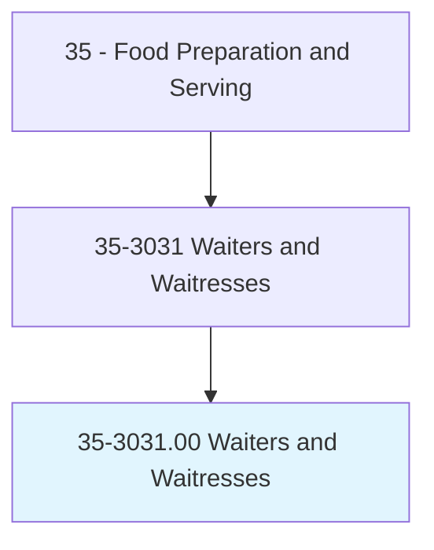
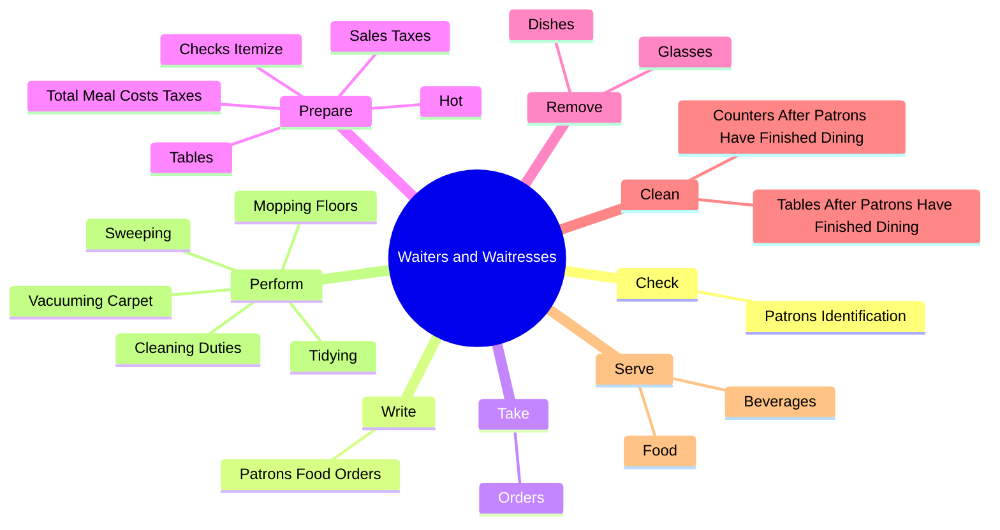
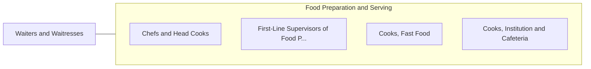

# Waiters and Waitresses

> Take orders and serve food and beverages to patrons at tables in dining establishment.

## Overview

Waiters and Waitresses is classified under Food Preparation and Serving (SOC 35). Take orders and serve food and beverages to patrons at tables in dining establishment.

## Classification Hierarchy

## Key Statistics

| Metric | Value |
|--------|-------|
| SOC Code | 35-3031.00 |
| Category | [Food Preparation and Serving](/occupations/FoodService) |
| Task Count | 92 |
| Source | O*NET |

## Core Tasks

### check.PatronsIdentification

Waiters and Waitresses check patrons identification as part of their core responsibilities.

**Actions:**
- `check.PatronsIdentification.to.ensure.TheyMeetMinimumAgeRequirementsForConsumptionOfAlcoholicBeverages`

### write.PatronsFoodOrders

Waiters and Waitresses write patrons food orders as part of their core responsibilities.

**Actions:**
- `write.PatronsFoodOrders.on.OrderSlips`
- `write.PatronsFoodOrders.on.MemorizeOrders`
- `write.PatronsFoodOrders.on.EnterOrdersIntoComputersForTransmittalToKitchenStaff`

### take.Orders

Waiters and Waitresses take orders as part of their core responsibilities.

**Actions:**
- `take.Orders.from.Patrons.for.Food`
- `take.Orders.from.Beverages`

## Skills & Competencies

### Technical Skills
- **Food Preparation** - Advanced
- **Food Safety** - Advanced
- **Customer Service** - Advanced

### Soft Skills
- **Communication** - Essential
- **Problem Solving** - Essential
- **Critical Thinking** - Important
- **Teamwork** - Important
- **Adaptability** - Important

## Related Occupations

## Industries

This occupation is found across multiple industries. See [Industries](/industries) for sector-specific employment data.

## Career Progression

---

*Source: O*NET 35-3031.00 - ONETOccupation*
