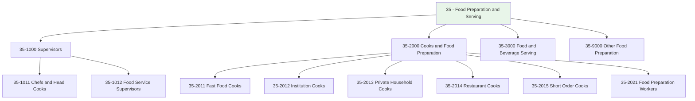
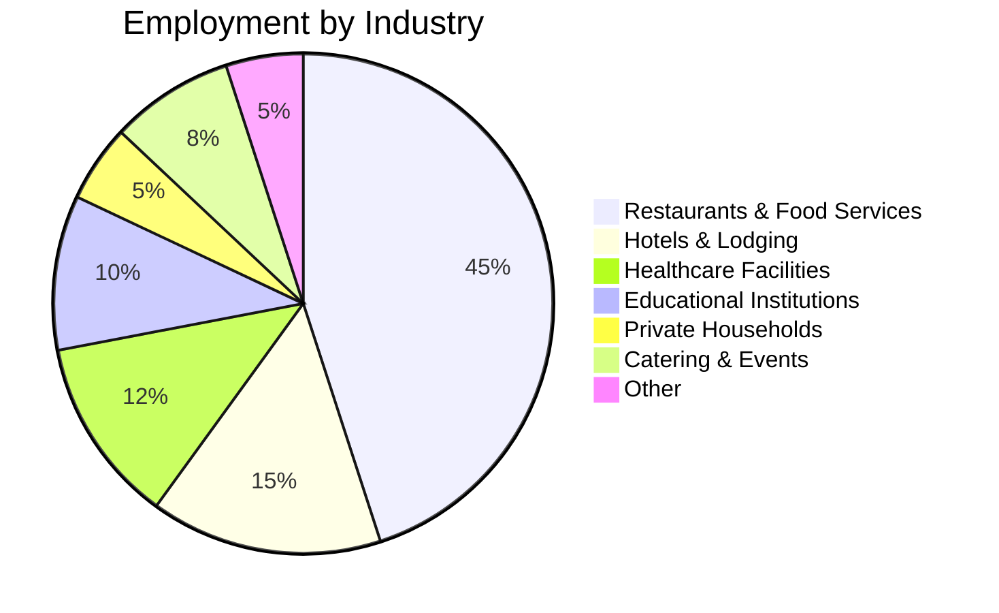
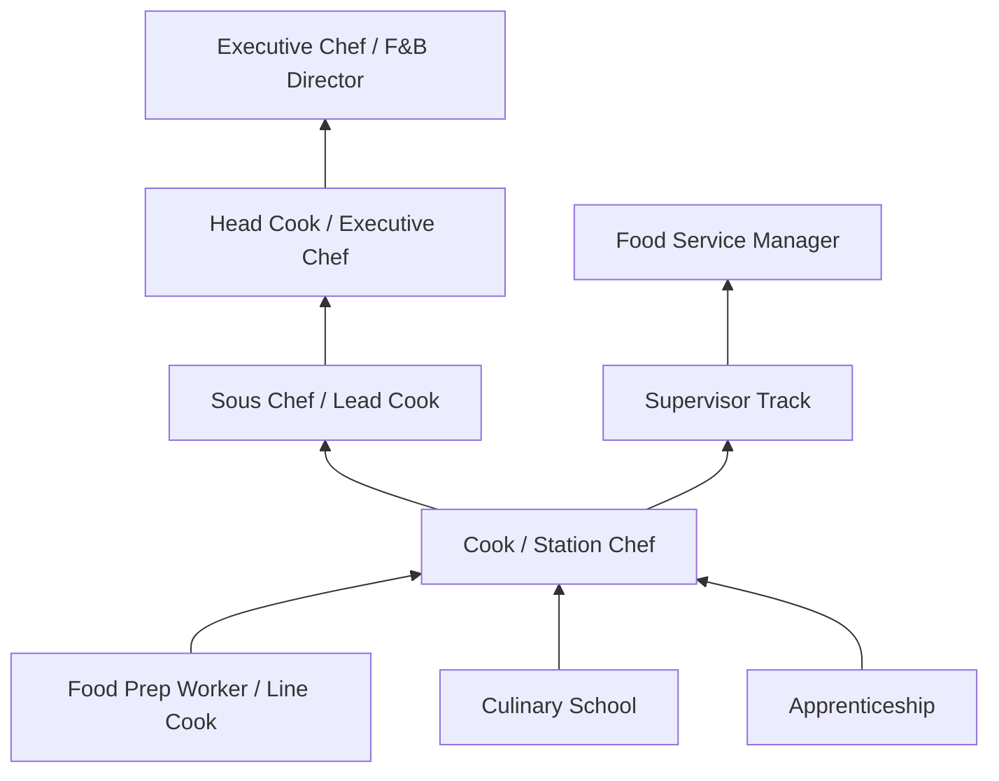

# Food Preparation and Serving Related Occupations

> Category 35 encompasses all occupations involved in preparing, cooking, and serving food and beverages in various settings including restaurants, institutions, private homes, and fast food establishments.

## Overview

Food Preparation and Serving occupations form the backbone of the hospitality and food service industry. This category includes roles ranging from entry-level fast food workers to executive chefs, covering the full spectrum of culinary operations. Workers in this category are found in restaurants, hotels, hospitals, schools, private households, and catering operations. The field offers diverse career paths with opportunities for advancement based on skill development, creativity, and leadership ability.

## Classification Hierarchy

## Key Statistics

| Metric | Value |
|--------|-------|
| SOC Category | 35 |
| Category Name | Food Preparation and Serving Related |
| Total Occupations | 20+ |
| Employment Sector | Hospitality, Healthcare, Education |
| Growth Outlook | Stable to Growing |

## Occupations in this Category

### Supervisory Roles

- [Chefs and Head Cooks](./Chefs.mdx) - 35-1011.00
- [First-Line Supervisors of Food Preparation and Serving Workers](./FoodServiceSupervisors.mdx) - 35-1012.00

### Cooks by Setting

- [Cooks, Fast Food](./FastFoodCooks.mdx) - 35-2011.00
- [Cooks, Institution and Cafeteria](./InstitutionalCooks.mdx) - 35-2012.00
- [Cooks, Private Household](./PrivateCooks.mdx) - 35-2013.00

### Related Occupations (Not in this folder)

- Cooks, Restaurant - 35-2014.00
- Cooks, Short Order - 35-2015.00
- Food Preparation Workers - 35-2021.00
- Bartenders - 35-3011.00
- Fast Food and Counter Workers - 35-3023.00
- Waiters and Waitresses - 35-3031.00

## Industry Distribution

## Career Progression Overview

## Core Competencies Across Category

### Technical Skills
- **Culinary Techniques** - Cooking methods, food preparation, knife skills
- **Food Safety** - HACCP principles, sanitation, temperature control
- **Equipment Operation** - Commercial kitchen equipment, specialized tools
- **Menu Planning** - Recipe development, cost control, nutrition

### Soft Skills
- **Time Management** - Working under pressure, meeting deadlines
- **Teamwork** - Kitchen coordination, communication
- **Attention to Detail** - Presentation, consistency, quality
- **Physical Stamina** - Standing, lifting, fast-paced environment

## Related Categories

- [Management Occupations](/occupations/Management) - Food Service Managers (11-9051)
- [Production Occupations](/occupations/Production) - Food Processing Workers (51-3000)
- [Healthcare Support](/occupations/HealthcareSupport) - Dietetic Technicians (29-2051)

## Industries

- [Food Services and Drinking Places](/industries/FoodServices) - Primary Employment
- [Accommodation](/industries/Accommodation) - High Employment
- [Healthcare](/industries/Healthcare) - Moderate Employment
- [Educational Services](/industries/Education) - Moderate Employment
- [Private Households](/industries/PrivateHouseholds) - Specialized Employment

---

*Source: O*NET Category 35 - Food Preparation and Serving Related Occupations*
