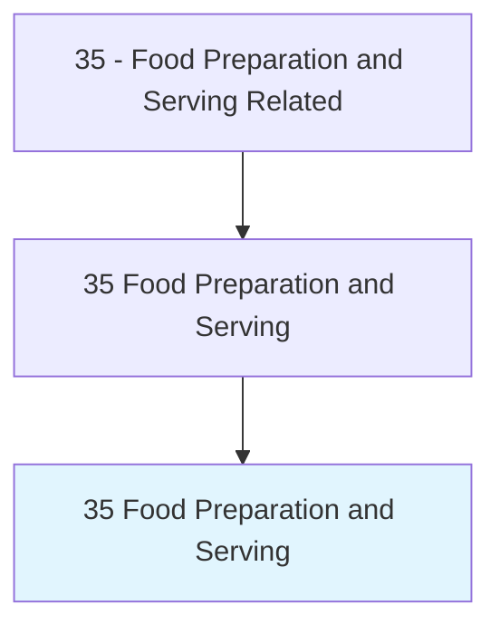
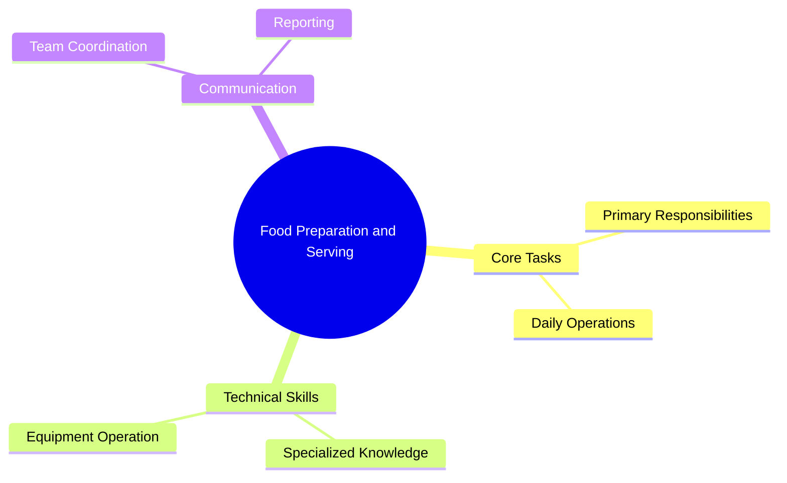
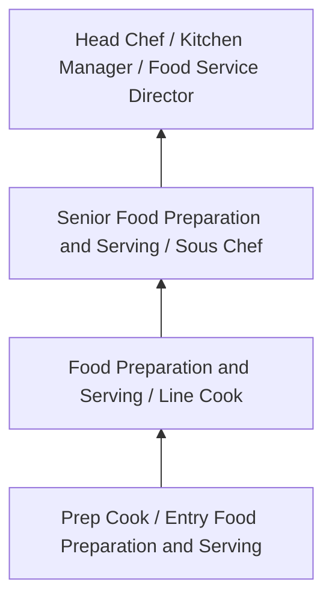
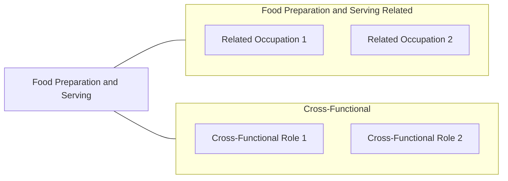

# Food Preparation and Serving

> Food Preparation and Serving professionals working in the Food Preparation and Serving Related field.

## Overview

Food Preparation and Serving professionals serve a vital function within the Food Preparation and Serving Related field. They bring specialized skills and knowledge to their roles, contributing to organizational objectives and societal needs.

These practitioners work in varied environments, adapting their expertise to meet specific requirements of their industry and employer. The role requires ongoing professional development to maintain competency and respond to changing demands.

Career paths in this field offer opportunities for advancement through experience, additional education, and specialized certifications. Employment prospects are influenced by industry trends, technological change, and workforce demographics.

## Classification Hierarchy



## Key Statistics

| Metric | Value |
|--------|-------|
| SOC Code | 35 |
| Job Zone | N/A |
| Category | [Food Preparation and Serving Related](/occupations/FoodService/index) |
| Core Tasks | N/A+ |
| Salary Range | $25,000 - $55,000 |
| Median Salary | $32,000 |
| Growth Outlook | 6% (As fast as average) |
| Source | O*NET |

## Core Tasks



### Supervisory Roles

- [Chefs and Head Cooks](./Chefs.mdx) - 35-1011.00
- [First-Line Supervisors of Food Preparation and Serving Workers](./FoodServiceSupervisors.mdx) - 35-1012.00

### Cooks by Setting

- [Cooks, Fast Food](./FastFoodCooks.mdx) - 35-2011.00
- [Cooks, Institution and Cafeteria](./InstitutionalCooks.mdx) - 35-2012.00
- [Cooks, Private Household](./PrivateCooks.mdx) - 35-2013.00

### Related Occupations (Not in this folder)

- Cooks, Restaurant - 35-2014.00
- Cooks, Short Order - 35-2015.00
- Food Preparation Workers - 35-2021.00
- Bartenders - 35-3011.00
- Fast Food and Counter Workers - 35-3023.00
- Waiters and Waitresses - 35-3031.00

### Technical Skills
- **Culinary Techniques** - Cooking methods, food preparation, knife skills
- **Food Safety** - HACCP principles, sanitation, temperature control
- **Equipment Operation** - Commercial kitchen equipment, specialized tools
- **Menu Planning** - Recipe development, cost control, nutrition

### Soft Skills
- **Time Management** - Working under pressure, meeting deadlines
- **Teamwork** - Kitchen coordination, communication
- **Attention to Detail** - Presentation, consistency, quality
- **Physical Stamina** - Standing, lifting, fast-paced environment


## Skills & Competencies

### Technical Skills
- **Food Preparation** - Advanced
- **Food Safety and Sanitation** - Advanced
- **Menu Knowledge** - Proficient
- **Kitchen Equipment Operation** - Proficient
- **Inventory Management** - Proficient
- **Portion Control** - Proficient

### Soft Skills
- **Time Management** - Critical
- **Teamwork** - Critical
- **Stress Tolerance** - Essential
- **Communication** - Essential
- **Customer Service** - Essential

## Education & Certifications

| Requirement | Details |
|-------------|---------|
| Typical Education | High school diploma; culinary programs beneficial |
| Work Experience | 0-2 years food service experience |
| On-the-Job Training | Short to moderate - food safety and preparation techniques |
| Certifications | Food Handler certification, ServSafe, state health permits |

## Career Progression



## Industry Variations

### Full-Service Restaurants
High-quality food preparation and presentation. Food Preparation and Serving professionals focus on menu creativity and dining experience.

### Institutional Food Service
Large-scale food preparation for schools, hospitals, or corporate cafeterias. Emphasis on nutrition, consistency, and volume.

### Quick-Service and Fast Food
High-volume, standardized food preparation. Focus on speed, consistency, and food safety compliance.

### Catering and Events
Event-based food service requiring planning, coordination, and ability to execute in varied locations and conditions.

## Technology & Tools

- **Point-of-sale (POS) systems**
- **Commercial kitchen equipment**
- **Food safety monitoring systems**
- **Inventory management software**
- **Recipe management and costing tools**

## Related Occupations



## Industries

- [Restaurants and Food Service](/industries/Restaurants) - High Employment
- Hotels and Hospitality - High Employment
- [Healthcare Facilities](/industries/Healthcare/index) - Moderate Employment
- [Education](/industries/Education) - Moderate Employment

## Departments

This occupation typically works in:
- Kitchen Operations
- Food and Beverage
- Hospitality Services

## GraphDL Semantic Structure

```graphdl
Food Preparation and Serving perform:
- prepare.Food.according.to.Recipes
- maintain.Kitchen.for.SanitaryConditions
- follow.Procedures.for.FoodSafety
- serve.Customers.with.QualityService
- manage.Inventory.of.FoodSupplies
```

---

*Source: O*NET 35 - ONETOccupation*
