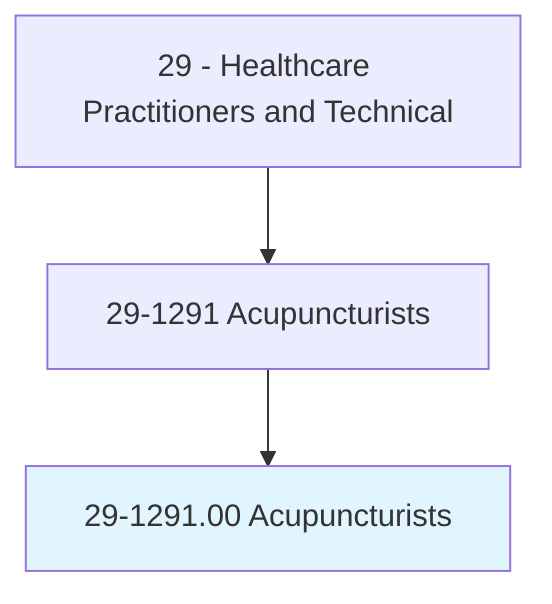
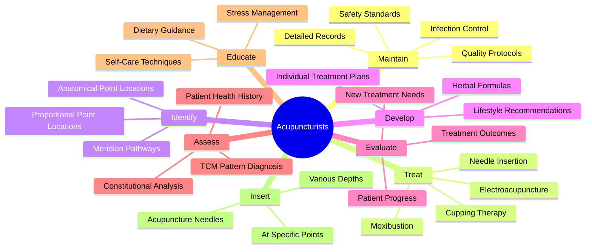
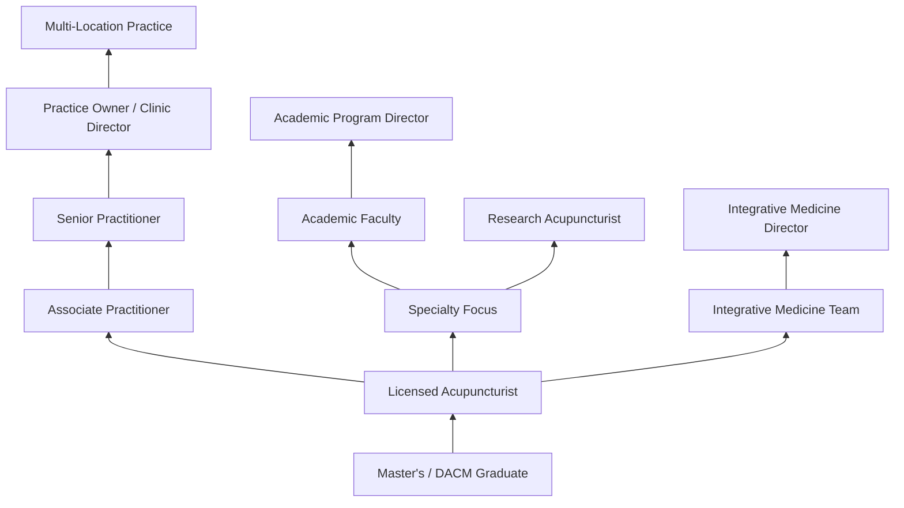
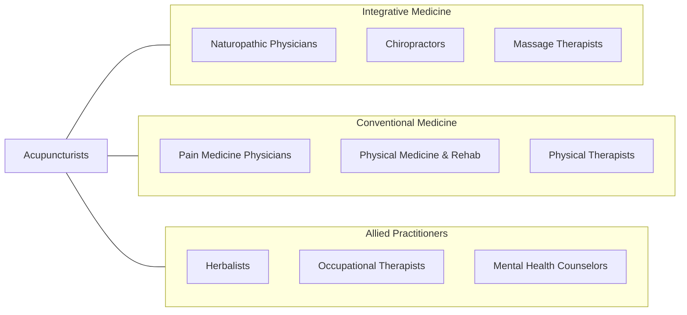

# Acupuncturists

> Diagnose, treat, and prevent disorders by stimulating specific acupuncture points within the body using acupuncture needles. May also use cups, nutritional supplements, therapeutic massage, acupressure, and other alternative health therapies.

## Overview

Acupuncturists are licensed healthcare practitioners who diagnose and treat a wide range of health conditions using Traditional Chinese Medicine (TCM) principles and acupuncture techniques. They insert thin, sterile needles into specific anatomical points (acupoints) along the body's meridian pathways to stimulate the nervous system, promote natural healing, reduce pain, and restore physiological balance. Treatment approaches may also include moxibustion, cupping, electroacupuncture, and herbal medicine recommendations.

Rooted in a medical tradition spanning thousands of years, modern acupuncture has gained significant acceptance within Western integrative medicine. Acupuncturists evaluate patients using both traditional diagnostic methods (pulse diagnosis, tongue assessment, meridian palpation) and contemporary health assessments. They develop individualized treatment plans for conditions including chronic pain, musculoskeletal disorders, neurological conditions, stress, anxiety, digestive disorders, and fertility challenges.

The integration of acupuncture into mainstream healthcare has accelerated as clinical research demonstrates efficacy for conditions such as chronic low back pain, migraines, osteoarthritis, and chemotherapy-induced nausea. Many acupuncturists now practice within multidisciplinary pain management clinics, integrative medicine centers, hospital systems, and sports medicine facilities, collaborating with physicians, physical therapists, and mental health providers.

## Classification Hierarchy

## Key Statistics

| Metric | Value |
|--------|-------|
| SOC Code | 29-1291.00 |
| Median Annual Salary | $74,530 |
| Employment | ~26,000 |
| Projected Growth | 17% (2022-2032, much faster than average) |
| Job Zone | 5 (Extensive Preparation) |
| Category | [Healthcare Practitioners](/occupations/HealthcarePractitioners) |
| Core Tasks | 111 |
| Source | O*NET |

## Core Tasks

### maintain.StandardQuality

Acupuncturists maintain safety, quality, and infection control standards.

**Actions:**
- `maintain.StandardQuality.in.ClinicalPractice` - Quality assurance
- `maintain.Safety.using.CleanNeedleTechnique` - Sterile procedure
- `maintain.InfectionControlPolicies.per.Regulations` - Infection prevention
- `maintain.DetailedRecords.for.PatientCare` - Documentation

### treat.PatientsUsingTools

Acupuncturists deliver needling and adjunctive therapies.

**Actions:**
- `treat.Patients.using.AcupunctureNeedles` - Core needling therapy
- `treat.Patients.using.Cups` - Cupping therapy
- `treat.Patients.using.EarBalls` - Auricular acupuncture
- `treat.Patients.using.Electroacupuncture` - Electrical stimulation

### develop.IndividualTreatmentPlans

Acupuncturists create individualized care protocols.

**Actions:**
- `develop.IndividualTreatmentPlans.for.ChronicPain` - Pain management
- `develop.IndividualTreatmentPlans.for.StressRelated.Conditions` - Mental health
- `evaluate.TreatmentOutcomes.to.AdjustProtocols` - Outcome tracking
- `identify.CorrectAnatomicalPointLocations.for.Treatment` - Point selection

## Practice Settings

| Setting | Description |
|---------|-------------|
| Private Practice | Solo or group acupuncture clinics |
| Integrative Medicine Centers | Multidisciplinary holistic care |
| Pain Management Clinics | Chronic pain treatment teams |
| Hospital Integrative Programs | Hospital-based acupuncture services |
| Sports Medicine Facilities | Athletic performance and recovery |
| Community Acupuncture Clinics | Affordable group treatment settings |
| Wellness Centers & Spas | Holistic wellness environments |
| Addiction Recovery Centers | NADA protocol for substance abuse |

## Skills & Competencies

### Technical Skills
- **Acupuncture Point Location** - Expert
- **Needle Insertion Techniques** - Expert
- **TCM Diagnosis** - Expert
- **Herbal Medicine** - Advanced
- **Electroacupuncture** - Advanced
- **Moxibustion & Cupping** - Advanced
- **Clean Needle Technique** - Expert
- **Anatomy & Physiology** - Advanced

### Soft Skills
- **Patient Communication** - Critical
- **Empathy & Active Listening** - Critical
- **Holistic Assessment** - Essential
- **Cultural Competency** - Essential
- **Business Management** - Important
- **Collaboration** - Important
- **Patience** - Essential

## Education & Training

| Requirement | Details |
|-------------|---------|
| Undergraduate | Bachelor's degree (prerequisite in most states) |
| Graduate Program | Master's degree in Acupuncture or TCM (3-4 years) |
| Doctoral Option | Doctor of Acupuncture and Chinese Medicine (DACM) |
| Clinical Hours | 660-1,000+ supervised clinical hours |
| Licensure | Must pass NCCAOM certification exams |
| State License | Required in 46+ states and DC |
| Continuing Education | 30-60 PDA points per renewal cycle |
| Clean Needle Technique | CNT course required for certification |

## Certifications

| Certification | Description |
|---------------|-------------|
| NCCAOM Diplomate in Acupuncture | National board certification |
| NCCAOM Diplomate in Chinese Herbology | Herbal medicine certification |
| NCCAOM Diplomate in Oriental Medicine | Combined acupuncture + herbs |
| L.Ac. (Licensed Acupuncturist) | State licensure designation |
| Clean Needle Technique (CNT) | Safety certification (required) |
| NADA Acu-Detox Specialist | Addiction treatment protocol |
| CPR/First Aid | Basic life support |

## Career Progression

## Specializations

| Subspecialty | Focus Area |
|-------------|------------|
| Pain Management | Chronic pain, musculoskeletal disorders |
| Fertility & Reproductive Health | IVF support, menstrual disorders |
| Sports Acupuncture | Athletic performance and injury recovery |
| Oncology Acupuncture | Cancer symptom management |
| Pediatric Acupuncture | Children's health conditions |
| Mental Health | Anxiety, depression, PTSD, insomnia |
| Cosmetic Acupuncture | Facial rejuvenation protocols |
| Addiction Recovery | NADA ear acupuncture protocol |

## Technology & Tools

| Technology | Purpose |
|------------|---------|
| Acupuncture Needles (Various Gauges) | Primary treatment tool |
| Electroacupuncture Devices | Electrical point stimulation |
| Moxibustion Equipment | Heat therapy application |
| Cupping Sets (Glass, Silicone) | Suction therapy |
| Infrared Heat Lamps (TDP) | Thermal therapy |
| Practice Management Software (Jane, Unified Practice) | Scheduling and charting |
| Anatomical Reference Software | Point location guidance |
| Pulse Diagnostic Devices | Objective pulse analysis |

## Related Occupations

## Industries

- [Health Practitioner Offices](/industries/Healthcare/PhysicianOffices) - Private Practice
- [Integrative Medicine Centers](/industries/Healthcare/AmbulatoryHealthCare) - Multidisciplinary Clinics
- [Hospitals](/industries/Healthcare/Hospitals/index) - Integrative Programs
- [Wellness Centers](/industries/Healthcare/WellnessCenters) - Holistic Health
- [Sports Medicine](/industries/Healthcare/SportsMedicine) - Athletic Care
- [Education](/industries/Education) - Acupuncture Schools

## Departments

This occupation typically works in:
- [Integrative Medicine](/departments/IntegrativeMedicine)
- [Pain Management](/departments/PainManagement)
- [Complementary & Alternative Medicine](/departments/CAM)
- [Rehabilitation Services](/departments/RehabilitationServices)
- [Wellness Programs](/departments/WellnessPrograms)

---

*Source: O*NET 29-1291.00 - ONETOccupation*
