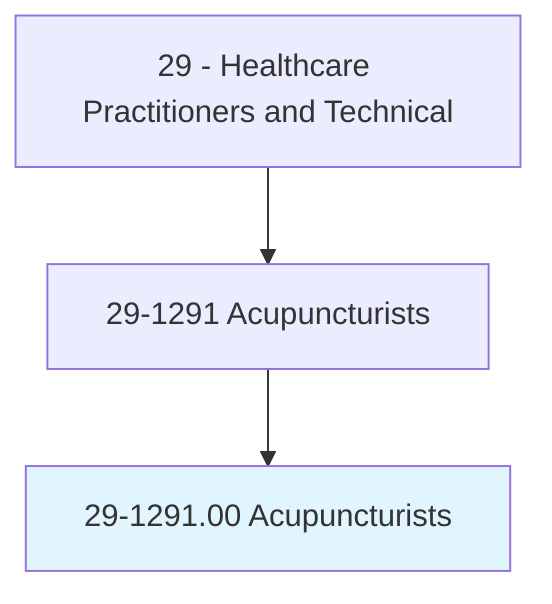
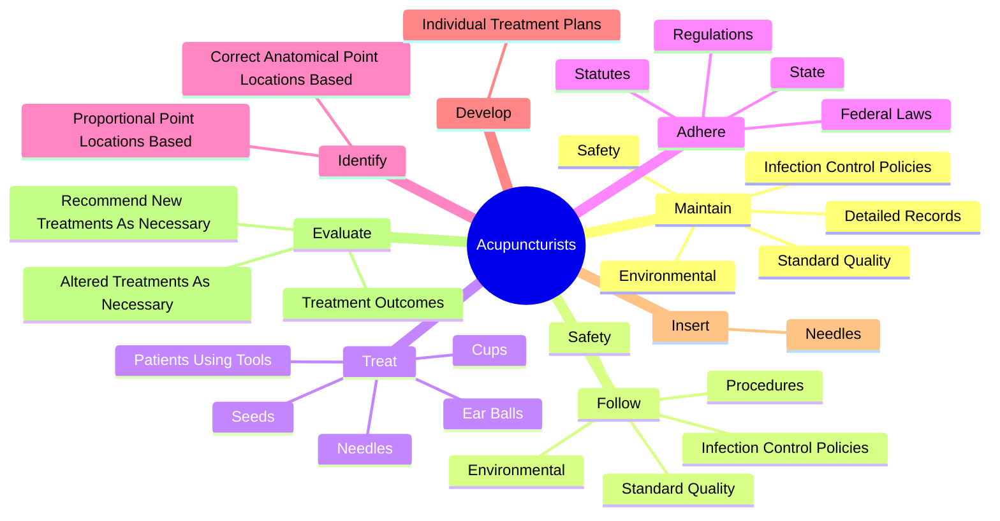
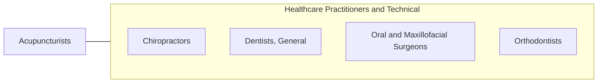

# Acupuncturists

> Diagnose, treat, and prevent disorders by stimulating specific acupuncture points within the body using acupuncture needles. May also use cups, nutritional supplements, therapeutic massage, acupressure, and other alternative health therapies.

## Overview

Acupuncturists is an occupation within the Healthcare Practitioners and Technical category. Diagnose, treat, and prevent disorders by stimulating specific acupuncture points within the body using acupuncture needles. 

## Classification Hierarchy

## Key Statistics

| Metric | Value |
|--------|-------|
| SOC Code | 29-1291.00 |
| Category | [Healthcare Practitioners and Technical](/occupations/HealthcarePractitioners) |
| Task Count | 111 |
| Source | O*NET |

## Core Tasks

### maintain.StandardQuality

Acupuncturists maintain standard quality as part of their core responsibilities.

**Actions:**
- `maintain.StandardQuality`
- `maintain.Safety`
- `maintain.Environmental`
- `maintain.InfectionControlPolicies`

### follow.StandardQuality

Acupuncturists follow standard quality as part of their core responsibilities.

**Actions:**
- `follow.StandardQuality`
- `follow.Safety`
- `follow.Environmental`
- `follow.InfectionControlPolicies`

### treat.PatientsUsingTools

Acupuncturists treat patients using tools as part of their core responsibilities.

**Actions:**
- `treat.PatientsUsingTools`
- `treat.Needles`
- `treat.Cups`
- `treat.EarBalls`

## Skills & Competencies

### Technical Skills
- **Clinical Skills** - Advanced
- **Diagnostic Procedures** - Advanced
- **Patient Care** - Advanced

### Soft Skills
- **Communication** - Essential
- **Problem Solving** - Essential
- **Critical Thinking** - Important
- **Teamwork** - Important
- **Adaptability** - Important

## Related Occupations

## Industries

This occupation is found across multiple industries. See [Industries](/industries) for sector-specific employment data.

## Career Progression

---

*Source: O*NET 29-1291.00 - ONETOccupation*
