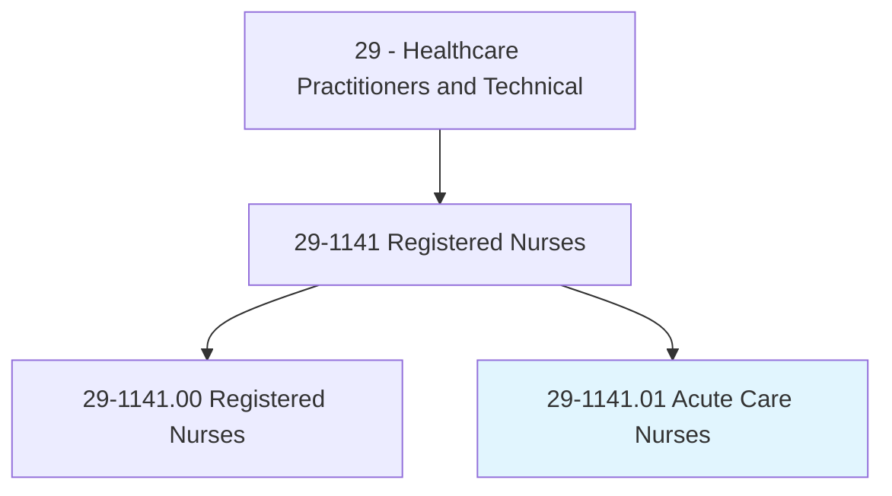
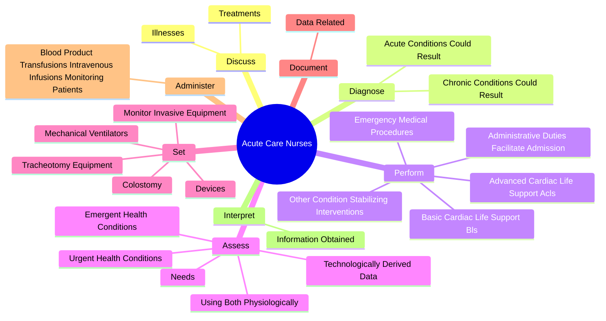
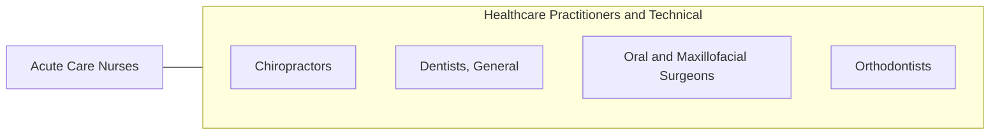

# Acute Care Nurses

> Provide advanced nursing care for patients with acute conditions such as heart attacks, respiratory distress syndrome, or shock. May care for pre- and post-operative patients or perform advanced, invasive diagnostic or therapeutic procedures.

## Overview

Acute Care Nurses is a specialized variant within the Healthcare Practitioners and Technical category. Provide advanced nursing care for patients with acute conditions such as heart attacks, respiratory distress syndrome, or shock. 

## Classification Hierarchy

## Key Statistics

| Metric | Value |
|--------|-------|
| SOC Code | 29-1141.01 |
| Category | [Healthcare Practitioners and Technical](/occupations/HealthcarePractitioners) |
| Task Count | 99 |
| Source | O*NET |

## Core Tasks

### discuss.Illnesses

Acute Care Nurses discuss illnesses as part of their core responsibilities.

**Actions:**
- `discuss.Illnesses.with.PatientsMembers`
- `discuss.Illnesses.with.FamilyMembers`
- `discuss.Treatments.with.PatientsMembers`
- `discuss.Treatments.with.FamilyMembers`

### diagnose.AcuteConditionsCouldResult

Acute Care Nurses diagnose acute conditions could result as part of their core responsibilities.

**Actions:**
- `diagnose.AcuteConditionsCouldResult.in.RapidPhysiologicalDeteriorationInstability`
- `diagnose.AcuteConditionsCouldResult.in.LifeThreateningInstability`
- `diagnose.ChronicConditionsCouldResult.in.RapidPhysiologicalDeteriorationInstability`
- `diagnose.ChronicConditionsCouldResult.in.LifeThreateningInstability`

### perform.EmergencyMedicalProcedures

Acute Care Nurses perform emergency medical procedures as part of their core responsibilities.

**Actions:**
- `perform.EmergencyMedicalProcedures`
- `perform.BasicCardiacLifeSupportBls`
- `perform.AdvancedCardiacLifeSupportAcls`
- `perform.OtherConditionStabilizingInterventions`

## Skills & Competencies

### Technical Skills
- **Clinical Skills** - Advanced
- **Diagnostic Procedures** - Advanced
- **Patient Care** - Advanced

### Soft Skills
- **Communication** - Essential
- **Problem Solving** - Essential
- **Critical Thinking** - Important
- **Teamwork** - Important
- **Adaptability** - Important

## Related Occupations

## Industries

This occupation is found across multiple industries. See [Industries](/industries) for sector-specific employment data.

## Career Progression

---

*Source: O*NET 29-1141.01 - ONETOccupation*
