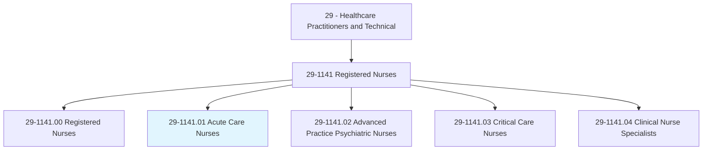
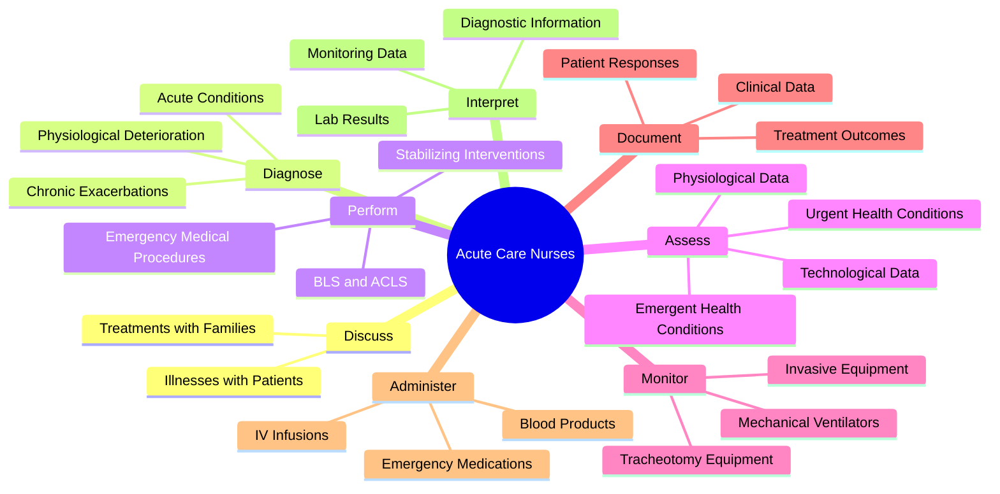
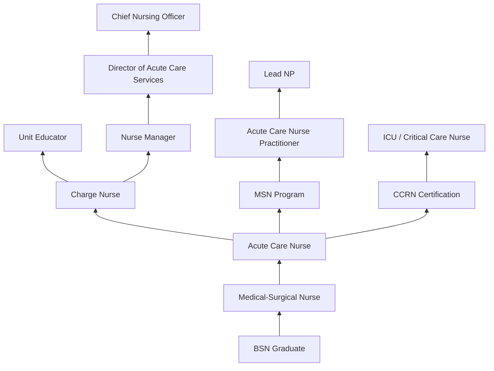
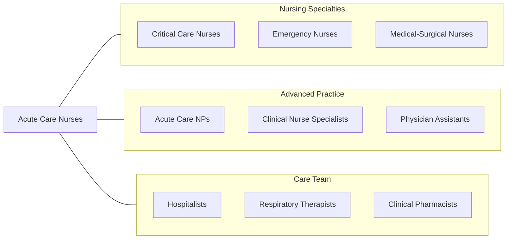

# Acute Care Nurses

> Provide advanced nursing care for patients with acute conditions such as heart attacks, respiratory distress syndrome, or shock. May care for pre- and post-operative patients or perform advanced, invasive diagnostic or therapeutic procedures.

## Overview

Acute Care Nurses are registered nurses who specialize in the assessment, diagnosis, and management of patients experiencing sudden, severe, or life-threatening health conditions. They provide advanced clinical care in high-acuity settings including emergency departments, progressive care units, step-down units, and surgical recovery areas. These nurses are trained to rapidly identify deteriorating patient conditions, initiate life-saving interventions, and manage complex medical technologies.

Working at the intersection of critical and general medical care, acute care nurses manage patients with conditions such as acute myocardial infarction, stroke, respiratory failure, sepsis, post-surgical complications, and multi-system organ dysfunction. They perform advanced assessments, interpret diagnostic data including laboratory values and cardiac monitoring, titrate vasoactive medications, manage hemodynamic monitoring, and coordinate care with physicians, respiratory therapists, and pharmacists.

The acute care nursing specialty has evolved to meet the increasing complexity of hospitalized patients. Many acute care nurses pursue certification as Acute Care Nurse Practitioners (ACNP), expanding their scope to include ordering diagnostic tests, prescribing medications, and performing procedures. The role requires exceptional clinical judgment, the ability to prioritize in rapidly changing situations, and strong communication skills for family-centered care in high-stress environments.

## Classification Hierarchy

## Key Statistics

| Metric | Value |
|--------|-------|
| SOC Code | 29-1141.01 |
| Median Annual Salary | $85,740 |
| Employment | ~250,000 (subset of RN population) |
| Projected Growth | 6% (2022-2032) |
| Job Zone | 4 (Considerable Preparation) |
| Category | [Healthcare Practitioners](/occupations/HealthcarePractitioners) |
| Core Tasks | 99 |
| Source | O*NET |

## Core Tasks

### discuss.Illnesses

Acute Care Nurses communicate with patients and families about conditions and treatments.

**Actions:**
- `discuss.Illnesses.with.PatientsMembers` - Patient education
- `discuss.Illnesses.with.FamilyMembers` - Family communication
- `discuss.Treatments.with.PatientsMembers` - Treatment planning
- `discuss.Treatments.with.FamilyMembers` - Family engagement

### diagnose.AcuteConditions

Acute Care Nurses identify conditions that may lead to rapid deterioration.

**Actions:**
- `diagnose.AcuteConditions.leading.to.RapidPhysiologicalDeterioration` - Acute assessment
- `diagnose.AcuteConditions.leading.to.LifeThreateningInstability` - Critical identification
- `diagnose.ChronicConditions.leading.to.RapidDeterioration` - Chronic exacerbation
- `assess.UrgentHealthConditions.using.PhysiologicalData` - Data-driven assessment

### perform.EmergencyMedicalProcedures

Acute Care Nurses execute life-saving interventions.

**Actions:**
- `perform.EmergencyMedicalProcedures.for.AcutePatients` - Emergency response
- `perform.BasicCardiacLifeSupport.during.CodeEvents` - BLS execution
- `perform.AdvancedCardiacLifeSupport.during.CodeEvents` - ACLS execution
- `perform.ConditionStabilizingInterventions.for.CriticalPatients` - Stabilization

## Practice Settings

| Setting | Description |
|---------|-------------|
| Progressive Care / Step-Down Units | Intermediate acuity monitoring |
| Emergency Departments | Acute stabilization and triage |
| Telemetry Units | Cardiac monitoring floors |
| Post-Anesthesia Care Units (PACU) | Post-surgical recovery |
| Trauma Units | Acute injury management |
| Observation Units | Short-stay acute assessment |
| Rapid Response Teams | Hospital-wide emergency response |
| Acute Rehabilitation | Post-acute intensive rehab |

## Skills & Competencies

### Technical Skills
- **Advanced Patient Assessment** - Expert
- **Cardiac Monitoring & Interpretation** - Expert
- **IV Therapy & Medication Administration** - Expert
- **Hemodynamic Monitoring** - Advanced
- **Ventilator Management** - Advanced
- **Wound & Drain Management** - Advanced
- **Point-of-Care Testing** - Advanced
- **Electronic Health Records** - Advanced

### Soft Skills
- **Rapid Decision Making** - Critical
- **Prioritization** - Critical
- **Communication** - Essential
- **Teamwork** - Essential
- **Stress Management** - Essential
- **Patient Advocacy** - Essential
- **Adaptability** - Essential

## Education & Training

| Requirement | Details |
|-------------|---------|
| Minimum Education | BSN preferred (ADN accepted) |
| Advanced Practice | MSN or DNP for ACNP role |
| Licensure | NCLEX-RN required |
| Acute Care Experience | Minimum 1-2 years medical-surgical nursing |
| Specialty Training | Hospital-based acute care orientation (6-12 weeks) |
| Continuing Education | 20-30 hours biennially (varies by state) |
| Clinical Competencies | Annual skills validation required |

## Certifications

| Certification | Description |
|---------------|-------------|
| PCCN | Progressive Care Certified Nurse (AACN) |
| CCRN | Critical Care Registered Nurse (AACN) |
| CEN | Certified Emergency Nurse |
| ACNPC-AG | Acute Care NP - Adult-Gerontology |
| ACLS | Advanced Cardiovascular Life Support |
| PALS | Pediatric Advanced Life Support |
| TNCC | Trauma Nursing Core Course |
| NIHSS | National Institutes of Health Stroke Scale |

## Career Progression

## Specializations

| Focus Area | Description |
|------------|-------------|
| Cardiac Acute Care | Post-MI, heart failure, post-cardiac surgery |
| Neuro Acute Care | Stroke, TBI, post-neurosurgery |
| Surgical Acute Care | Post-operative management |
| Trauma Acute Care | Multi-system injury management |
| Oncology Acute Care | Cancer treatment complications |
| Transplant Acute Care | Post-transplant monitoring |
| Rapid Response | Hospital-wide emergency activation |
| Acute Care NP | Advanced practice acute management |

## Technology & Tools

| Technology | Purpose |
|------------|---------|
| Cardiac Monitors & Telemetry Systems | Continuous ECG surveillance |
| Electronic Health Records (Epic, Cerner) | Documentation and order management |
| IV Infusion Pumps (Smart Pumps) | Medication delivery with safety limits |
| Ventilators | Mechanical ventilation support |
| Portable Ultrasound | Bedside assessment |
| Medication Dispensing Systems (Pyxis) | Automated medication access |
| Patient Communication Systems (Vocera) | Hands-free team communication |
| Early Warning Score Systems | Deterioration detection tools |

## Related Occupations

## Industries

- [Hospitals](/industries/Healthcare/Hospitals/index) - Primary Employment
- [Academic Medical Centers](/industries/Healthcare/Hospitals/Teaching) - Teaching Hospitals
- [Trauma Centers](/industries/Healthcare/Hospitals/Trauma) - Level I-IV Trauma Facilities
- [Rehabilitation Hospitals](/industries/Healthcare/RehabilitationCenters) - Acute Rehab
- [Veterans Affairs](/industries/Government/Federal) - VA Medical Centers
- [Travel Nursing Agencies](/industries/Healthcare/StaffingAgencies) - Contract Assignments

## Departments

This occupation typically works in:
- [Acute Care / Progressive Care](/departments/AcuteCare)
- [Step-Down Unit](/departments/StepDown)
- [Telemetry Unit](/departments/Telemetry)
- [Post-Anesthesia Care Unit](/departments/PACU)
- [Emergency Department](/departments/EmergencyDepartment)
- [Rapid Response Team](/departments/RapidResponse)

---

*Source: O*NET 29-1141.01 - ONETOccupation*
