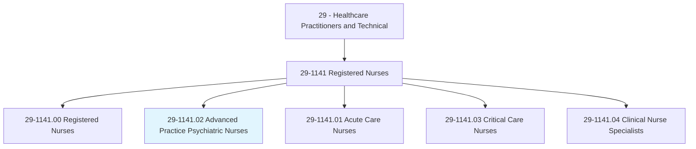
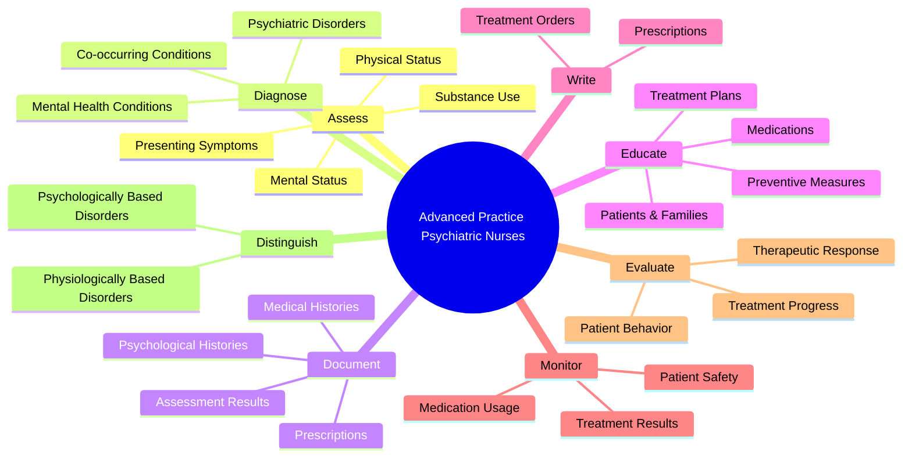
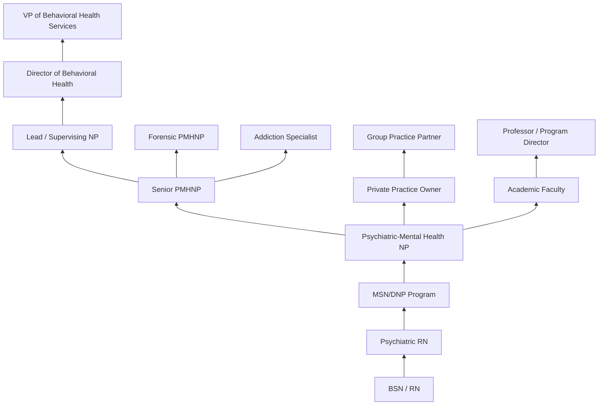
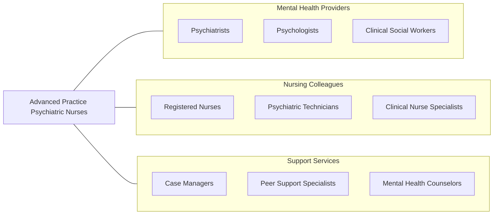

# Advanced Practice Psychiatric Nurses

> Assess, diagnose, and treat individuals and families with mental health or substance use disorders or the potential for such disorders. Apply therapeutic activities, including the prescription of medication, per state regulations, and the administration of psychotherapy.

## Overview

Advanced Practice Psychiatric Nurses (APPNs) are master's- or doctoral-prepared registered nurses who specialize in the assessment, diagnosis, and treatment of mental health and substance use disorders. They combine advanced nursing expertise with psychiatric-mental health knowledge to provide comprehensive care including psychotherapy, pharmacological management, crisis intervention, and health promotion for individuals, families, and groups across the lifespan.

These advanced practice providers function with considerable autonomy in many states, prescribing psychotropic medications, conducting diagnostic evaluations, developing treatment plans, and providing individual, group, and family therapy. They bridge the gap between traditional psychiatric care and holistic nursing practice, addressing both the mental health and physical health needs of patients. APPNs are particularly valued in underserved and rural areas where psychiatrist access is limited.

The growing mental health crisis and shortage of psychiatric providers has elevated the demand for APPNs significantly. They work across the continuum of care from community mental health centers and outpatient clinics to inpatient psychiatric units, consultation-liaison services, and forensic settings. Their training emphasizes therapeutic relationships, trauma-informed care, recovery-oriented practice, and evidence-based psychotherapeutic modalities.

## Classification Hierarchy

## Key Statistics

| Metric | Value |
|--------|-------|
| SOC Code | 29-1141.02 |
| Median Annual Salary | $128,490 |
| Employment | ~12,000 |
| Projected Growth | 9% (2022-2032, faster than average) |
| Job Zone | 5 (Extensive Preparation) |
| Category | [Healthcare Practitioners](/occupations/HealthcarePractitioners) |
| Core Tasks | 73 |
| Source | O*NET |

## Core Tasks

### assess.PatientMentalStatus

APPNs conduct comprehensive psychiatric evaluations.

**Actions:**
- `assess.PatientsMentalStatus.based.on.PresentingSymptoms` - Psychiatric assessment
- `assess.PatientsMentalStatus.based.on.Complaints` - Chief concern evaluation
- `assess.PhysicalStatus.based.on.PresentingSymptoms` - Physical examination
- `assess.SubstanceUse.using.ValidatedInstruments` - Addiction screening

### diagnose.PsychiatricDisorders

APPNs identify and classify mental health conditions.

**Actions:**
- `diagnose.PsychiatricDisorders.using.DSMCriteria` - Diagnostic classification
- `diagnose.MentalHealthConditions.through.ClinicalInterview` - Clinical evaluation
- `distinguish.PsychologicallyBasedDisorders.from.PhysiologicalCauses` - Differential diagnosis
- `evaluate.PatientsBehavior.for.SafetyRisk` - Risk assessment

### document.PatientRecords

APPNs maintain comprehensive clinical documentation.

**Actions:**
- `document.PatientsMedicalHistories.in.ElectronicRecords` - Medical documentation
- `document.PsychologicalHistories.for.TreatmentPlanning` - Psychiatric history
- `document.PhysicalAssessmentResults.for.ClinicalReference` - Physical findings
- `document.Diagnoses.and.TreatmentPlans` - Care documentation

## Practice Settings

| Setting | Description |
|---------|-------------|
| Community Mental Health Centers | Outpatient psychiatric care |
| Inpatient Psychiatric Units | Acute psychiatric stabilization |
| Private Practice | Independent psychiatric NP practice |
| Consultation-Liaison Services | Hospital-based psychiatric consultation |
| Substance Use Treatment Centers | Addiction and dual-diagnosis care |
| Forensic Settings | Correctional and forensic psychiatry |
| Telehealth/Telepsychiatry | Remote psychiatric services |
| Veterans Affairs | Military and veteran mental health |

## Skills & Competencies

### Technical Skills
- **Psychiatric Diagnostic Assessment** - Expert
- **Psychopharmacology** - Expert
- **Psychotherapy Techniques (CBT, DBT, EMDR)** - Expert
- **Risk Assessment** - Expert
- **Crisis Intervention** - Advanced
- **Neuropsychiatric Evaluation** - Advanced
- **Lab & Diagnostic Interpretation** - Advanced
- **Addiction Medicine** - Advanced

### Soft Skills
- **Therapeutic Communication** - Critical
- **Empathy & Active Listening** - Critical
- **Cultural Competency** - Essential
- **Emotional Resilience** - Essential
- **Ethical Decision Making** - Essential
- **Collaboration** - Essential
- **Boundary Setting** - Essential

## Education & Training

| Requirement | Details |
|-------------|---------|
| BSN | Bachelor of Science in Nursing (4 years) |
| MSN or DNP | Master's or Doctoral degree in Psychiatric-Mental Health NP (2-4 years) |
| Clinical Hours | 500-1,000+ supervised clinical hours in psychiatric settings |
| RN Experience | Typically 1-2 years nursing experience preferred |
| Licensure | NCLEX-RN + state APRN licensure |
| Board Certification | ANCC Psychiatric-Mental Health NP certification |
| Continuing Education | Per state APRN requirements |
| DEA Registration | Required for prescribing controlled substances |

## Certifications

| Certification | Description |
|---------------|-------------|
| PMHNP-BC | Psychiatric-Mental Health Nurse Practitioner - Board Certified (ANCC) |
| PMH-CNS | Psychiatric-Mental Health Clinical Nurse Specialist |
| CARN-AP | Certified Addictions RN - Advanced Practice |
| MAT Waivered | Medication-Assisted Treatment for opioid use disorder |
| BLS | Basic Life Support |
| CPI | Crisis Prevention Institute certification |
| Trauma-Informed Care | Specialized training certification |

## Career Progression

## Specializations

| Focus Area | Description |
|------------|-------------|
| Child & Adolescent Psychiatry | Youth mental health care |
| Geriatric Psychiatry | Elderly cognitive and mood disorders |
| Addiction Psychiatry | Substance use and dual diagnosis |
| Forensic Psychiatry | Legal system and correctional care |
| Consultation-Liaison | Hospital psychiatric consultation |
| Trauma & PTSD | Trauma-focused treatment |
| Eating Disorders | Anorexia, bulimia, BED |
| Perinatal Mental Health | Peripartum mood and anxiety disorders |

## Technology & Tools

| Technology | Purpose |
|------------|---------|
| Telepsychiatry Platforms (Zoom, Doxy.me) | Remote psychiatric sessions |
| Electronic Health Records (Epic, Cerner) | Documentation and e-prescribing |
| Prescription Drug Monitoring Programs | Controlled substance tracking |
| Standardized Assessment Tools (PHQ-9, GAD-7) | Validated symptom measurement |
| Pharmacogenomic Testing | Medication response prediction |
| E-Prescribing Systems | Electronic prescription management |
| Outcome Measurement Systems | Treatment progress tracking |
| Patient Portal Systems | Secure patient communication |

## Related Occupations

## Industries

- [Mental Health Centers](/industries/Healthcare/MentalHealth) - Primary Employment
- [Hospitals](/industries/Healthcare/Hospitals/index) - Inpatient Psychiatry
- [Physician Offices](/industries/Healthcare/PhysicianOffices) - Private Practice
- [Substance Abuse Centers](/industries/Healthcare/SubstanceAbuse) - Addiction Treatment
- [Government](/industries/PublicAdministration) - VA and Corrections
- [Telehealth Companies](/industries/Healthcare/Telehealth) - Virtual Psychiatry
- [Schools & Universities](/industries/Education) - Student Mental Health

## Departments

This occupation typically works in:
- Psychiatry
- Behavioral Health
- Addiction Services
- Consultation-Liaison Psychiatry
- Outpatient Mental Health

---

*Source: O*NET 29-1141.02 - ONETOccupation*
