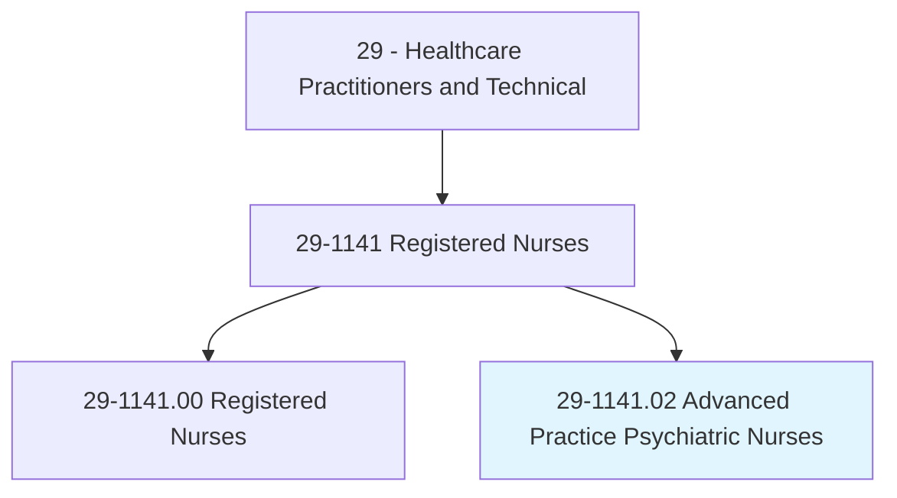
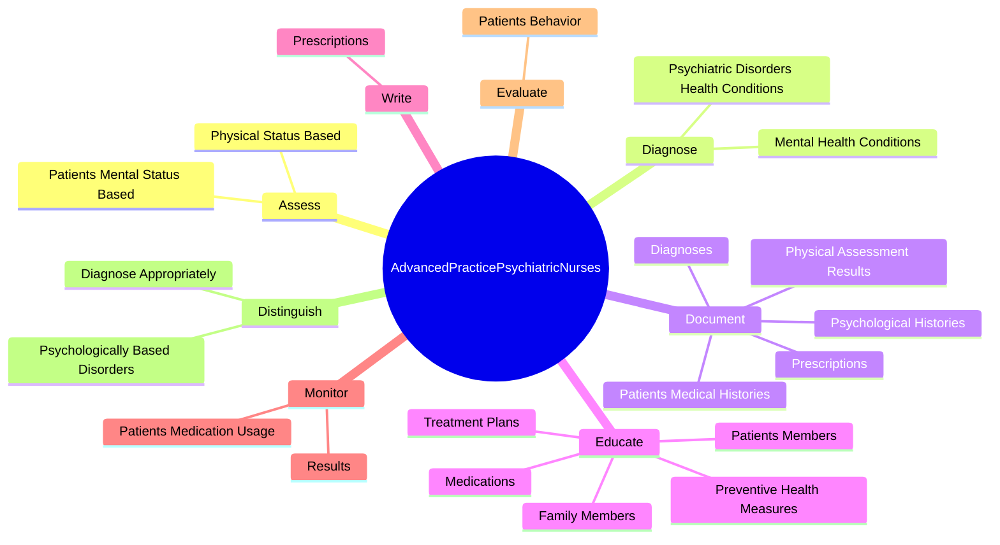
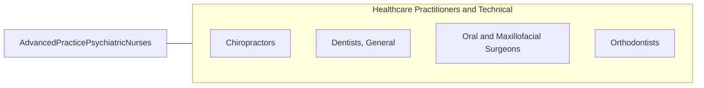

# Advanced Practice Psychiatric Nurses

> Assess, diagnose, and treat individuals and families with mental health or substance use disorders or the potential for such disorders. Apply therapeutic activities, including the prescription of medication, per state regulations, and the administration of psychotherapy.

## Overview

Advanced Practice Psychiatric Nurses is a specialized variant within the Healthcare Practitioners and Technical category. Assess, diagnose, and treat individuals and families with mental health or substance use disorders or the potential for such disorders. 

## Classification Hierarchy

## Key Statistics

| Metric | Value |
|--------|-------|
| SOC Code | 29-1141.02 |
| Category | [Healthcare Practitioners and Technical](/occupations/HealthcarePractitioners) |
| Task Count | 73 |
| Source | O*NET |

## Core Tasks

### assess.PatientsMentalStatusBased

Advanced Practice Psychiatric Nurses assess patients mental status based as part of their core responsibilities.

**Actions:**
- `assess.PatientsMentalStatusBased.on.PresentingSymptoms`
- `assess.PatientsMentalStatusBased.on.Complaints`
- `assess.PhysicalStatusBased.on.PresentingSymptoms`
- `assess.PhysicalStatusBased.on.Complaints`

### diagnose.PsychiatricDisordersHealthConditions

Advanced Practice Psychiatric Nurses diagnose psychiatric disorders health conditions as part of their core responsibilities.

**Actions:**
- `diagnose.PsychiatricDisordersHealthConditions`
- `diagnose.MentalHealthConditions`

### document.PatientsMedicalHistories

Advanced Practice Psychiatric Nurses document patients medical histories as part of their core responsibilities.

**Actions:**
- `document.PatientsMedicalHistories`
- `document.PsychologicalHistories`
- `document.PhysicalAssessmentResults`
- `document.Diagnoses`

## Skills & Competencies

### Technical Skills
- **Clinical Skills** - Advanced
- **Diagnostic Procedures** - Advanced
- **Patient Care** - Advanced

### Soft Skills
- **Communication** - Essential
- **Problem Solving** - Essential
- **Critical Thinking** - Important
- **Teamwork** - Important
- **Adaptability** - Important

## Related Occupations

## Industries

This occupation is found across multiple industries. See [Industries](/industries) for sector-specific employment data.

## Career Progression

---

*Source: O*NET 29-1141.02 - ONETOccupation*
