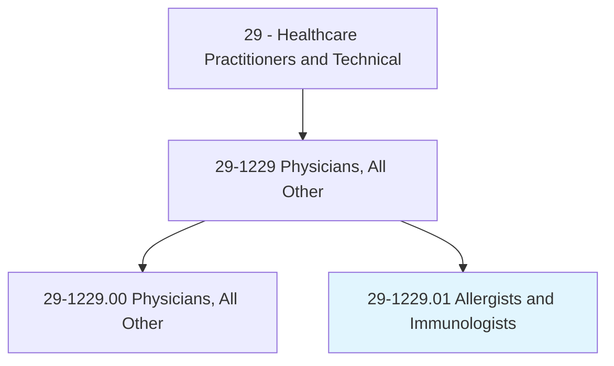
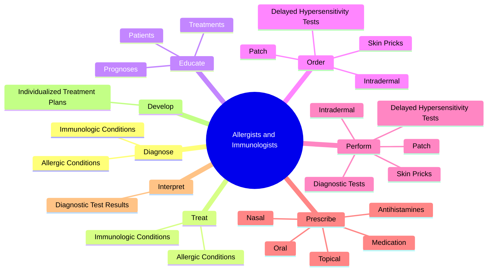
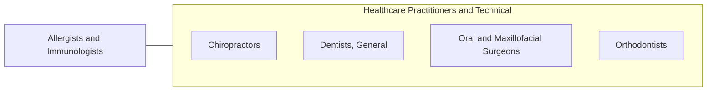

# Allergists and Immunologists

> Diagnose, treat, and help prevent allergic diseases and disease processes affecting the immune system.

## Overview

Allergists and Immunologists is classified under Healthcare Practitioners and Technical (SOC 29). Diagnose, treat, and help prevent allergic diseases and disease processes affecting the immune system.

## Classification Hierarchy

## Key Statistics

| Metric | Value |
|--------|-------|
| SOC Code | 29-1229.01 |
| Category | [Healthcare Practitioners and Technical](/occupations/HealthcarePractitioners) |
| Task Count | 56 |
| Source | O*NET |

## Core Tasks

### diagnose.AllergicConditions

Allergists and Immunologists diagnose allergic conditions as part of their core responsibilities.

**Actions:**
- `diagnose.AllergicConditions`
- `diagnose.ImmunologicConditions`

### treat.AllergicConditions

Allergists and Immunologists treat allergic conditions as part of their core responsibilities.

**Actions:**
- `treat.AllergicConditions`
- `treat.ImmunologicConditions`

### educate.Patients

Allergists and Immunologists educate patients as part of their core responsibilities.

**Actions:**
- `educate.Patients.about.Diagnoses`
- `educate.Prognoses`
- `educate.Treatments`

## Skills & Competencies

### Technical Skills
- **Clinical Skills** - Advanced
- **Diagnostic Procedures** - Advanced
- **Patient Care** - Advanced

### Soft Skills
- **Communication** - Essential
- **Problem Solving** - Essential
- **Critical Thinking** - Important
- **Teamwork** - Important
- **Adaptability** - Important

## Related Occupations

## Industries

This occupation is found across multiple industries. See [Industries](/industries) for sector-specific employment data.

## Career Progression

---

*Source: O*NET 29-1229.01 - ONETOccupation*
